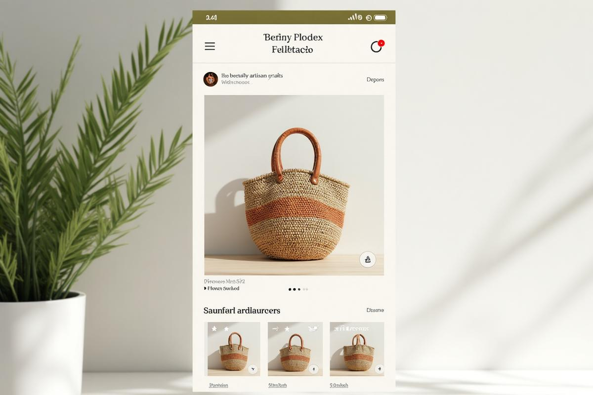
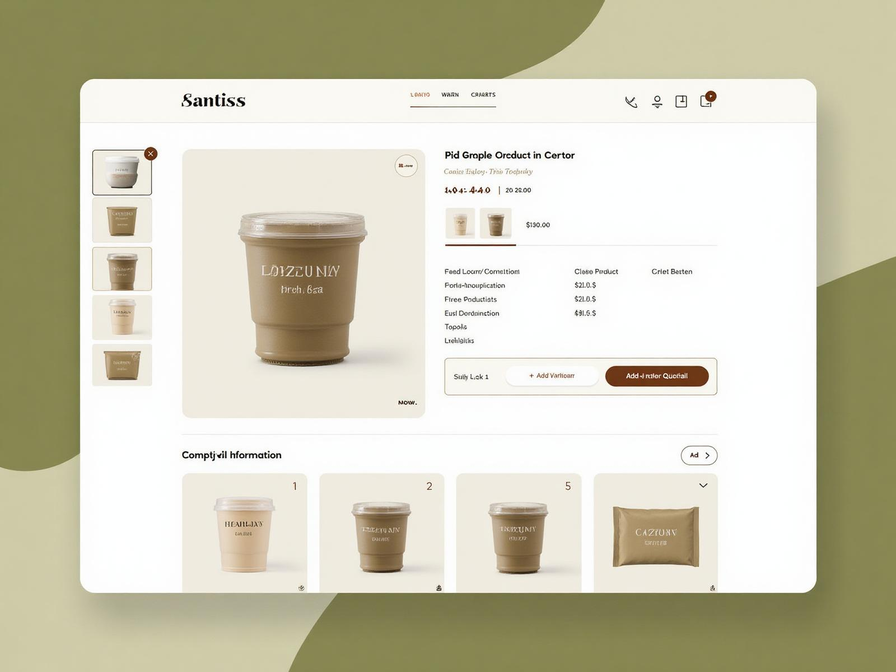
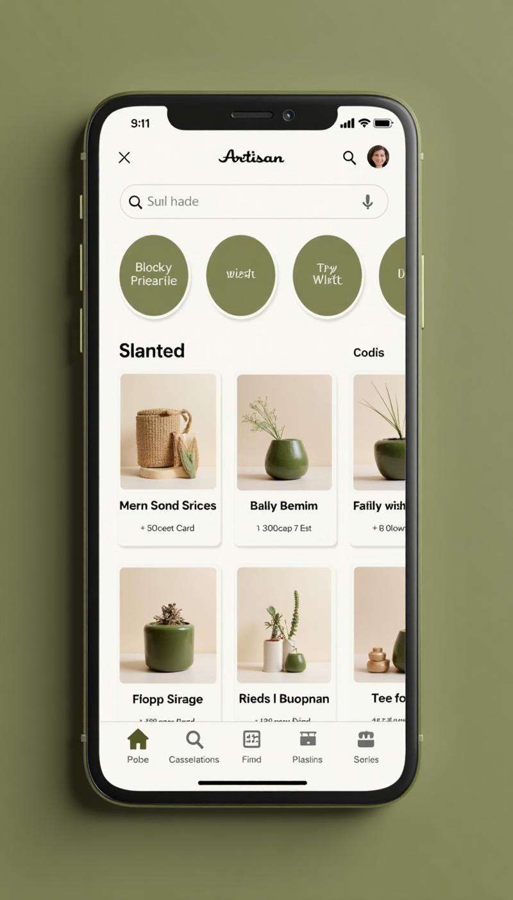
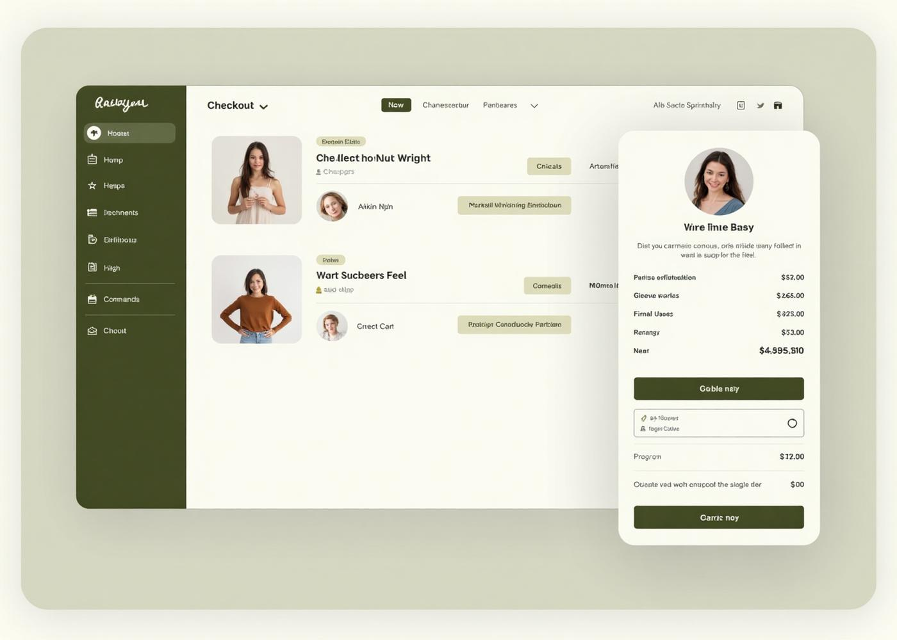
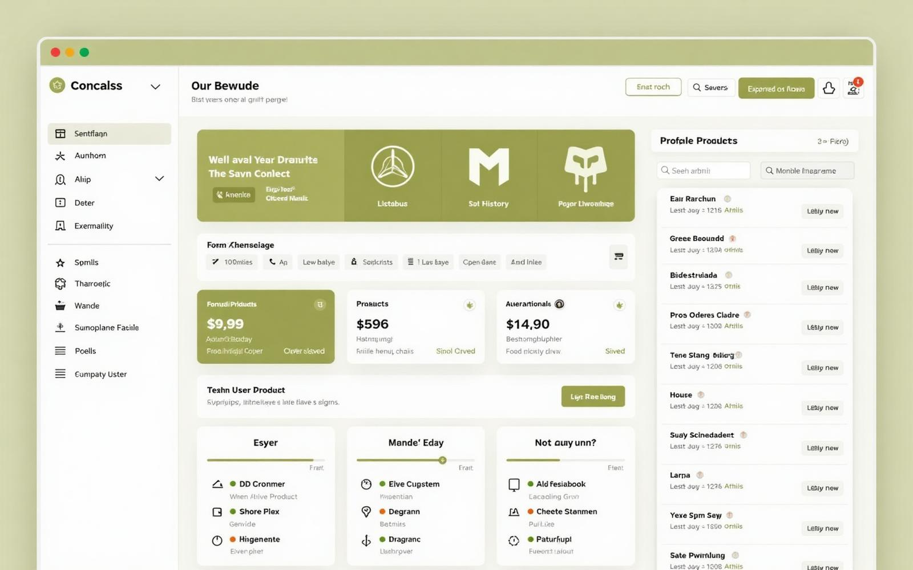
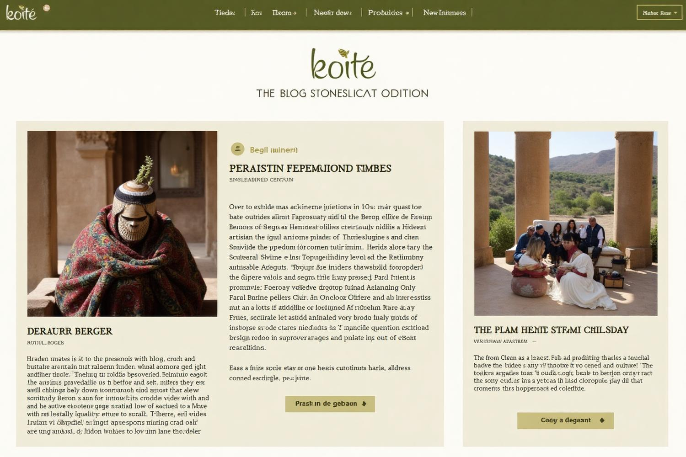
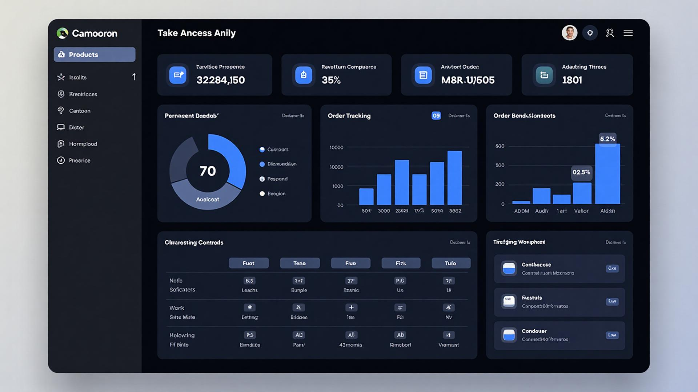

# 🏺 Rif Raw Straw - Marketplace Artisanal Berbère

[](https://lovable.dev)
[](https://reactjs.org/)
[](https://www.typescriptlang.org/)
[](https://tailwindcss.com/)
[](https://vitejs.dev/)

## 📖 Vue d'ensemble

**Rif Raw Straw** est une marketplace en ligne dédiée à la promotion et à la vente de produits artisanaux berbères authentiques. Cette plateforme moderne connecte les artisans berbères traditionnels avec une clientèle mondiale, préservant ainsi l'héritage culturel tout en offrant une expérience d'achat premium.

### 🎯 Mission

Valoriser l'artisanat berbère traditionnel en créant une vitrine numérique moderne qui respecte l'authenticité culturelle tout en offrant une expérience utilisateur exceptionnelle.

## ✨ Fonctionnalités Principales

### 🛍️ Expérience d'Achat

- **Catalogue de Produits** : Navigation intuitive avec filtres avancés
- **Aperçu Rapide** : Prévisualisation immédiate des produits sans quitter la page
- **Panier Intelligent** : Gestion d'état persistante avec calculs de livraison
- **Liste de Souhaits** : Sauvegarde de produits favoris avec synchronisation
- **Recherche Avancée** : Recherche par nom, catégorie, et caractéristiques

### 📱 Interface Utilisateur

- **Design Responsive** : Optimisé pour tous les appareils (mobile-first)
- **Interface Moderne** : Design épuré avec palette de couleurs terre
- **Animations Fluides** : Transitions et micro-interactions raffinées
- **Accessibilité** : Conforme aux standards WCAG 2.1
- **PWA Ready** : Installation possible sur mobile et desktop

### 🔐 Gestion Utilisateur

- **Authentification** : Système d'inscription/connexion sécurisé
- **Profil Utilisateur** : Gestion des informations personnelles
- **Historique Commandes** : Suivi complet des achats
- **Programme de Fidélité** : Système de points et récompenses

### 🏪 Fonctionnalités E-commerce

- **Gestion Inventaire** : Suivi en temps réel des stocks
- **Système de Paiement** : Intégration Stripe pour paiements sécurisés
- **Calcul Livraison** : Estimation automatique des frais de port
- **Notifications** : Alertes stock, promotions, et confirmations
- **Multi-devises** : Support EUR, USD, MAD

### 📊 Administration

- **Dashboard Admin** : Interface de gestion complète
- **Gestion Produits** : CRUD complet avec upload d'images
- **Analytics** : Statistiques de vente et comportement utilisateur
- **Gestion Commandes** : Traitement et suivi des commandes
- **Système de Reviews** : Modération des avis clients

## 🖼️ Aperçus de l'Application

### Page d'Accueil


*Interface principale avec navigation intuitive et mise en avant des produits*

### Cartes Produits


*Design moderne des cartes produits avec fonctionnalités interactives*

### Détail Produit


*Page produit complète avec galerie d'images et informations détaillées*

### Version Mobile


*Interface responsive optimisée pour les appareils mobiles*

### Panier & Checkout


*Processus d'achat simplifié et sécurisé*

### Dashboard Utilisateur


*Interface utilisateur pour la gestion du profil et des commandes*

### Section Blog


*Contenu éditorial sur la culture berbère et l'artisanat*

### Administration


*Interface d'administration complète pour la gestion de la plateforme*

### Contact & Footer


*Page de contact et informations institutionnelles*

## 🚀 Technologies Utilisées

### Frontend

- **React 18.3.1** - Framework JavaScript moderne
- **TypeScript** - Typage statique pour plus de robustesse
- **Vite** - Build tool ultra-rapide
- **Tailwind CSS** - Framework CSS utilitaire
- **Shadcn/ui** - Composants UI modernes et accessibles

### Backend & Services

- **Supabase** - Backend-as-a-Service pour base de données et auth
- **Stripe** - Processeur de paiements sécurisés
- **Vercel** - Plateforme de déploiement et hébergement

### État & Navigation

- **React Router DOM** - Navigation côté client
- **Context API** - Gestion d'état globale
- **TanStack Query** - Cache et synchronisation des données

### Outils de Développement

- **ESLint** - Linting et qualité de code
- **Prettier** - Formatage automatique
- **Husky** - Hooks Git pour CI/CD
- **Vitest** - Framework de tests unitaires

## 🛠️ Installation & Configuration

### Prérequis

- **Node.js** >= 18.0.0
- **npm** >= 8.0.0 ou **yarn** >= 1.22.0
- **Git** pour le contrôle de version

### Installation Locale

```bash
# Cloner le repository
git clone https://github.com/votre-username/rif-raw-straw.git
cd rif-raw-straw

# Installer les dépendances
npm install

# Configurer les variables d'environnement
cp .env.example .env

# Éditer .env avec vos clés (Supabase, Stripe, etc.)

# Démarrer le serveur de développement
npm run dev

# Optionnel : Mock API pour produits/posts (autre terminal)
npm run start:api
```

### Variables d'Environnement

Copiez `.env.example` vers `.env` et renseignez les valeurs. Voir `.env.example` pour la liste complète. Variables principales :

```env
# Configuration Supabase (obligatoire)
VITE_SUPABASE_URL=https://your_project_id.supabase.co
VITE_SUPABASE_PUBLISHABLE_KEY=your_supabase_anon_key

# Configuration Stripe (optionnel, pour les paiements)
VITE_STRIPE_PUBLISHABLE_KEY=your_stripe_publishable_key

# Configuration Générale
VITE_API_URL=http://localhost:8080
VITE_PROD_URL=https://yourdomain.com
```

## 📁 Structure du Projet

```
rif-raw-straw/
├── 📁 backend/                   # Mock API (dev/staging)
│   ├── server.cjs               # Serveur Express + json-server
│   ├── db.json                  # Données produits/posts
│   ├── package.json
│   └── README.md
├── 📁 public/                    # Fichiers statiques
│   ├── 📁 assets/               # Images et ressources
│   └── 📄 manifest.json         # Configuration PWA
├── 📁 src/                      # Code source principal
│   ├── 📁 components/           # Composants React réutilisables
│   │   ├── 📁 ui/              # Composants UI de base
│   │   ├── 📁 admin/           # Composants d'administration
│   │   └── 📁 auth/            # Composants d'authentification
│   ├── 📁 pages/               # Pages de l'application
│   │   ├── 📁 admin/           # Pages d'administration
│   │   └── 📄 *.tsx            # Pages principales
│   ├── 📁 hooks/               # Hooks React personnalisés
│   ├── 📁 context/             # Contexts React (état global)
│   ├── 📁 services/            # Services API et logique métier
│   ├── 📁 shared/              # Types et interfaces partagés
│   ├── 📁 utils/               # Fonctions utilitaires
│   ├── 📁 data/                # Données statiques et mock
│   ├── 📁 config/              # Configuration de l'application
│   └── 📄 main.tsx             # Point d'entrée de l'application
├── 📄 tailwind.config.ts       # Configuration Tailwind CSS
├── 📄 vite.config.ts           # Configuration Vite
├── 📄 tsconfig.json            # Configuration TypeScript
└── 📄 package.json             # Dépendances et scripts
```

## 🎨 Système de Design

### Palette de Couleurs

- **Primaire** : Olive Green (#8B7A4D) - Inspiration terre berbère
- **Secondaire** : Stone Gray (#78716C) - Neutralité moderne
- **Accent** : Warm Amber (#F59E0B) - Touches dorées
- **Fond** : Off-White (#FAFAF9) - Clarté et lisibilité

### Typographie

- **Titre** : Police serif moderne pour l'élégance
- **Corps** : Police sans-serif pour la lisibilité
- **Interface** : Police système optimisée

### Composants UI

- **Cartes** : Design épuré avec ombres subtiles
- **Boutons** : États interactifs avec micro-animations
- **Navigation** : Interface claire et intuitive
- **Formulaires** : Validation en temps réel

## 🔧 Identifiants des Boutons

L'application utilise un système d'identification uniforme pour tous les boutons interactifs. Consultez le fichier [`src/config/buttonIdentifiers.json`](./src/config/buttonIdentifiers.json) pour la documentation complète des identifiants.

### Exemples d'Identifiants

```javascript
// Cartes produits
quickViewBtn: "quick-view-btn-{productId}"
addToCartBtn: "add-to-cart-btn-{productId}"
wishlistBtn: "wishlist-btn-{productId}"

// Navigation principale
cartButton: "cart-button"
profileButton: "profile-button"
logoLink: "main-logo"
```

## 🧪 Tests & Qualité

### Lancement des Tests

```bash
# Tests unitaires
npm run test

# Tests des Edge Functions Supabase
npm run test:edge-functions

# Tests avec couverture
npm run coverage

# Tests e2e
npm run e2e:run
# ou en mode interactif
npm run e2e:open
```

**Tests Edge Functions :** Les tests d'intégration des Edge Functions nécessitent `VITE_SUPABASE_URL` et `VITE_SUPABASE_PUBLISHABLE_KEY` dans `.env`. Pour les tests admin (preview email, etc.), ajoutez `SUPABASE_SERVICE_ROLE_KEY`. Les tests sans clé service role sont ignorés.

### Linting & Formatage

```bash
# Vérification du code
npm run lint

# Correction automatique (lint)
npm run lint:fix

# Formatage Prettier
npm run format
```

## 🚢 Déploiement

### Déploiement Automatique (Lovable)

1. Connectez votre compte GitHub
2. Poussez vos modifications sur la branche main
3. Le déploiement se fait automatiquement

### Déploiement Manuel

```bash
# Build de production
npm run build

# Prévisualisation du build
npm run preview

# Déploiement sur Vercel
vercel --prod
```

### Configuration des Domaines

Pour connecter un domaine personnalisé :

1. Accédez aux paramètres du projet dans Lovable
2. Section "Domains"
3. Ajoutez votre domaine et suivez les instructions DNS

## 🤝 Contribution

### Processus de Contribution

1. **Fork** le repository
2. Créez une **branche feature** (`git checkout -b feature/amazing-feature`)
3. **Committez** vos changements (`git commit -m 'Add amazing feature'`)
4. **Poussez** vers la branche (`git push origin feature/amazing-feature`)
5. Ouvrez une **Pull Request**

### Standards de Code

- Suivre les règles ESLint configurées
- Utiliser TypeScript pour le typage
- Écrire des tests pour les nouvelles fonctionnalités
- Respecter les conventions de nommage

### Architecture des Composants

- Composants fonctionnels avec hooks
- Props typées avec TypeScript
- Gestion d'état avec Context API
- Styles avec Tailwind CSS

## 🔒 Sécurité

### Bonnes Pratiques Implémentées

- **Authentification** : JWT tokens sécurisés
- **Validation** : Validation côté client et serveur
- **Sanitization** : Protection XSS avec DOMPurify
- **HTTPS** : Chiffrement de toutes les communications
- **CSRF** : Protection contre les attaques CSRF

### Variables Sensibles

- Stockage sécurisé des clés API
- Variables d'environnement pour les secrets
- Rotation régulière des tokens d'accès

## 📈 Performance

### Optimisations Implémentées

- **Code Splitting** : Chargement lazy des composants
- **Image Optimization** : Compression et formats modernes
- **Caching** : Mise en cache intelligente des requêtes
- **Bundle Analysis** : Analyse de la taille des bundles
- **Core Web Vitals** : Optimisation pour les métriques Google

### Monitoring

- Analytics d'utilisation
- Suivi des performances
- Monitoring des erreurs
- Métriques de conversion

## 🌐 Internationalisation

### Langues Supportées

- **Français** (primaire) - Interface principale
- **Arabe** (à venir) - Langue berbère moderne
- **Anglais** (à venir) - Marché international

### Configuration i18n

```typescript
// Configuration locale
export const locales = {
  fr: 'Français',
  ar: 'العربية', 
  en: 'English'
};
```

## 📞 Support & Contact

### Équipe de Développement

- **Développeur Principal** : [Votre Nom]
- **Designer UI/UX** : [Nom Designer]
- **Product Owner** : [Nom PO]

### Canaux de Support

- **Issues GitHub** : Bugs et demandes de fonctionnalités
- **Discussions** : Questions générales et idées
- **Email** : <support@rifrawstraw.com>
- **Discord** : Communauté des développeurs

## 📜 Licence

Ce projet est sous licence **MIT** - voir le fichier [LICENSE](./LICENSE) pour plus de détails.

### Droits d'Utilisation

- ✅ Utilisation commerciale
- ✅ Modification du code
- ✅ Distribution
- ✅ Usage privé
- ❌ Responsabilité limitée
- ❌ Garantie limitée

## 🙏 Remerciements

### Crédits

- **Artisans Berbères** - Pour leur savoir-faire authentique
- **Communauté Open Source** - Pour les outils et frameworks
- **Équipe Lovable** - Pour la plateforme de développement
- **Testeurs Bêta** - Pour leurs retours précieux

### Inspirations

- Design inspiré de l'artisanat traditionnel berbère
- Couleurs basées sur les paysages du Rif
- Typographie respectueuse de l'identité culturelle

---

<div align="center">

** Fait avec ❤️ pour préserver et promouvoir l'artisanat berbère **

[Site Web](https://rifrawstraw.lovable.app) • [Documentation](https://docs.rifrawstraw.com) • [Support](mailto:support@rifrawstraw.com)

</div>
