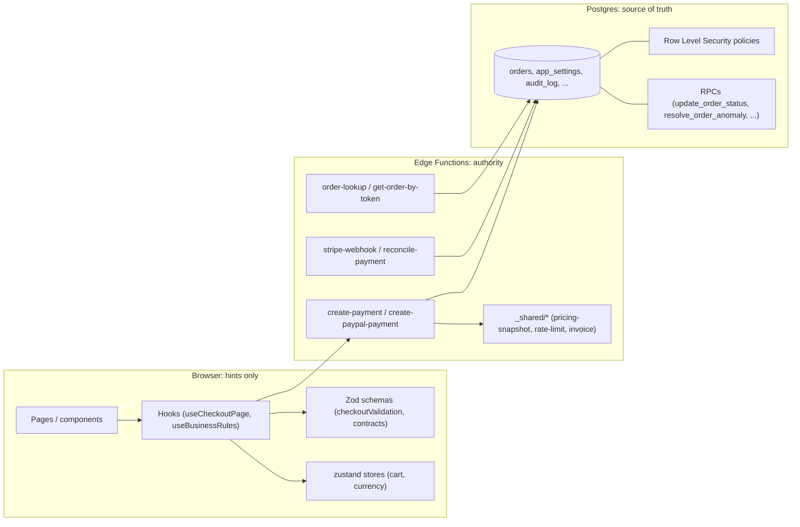
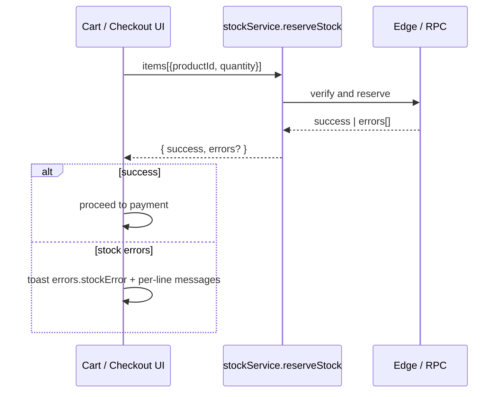
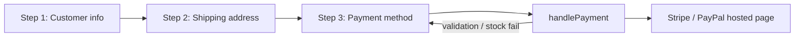
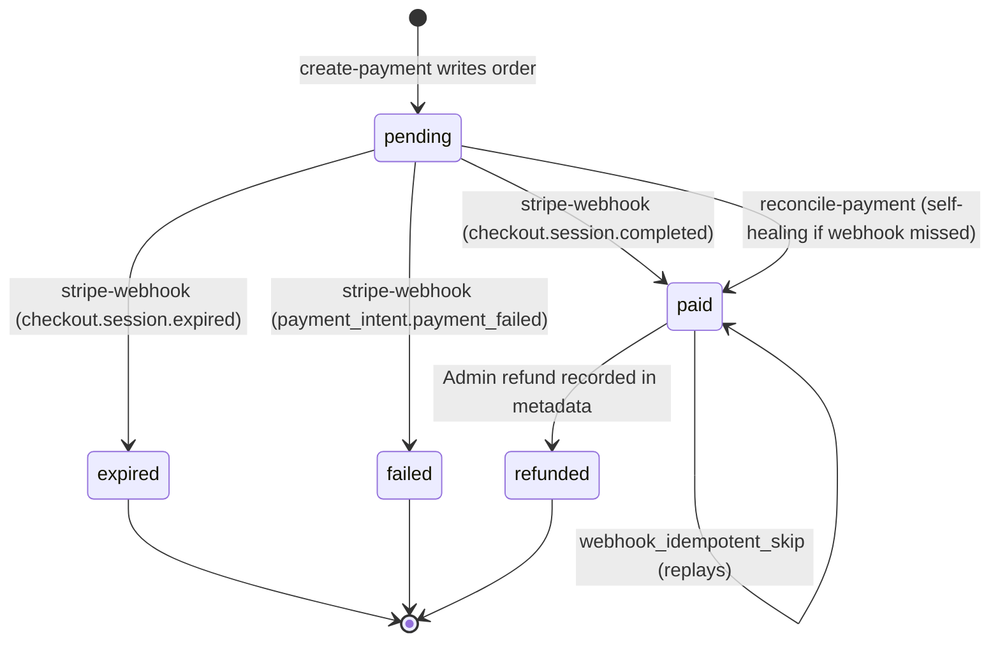
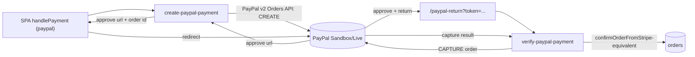

# Business logic and edge cases

Companion to [RULES_REGISTRY.md](./RULES_REGISTRY.md). Where the registry says **what governs the system and where it lives**, this file says **how each rule behaves in practice**: the **schemas**, the **enforcement layer**, and the **UI effects** users actually see (toasts, blocking states, redirects, copy keys).

Authoritative behavior lives in **Supabase Edge Functions** and **Postgres RLS**. The SPA enforces the same rules as **early UX hints**; final correctness is decided server-side.

## Contents

- [Trust boundary at a glance](#trust-boundary-at-a-glance)
1. [Business rules (`BusinessRules`)](#1-business-rules-businessrules)
2. [Cart & inventory](#2-cart--inventory)
3. [Checkout steps & persistence](#3-checkout-steps--persistence)
4. [Checkout validation](#4-checkout-validation)
5. [Payment session creation (client ↔ Edge)](#5-payment-session-creation-client--edge)
6. [Pricing snapshot / money path](#6-pricing-snapshot--money-path)
7. [Orders & admin](#7-orders--admin)
8. [Contact, newsletter & other Edge flows](#8-contact-newsletter--other-edge-flows)
9. [Auth, sessions, CSRF](#9-auth-sessions-csrf)
10. [Promo codes, free shipping, currency, realtime](#10-promo-codes-free-shipping-currency-realtime)
11. [Stripe webhook, PayPal, emails, admin actions](#11-stripe-webhook-paypal-emails-admin-actions)
12. [Secondary domains (wishlist, loyalty, newsletter, images, A/B & themes, a11y, perf)](#12-secondary-domains-wishlist-loyalty-newsletter-images-ab--themes-a11y-perf)
13. [Cross-cutting edge-case catalog (quick reference)](#13-cross-cutting-edge-case-catalog-quick-reference)
14. [Checkout i18n keys used in the catalog](#14-checkout-i18n-keys-used-in-the-catalog)
15. [Keeping this doc honest](#15-keeping-this-doc-honest)

---

## Trust boundary at a glance



**Reading guide.** Every domain chapter below uses three columns where relevant:

| Layer | Schema or invariant | UI effect |
| --- | --- | --- |
| `browser` / `edge` / `db` | Type / Zod / Postgres constraint | Toast, blocking state, error key |

---

## 1. Business rules (`BusinessRules`)

**Source of truth**: `app_settings` row with `setting_key = 'business_rules'`. **Default fallback**: `DEFAULT_BUSINESS_RULES` in [`src/hooks/useBusinessRules.ts`](../src/hooks/useBusinessRules.ts).

### 1.1 Schema (from [`src/hooks/useBusinessRules.ts`](../src/hooks/useBusinessRules.ts))

```ts
export interface BusinessRules {
  cart: {
    maxQuantityPerItem: number;
    maxProductTypes: number;
    highValueThreshold: number;
    minOrderAmount: number;
    maxOrderAmount: number;
  };
  wishlist: { maxItems: number };
  checkout: {
    requireEmailVerification: boolean;
    allowGuestCheckout: boolean;
    showVipContactForHighValue: boolean;
  };
  contact: { vipEmail: string; vipPhone: string };
}
```

Canonical defaults (auto-generated to prevent drift with the source):

<!-- BEGIN auto:business-rules-defaults -->
Generated from [`src/hooks/useBusinessRules.ts`](../src/hooks/useBusinessRules.ts) — do not edit between the markers. Run `pnpm run docs:gen` to refresh.

```json
{
  "cart": {
    "maxQuantityPerItem": 10,
    "maxProductTypes": 10,
    "highValueThreshold": 1000,
    "minOrderAmount": 0,
    "maxOrderAmount": 10000
  },
  "wishlist": {
    "maxItems": 10
  },
  "checkout": {
    "requireEmailVerification": false,
    "allowGuestCheckout": true,
    "showVipContactForHighValue": true
  },
  "contact": {
    "vipEmail": "vip@rifrawstraw.com",
    "vipPhone": "+33600000000"
  }
}
```
<!-- END auto:business-rules-defaults -->

### 1.2 Field reference

| Field | Type | Default | Consumers | UI effect |
| --- | --- | --- | --- | --- |
| `cart.maxQuantityPerItem` | `number` | `10` | [`src/pages/Cart.tsx`](../src/pages/Cart.tsx) (`useCart` + `useBusinessRules`) | Quantity input capped; copy: “Au-delà, le client doit vous contacter directement” (admin tooltip in [BusinessRulesConfig](../src/components/admin/BusinessRulesConfig.tsx)). |
| `cart.maxProductTypes` | `number` | `10` | Cart UI | Limits distinct SKUs; soft cap surfaced in admin tooltip. |
| `cart.highValueThreshold` | `number` (EUR) | `1000` | Cart, Checkout | Triggers VIP banner / contact prompt when total ≥ threshold (gated by `checkout.showVipContactForHighValue`). |
| `cart.minOrderAmount` | `number` (EUR) | `0` | [`useCheckoutPage.handlePayment`](../src/hooks/useCheckoutPage.ts) | If `> 0` and `subtotal < minOrderAmount` → toast `t('promo.minOrder', { amount })`, payment blocked. |
| `cart.maxOrderAmount` | `number` (EUR) | `10000` | [`useCheckoutPage.handlePayment`](../src/hooks/useCheckoutPage.ts) | If `> 0` and `subtotal > maxOrderAmount` → toast `t('errors.genericError')`, payment blocked. |
| `wishlist.maxItems` | `number` | `10` | Wishlist UI / [`wishlistApi`](../src/services/wishlistApi.ts) | Add-to-wishlist disabled / toasted when reached. |
| `checkout.requireEmailVerification` | `boolean` | `false` | Auth + checkout gating | When enabled, unverified email blocks payment step. |
| `checkout.allowGuestCheckout` | `boolean` | `true` | Checkout step machine | When `false`, guests forced through login. |
| `checkout.showVipContactForHighValue` | `boolean` | `true` | Cart / Checkout | Enables / disables VIP UX described above. |
| `contact.vipEmail` | `string` | `vip@rifrawstraw.com` | VIP UX | Shown / mailto link. |
| `contact.vipPhone` | `string` | `+33600000000` | VIP UX | Cart shows `vipPhone` near high-value banner. |

### 1.3 Loading & caching

- **Module-level cache**: `cachedRules` + in-flight `fetchPromise` in [`useBusinessRules.ts`](../src/hooks/useBusinessRules.ts) — prevents duplicate fetches across consumers.
- **Defaults applied first** so the SPA never blocks rendering; DB values **deep-merge** per section (`cart`, `wishlist`, `checkout`, `contact`).
- **Refetch** is explicit — call `refetch()` from the hook or `clearBusinessRulesCache()` (used by [`BusinessRulesConfig`](../src/components/admin/BusinessRulesConfig.tsx) after save).
- **Sync accessor for stores**: `getBusinessRules()` returns the current cached snapshot or defaults.

### 1.4 Edge cases

| ID | Trigger | Layer(s) | Effect |
| --- | --- | --- | --- |
| BR-1 | `app_settings.business_rules` missing or read fails | `browser` | `fetchBusinessRules` returns `DEFAULT_BUSINESS_RULES`; UI keeps working. |
| BR-2 | Partial DB payload (e.g. only `cart`) | `browser` | Missing sections fall back to defaults via section-level spread. |
| BR-3 | Admin save | `browser → db` | Writes `app_settings`, appends `audit_log` row (`BUSINESS_RULES_UPDATED`), then calls `clearBusinessRulesCache()` so other tabs hydrate fresh values on next mount. |
| BR-4 | `minOrderAmount = 0` | `browser` | Treated as “no minimum” (the guard requires `minOrderAmount > 0`). |

---

## 2. Cart & inventory

**Primary files**: [`src/stores/cartStore.ts`](../src/stores/cartStore.ts), [`src/services/cartApi.ts`](../src/services/cartApi.ts), [`src/services/cartSyncService.ts`](../src/services/cartSyncService.ts), [`src/services/stockService.ts`](../src/services/stockService.ts), [`src/pages/Cart.tsx`](../src/pages/Cart.tsx).

### 2.1 State shape (cart store, zustand)

| Slice | Purpose |
| --- | --- |
| `cart.items` | Validated product + quantity lines (UI filters out items missing product data). |
| `itemCount`, `totalPrice` | Derived counters. |
| `hasPendingProductResolution` | Signals an unresolved product hydration (e.g. guest cart with stale IDs). |

### 2.2 Stock verification



### 2.3 Edge cases

| ID | Trigger | Layer(s) | Effect |
| --- | --- | --- | --- |
| CART-1 | Cart line missing product (data drift) | `browser` | Cart UI filters it out; `hasPendingProductResolution` becomes `true`; checkout disabled. |
| CART-2 | Stock check returns issues | `browser → edge` | Toast `t('errors.stockError')` with per-line `<product>: <error>`. Payment is **not** initiated. |
| CART-3 | Quantity above `cart.maxQuantityPerItem` | `browser` | UI clamps / disables increase; admin tooltip explains the cap. |
| CART-4 | Subtotal below `cart.minOrderAmount` (`> 0`) | `browser` | Toast `t('promo.minOrder', { amount: formatPrice(minOrderAmount) })`. |
| CART-5 | Subtotal above `cart.maxOrderAmount` (`> 0`) | `browser` | Toast `t('errors.genericError')`. |
| CART-6 | Server cart sync (`cartSyncService.persistUserCartLinesViaRpc`) fails | `browser → db` | Cart still works locally; subsequent reload may re-hydrate from server. |
| CART-7 | Guest cart → authenticated user transition | `browser → db` | Cart merge / hydration governed by [`cartSyncPolicy`](../src/lib/cart/cartSyncPolicy.ts) and [`cartSyncService`](../src/services/cartSyncService.ts). |

---

## 3. Checkout steps & persistence

**Primary files**: [`src/hooks/useCheckoutPage.ts`](../src/hooks/useCheckoutPage.ts), [`src/hooks/useCheckoutFormPersistence.ts`](../src/hooks/useCheckoutFormPersistence.ts), [`src/hooks/useCheckoutSession.ts`](../src/hooks/useCheckoutSession.ts), [`src/lib/checkout/checkoutStorageKeys.ts`](../src/lib/checkout/checkoutStorageKeys.ts).

### 3.1 Step machine (high level)



State is kept by `useCheckoutPage` (`step`, `completedSteps`), persisted via `useCheckoutFormPersistence.saveStepState` (localStorage) and `useCheckoutSession.updateStep` (DB / draft).

### 3.2 `CheckoutFormData` schema (browser)

```ts
interface CheckoutFormData {
  firstName: string;
  lastName: string;
  email: string;
  phone: string;
  address: string;
  addressComplement: string;
  postalCode: string;
  city: string;
  country: 'FR' | 'BE' | 'CH' | 'MC' | 'LU';
}
```

Defined in [`src/hooks/useCheckoutFormPersistence.ts`](../src/hooks/useCheckoutFormPersistence.ts); validated by `checkoutFormSchema` in [`src/utils/checkoutValidation.ts`](../src/utils/checkoutValidation.ts).

### 3.3 Persistence

| Channel | Where | Notes |
| --- | --- | --- |
| `localStorage` (form draft + step state) | `safeStorage` helpers in [`src/lib/storage/safeStorage.ts`](../src/lib/storage/safeStorage.ts) | Keys provided by `getCheckoutStorageKeys(elevated)` — elevated storefront users get distinct keys so admin drafts cannot leak to other users. |
| `checkout_sessions` (DB) | [`fetchCheckoutFormSnapshotByGuestId`](../src/services/checkoutApi.ts), [`fetchCheckoutFormSnapshotByUserId`](../src/services/checkoutApi.ts) | Skipped for elevated users (see hook doc). |
| Profile prefill | [`fetchProfileCheckoutPrefill`](../src/services/profileApi.ts), [`fetchDefaultShippingAddress`](../src/services/profileApi.ts) | Hydrates email / shipping on first mount when authenticated. |
| `checkout_snapshot` localStorage | Set in `handlePayment` (success branch) | Allows the post-payment page to render instantly even if Edge is slow. |

### 3.4 Edge cases

| ID | Trigger | Layer(s) | Effect |
| --- | --- | --- | --- |
| CO-1 | Honeypot field non-empty | `browser` | Toast `t('errors.genericError')`; payment cancelled silently from the user’s perspective. |
| CO-2 | Restored step is `> 1` but draft is invalid | `browser` | `useCheckoutFormPersistence` falls back through `isValidPersonalInfo` / `isValidShippingInfo` ([`checkoutSessionValidation`](../src/utils/checkoutSessionValidation.ts)); user is dropped to the earliest invalid step. |
| CO-3 | Elevated storefront user (admin previewing checkout) | `browser` | Uses [`isElevatedStorefrontUser`](../src/lib/cart/cartSyncPolicy.ts); skips `checkout_sessions` hydration; storage keys namespaced. |
| CO-4 | Guest with `useGuestSession` data missing **and** no authenticated user | `browser` | Toast `t('errors.genericError', '… Session de paiement indisponible …')`; payment blocked. |
| CO-5 | Cash on delivery selected for ineligible postal code | `browser` | `isEligibleForCOD(postalCode)` returns `false`; toast French copy “Le paiement à la livraison n’est pas disponible pour cette adresse.” and `paymentMethod` reset to `'card'`. |
| CO-6 | Existing applied coupon restored from persistence | `browser` | `appliedCoupon` rehydrated by `useCheckoutFormPersistence.savedCoupon`. |

---

## 4. Checkout validation

**Source**: [`src/utils/checkoutValidation.ts`](../src/utils/checkoutValidation.ts).

### 4.1 Field constraints

| Field | Min | Max | Pattern | Sanitization | Notes |
| --- | --- | --- | --- | --- | --- |
| `firstName`, `lastName` | 2 | 50 | `/^[a-zA-ZÀ-ÿ\s\-'.]+$/` | `sanitizeUserInput` | Rejects dangerous patterns; FR error messages. |
| `email` | 5 | 254 | RFC-ish + extra `^[A-Za-z0-9._%+-]+@[A-Za-z0-9.-]+\.[A-Za-z]{2,}$` + reject `..` | Trim, lowercase | Refuses XSS patterns. |
| `phone` | 0 (optional) | 20 | `/^[+]?[(]?[0-9]{1,4}[)]?[-\s./0-9]*$/` | `sanitizeUserInput` | Empty allowed. |
| `address` | 5 | 200 | — | `sanitizeUserInput` | Refuses dangerous patterns. |
| `addressComplement` | 0 (optional) | 100 | — | `sanitizeUserInput` | Empty allowed. |
| `city` | 2 | 100 | `/^[a-zA-ZÀ-ÿ\s\-'.]+$/` | `sanitizeUserInput` | |
| `country` | — | — | `enum('FR','BE','CH','MC','LU')` | — | Drives postal-code regex selection. |
| `postalCode` | ≥ 1 char | — | per country: `FR /^\d{5}$/`, `BE /^\d{4}$/`, `CH /^\d{4}$/`, `MC /^\d{5}$/`, `LU /^\d{4}$/` | trim | Cross-field refinement via `.refine`. |
| `promoCode` | 1 | 50 | `/^[A-Z0-9\-_]+$/` (uppercased) | — | Refuses dangerous patterns. |

Raw constraints (auto-generated to prevent drift):

<!-- BEGIN auto:checkout-validation-constraints -->
Generated from [`src/utils/checkoutValidation.ts`](../src/utils/checkoutValidation.ts) — do not edit between the markers. Run `pnpm run docs:gen` to refresh.

| Field | Min | Max | Pattern |
| --- | --- | --- | --- |
| firstName / lastName | 2 | 50 | `/^[a-zA-ZÀ-ÿ\s\-'.]+$/` |
| email | 5 | 254 | RFC + reject `..` |
| phone (optional) | — | 20 | `/^[+]?[(]?[0-9]{1,4}[)]?[-\s./0-9]*$/` |
| address | 5 | 200 | — |
| addressComplement (optional) | — | — | — |
| city | 2 | 100 | letters + accents + ` -'.` |

Postal-code regex per country (`POSTAL_CODE_REGEX`):

| Country | Regex |
| --- | --- |
| FR | `/^\d{5}$/` |
| BE | `/^\d{4}$/` |
| CH | `/^\d{4}$/` |
| MC | `/^\d{5}$/` |
| LU | `/^\d{4}$/` |
<!-- END auto:checkout-validation-constraints -->


### 4.2 Dangerous-pattern detection

Applied as a Zod `.refine` on all free-text fields; substrings (case-insensitive) checked include `javascript:`, `<script`, `eval(`, `onclick`, `onerror`, `onload`, `
Generated from [`supabase/functions/create-payment/constants.ts`](../supabase/functions/create-payment/constants.ts) — do not edit between the markers. Run `pnpm run docs:gen` to refresh.

| Constant | Value |
| --- | --- |
| `CHECKOUT_VALIDATION_ERROR_PREFIX` | `'Invalid checkout request:'` |
| `MAX_CART_ITEMS` | `50` |
| `STRIPE_MINIMUM_CENTS` | `50` |
| `SHIPPING_COST_CENTS` | `695` |
| `RATE_LIMIT_WINDOW_MS` | `300000` |
| `MAX_PAYMENT_ATTEMPTS` | `3` |
<!-- END auto:create-payment-constants -->


### 5.3 Error normalization & retry

[`normalizeCreatePaymentInvokeResult`](../src/services/checkoutService.ts) prefers the server JSON `error` over generic “non-2xx”. [`isRetryablePaymentInvokeError`](../src/services/checkoutService.ts) retries on transient errors: messages matching `fetch`, `network`, `503`, `502`, `timeout`. Defaults: `maxAttempts = 2`, `baseDelayMs = 1000`, with a `t('payment.retrying')` toast between attempts.

### 5.4 Pre-flight guards in `handlePayment`

Order of checks (early return on first failure):

1. Honeypot non-empty → toast `errors.genericError`.
2. `subtotal < minOrderAmount` (when set) → toast `promo.minOrder`.
3. `subtotal > maxOrderAmount` (when set) → toast `errors.genericError`.
4. `validateCheckoutForm` fails → first message toast + `formErrors`.
5. `stockService.reserveStock` fails → `errors.stockError` + per-line detail.
6. No `user` and no `guestSession` → `errors.genericError` ("Session de paiement indisponible …").
7. `paymentMethod === 'cod'` and `!isEligibleForCOD(postalCode)` → French copy; method reset to `'card'`.

### 5.5 Post-Edge handling

| Branch | Effect |
| --- | --- |
| `data.url` returned | Sets `localStorage.checkout_payment_pending = 'true'`, writes `checkout_snapshot` (best-effort), redirects `window.top.location.href`. |
| Edge `error.message` contains `rate limit` or `429` | Toast `errors.rateLimited`. |
| Other server message present | Toast the message directly. |
| Empty error | Toast `errors.paymentFailed`. |
| Thrown error categorized (`introuvable`, `indisponible`, `insuffisant`) | Toast message verbatim. |
| Thrown error categorized (`Invalid email`, `invalide`) | Toast `errors.invalidEmail`. |
| Thrown error categorized (`network` / `fetch`) | Toast `errors.networkError`. |
| No `data.url` | Throw `'No checkout URL received'` → toast `errors.paymentFailed`. |

### 5.6 Edge cases

| ID | Trigger | Layer(s) | Effect |
| --- | --- | --- | --- |
| PAY-1 | More than `MAX_CART_ITEMS` line items | `edge` | Validation error with `CHECKOUT_VALIDATION_ERROR_PREFIX` → HTTP 422; client surfaces server message. |
| PAY-2 | Discount drives total below `STRIPE_MINIMUM_CENTS` | `edge` | Edge caps discount per shared logic in [`_shared/`](../supabase/functions/_shared/). |
| PAY-3 | Origin not in allowlist | `edge` | `getValidOrigin` falls back to `SITE_URL` so Stripe return stays canonical. |
| PAY-4 | Rate-limit hit | `edge → browser` | Edge returns rate-limit error; client toast `errors.rateLimited`. |
| PAY-5 | Network blip mid-invoke | `browser` | `retryWithBackoff` retries up to 2 times with `payment.retrying` toast. |
| PAY-6 | Successful Stripe redirect (popup blocked) | `browser` | `window.top.location.href = data.url` keeps navigation in the top frame. |

---

## 6. Pricing snapshot / money path

**Contract**: [`supabase/functions/_shared/PRICING_SNAPSHOT.md`](../supabase/functions/_shared/PRICING_SNAPSHOT.md). **Server helpers**: [`supabase/functions/_shared/pricing-snapshot.ts`](../supabase/functions/_shared/pricing-snapshot.ts), [`persist-pricing-snapshot.ts`](../supabase/functions/_shared/persist-pricing-snapshot.ts), [`order-money.ts`](../supabase/functions/_shared/order-money.ts). **Client mirror**: `src/lib/checkout/pricingSnapshot*.ts`. **Tests**: `pnpm run test:pricing-snapshot`.

### 6.1 Invariant

The amounts persisted with each order are computed on the **server** and snapshotted at payment time so that:

- Confirmation / email / invoice rendering use **the same numbers** regardless of later price changes.
- Schema versioning is **explicit** — read [PRICING_SNAPSHOT.md](../supabase/functions/_shared/PRICING_SNAPSHOT.md) before changing the shape.
- The SPA must **never** be the source of truth for charged amounts; client subtotals are display hints only.

### 6.2 UI surfaces

| UI | Source |
| --- | --- |
| Cart subtotal, shipping, discount, total | Client computation (`useCheckoutPage`) — display only. |
| `checkout_snapshot` on `OrderConfirmation` (instant render) | Client snapshot stored just before redirect — meant only for fast UX; replaced by server data once fetched. |
| `OrderConfirmation` final amounts | Server (Edge `order-lookup` / `order-confirmation-lookup`) using persisted pricing snapshot. |
| Invoice PDF | Server-rendered via [`_shared/invoice/`](../supabase/functions/_shared/invoice/). |
| Confirmation / shipping / cancellation emails | Edge functions in the [`send-*`](../supabase/functions/) family using server-side amounts. |

### 6.3 Edge cases

| ID | Trigger | Effect |
| --- | --- | --- |
| PRC-1 | Product price changed after order created | Persisted snapshot is used; UI / email totals do not drift. |
| PRC-2 | Snapshot shape evolved | Versioned per [PRICING_SNAPSHOT.md](../supabase/functions/_shared/PRICING_SNAPSHOT.md); regression covered by Deno + Vitest tests. |

---

## 7. Orders & admin

**Primary files**: [`src/services/orderService.ts`](../src/services/orderService.ts), [`src/services/adminOrdersApi.ts`](../src/services/adminOrdersApi.ts), [`src/components/admin/orders/OrderPaymentTab.tsx`](../src/components/admin/orders/OrderPaymentTab.tsx), Edge `order-*` functions.

### 7.1 Order status RPC

| RPC | Required input | Edge cases |
| --- | --- | --- |
| `update_order_status` | `p_status`, optional `p_reason_code` / `p_reason_message` / `p_actor_user_id` | Undefined keys must be **omitted** so PostgREST does not cast `undefined` → wrong SQL type; verified by [`adminOrdersApi.resolveAnomaly.test.ts`](../src/services/adminOrdersApi.resolveAnomaly.test.ts) and the optional smoke ([TECH_DEBT.md — RPC validation](./TECH_DEBT.md#rpc-validation-staging--prod-smoke)). |
| `resolve_order_anomaly` | `p_anomaly_id`, `p_resolved_by` (must be a real `auth.users` UUID) | Empty string for `p_resolved_by` is rejected client-side (test enforces). |

### 7.2 Refunds (admin)

`processRefund` in [`orderService.ts`](../src/services/orderService.ts) currently:

- Updates `orders.metadata.refund_history` and optionally `order_status`.
- Leaves `stripe_refund_id` `null` until a server-side Stripe refunds Edge Function lands.
- [`OrderPaymentTab`](../src/components/admin/orders/OrderPaymentTab.tsx) **states this explicitly**: operators must complete the card refund in the Stripe Dashboard.

Tracked in [TECH_DEBT.md — Admin refunds (Stripe)](./TECH_DEBT.md#admin-refunds-stripe).

### 7.3 Order lookup post-payment

The success page fetches via Edge `order-lookup` / `order-confirmation-lookup` / `get-order-by-token`, gated by `sign-order-token`. UI shows the pre-redirect `checkout_snapshot` first, then replaces with server values once available.

### 7.4 Edge cases

| ID | Trigger | Effect |
| --- | --- | --- |
| ORD-1 | Token expired or invalid on confirmation page | Edge returns error; UI shows fallback “order not found / link expired” copy. |
| ORD-2 | Admin attempts refund without server integration | UI surfaces the documented limitation; recorded in `refund_history` for traceability. |
| ORD-3 | RPC payload contains empty string instead of UUID | Local Vitest guard refuses to call RPC; production smoke covers happy path. |

---

## 8. Contact, newsletter & other Edge flows

| Flow | Edge | Notes |
| --- | --- | --- |
| Contact form | [`supabase/functions/submit-contact/`](../supabase/functions/submit-contact/) | Client validation + CSRF; Cypress smoke covers it. |
| Newsletter welcome | [`send-newsletter-welcome/`](../supabase/functions/send-newsletter-welcome/) | Triggered after subscription. |
| Tag translation | [`translate-tag/`](../supabase/functions/translate-tag/) | Used by admin / blog tooling. |
| Sitemap | [`generate-sitemap/`](../supabase/functions/generate-sitemap/) | SEO. |
| Carrier webhook | [`carrier-webhook/`](../supabase/functions/carrier-webhook/) | Drives shipping notifications. |
| Promo alerts | [`check-promo-alerts/`](../supabase/functions/check-promo-alerts/) | Operational. |

Additional non-trivial behavior in these flows should be documented here as it solidifies. See [`supabase/functions/README.md`](../supabase/functions/README.md) for the full inventory and [TECH_MAP.md](./TECH_MAP.md) for the family table.

---

## 9. Auth, sessions, CSRF

Authentication, **guest sessions**, and **CSRF** headers underlie almost every other domain in this file. The "elevated storefront user" mentioned in the checkout section, the `x-guest-id` propagation, and the headers gating `create-payment` all originate here.

### 9.1 Auth context

**Primary files**: [`src/context/AuthContext.tsx`](../src/context/AuthContext.tsx) (`AuthProvider`, `useAuth`, `useOptimizedAuth`), [`src/lib/rbac.ts`](../src/lib/rbac.ts) (`AppRole`), [`src/services/authApi.ts`](../src/services/authApi.ts), [`src/services/profileApi.ts`](../src/services/profileApi.ts).

| Behavior | Where | Notes |
| --- | --- | --- |
| `AuthState`: `{ user, profile, role, ... }` | [`AuthContext.tsx`](../src/context/AuthContext.tsx) | `useOptimizedAuth()` is the canonical consumer; [`useCheckoutPage`](../src/hooks/useCheckoutPage.ts) reads only `user`. |
| Role refresh cadence | `ROLE_REFRESH_INTERVAL = 60_000` ms | Polls role/profile every 60 s to detect demotions. |
| Sign-out cleanup | `cleanupAuthState()` + `clearCheckoutContextState()` | Drops checkout draft / cart-storage / cart-storage-elevated localStorage keys to avoid cross-account leakage. |
| Token transport | Supabase JS client (`@supabase/supabase-js`) | Adds `Authorization: Bearer <jwt>` to PostgREST + Edge `invoke` calls automatically. |

### 9.2 Elevated storefront user

**Source**: [`src/lib/cart/cartSyncPolicy.ts`](../src/lib/cart/cartSyncPolicy.ts).

The policy distinguishes a **regular customer** from an **admin** browsing the same storefront. The distinction is necessary because admins must not write to the same `carts` / `wishlists` rows as the customer they may be impersonating-by-observation.

| API | Meaning |
| --- | --- |
| `resolveCartSyncPolicy(userId)` | Idempotent: calls `fetchIsAdminUserForCartPolicy(userId)`; caches result in `sessionStorage` under `cart_sync_policy_v1:<userId>` (`'elevated'` or `'standard'`). |
| `isElevatedStorefrontUser()` | `true` only after policy is known and the user is admin. |
| `isSupabaseCartSyncAllowed()` | `false` while policy unknown OR user is elevated. |
| `isWishlistCloudSyncAllowed()` | `false` only for elevated users. |
| `getCartPersistStorageName()` | Zustand persist bucket: `'cart-storage-elevated'` for admin, `'cart-storage'` otherwise. |

### 9.3 Guest session

**Primary file**: [`src/hooks/useGuestSession.ts`](../src/hooks/useGuestSession.ts).

| Aspect | Value |
| --- | --- |
| Storage | `localStorage` key `guest_session`, TTL `StorageTTL.MONTH` (30 days). |
| ID source | `supabase.rpc('create_guest_token')` first; if RPC fails, falls back to `crypto.randomUUID()` (unsigned). |
| Signature | Optional `signature` field returned by RPC, propagated to Edge for server-side verification. |
| Device metadata | `{ deviceType, os, browser }` — derived from User-Agent (no fingerprinting). |
| Public API | `{ guestId, deviceMetadata, isInitialized, getSessionData, clearSession }`. `getSessionData()` returns `null` until ready so checkout never sends a mismatched guest ID. |
| Header propagation | The session object is included in the `create-payment` body as `guestSession`. `corsHeaders` on the Edge side allows `x-guest-id` as a separate header where needed. |

### 9.4 CSRF token

**Primary file**: [`src/hooks/useCsrfToken.ts`](../src/hooks/useCsrfToken.ts).

| Aspect | Value |
| --- | --- |
| Storage | `sessionStorage` key `csrf_token_v2` (cleared on tab close). |
| Token | 32 random bytes hex-encoded (`crypto.getRandomValues`). |
| Nonce | `${Date.now()}-<base36 random>` for entropy + replay distinction. |
| Hash | `SHA-256(token + ':' + nonce)` via `crypto.subtle.digest`. |
| Expiration | 30 minutes (`30 * 60 * 1000` ms); regenerated on expiry. |
| `regenerateToken()` | Must be called after sensitive operations to rotate. |
| Headers from `getCsrfHeaders()` | `X-CSRF-Token`, `X-CSRF-Nonce`, `X-CSRF-Hash`. |

These three headers are allowlisted on the Edge side by `corsHeaders['Access-Control-Allow-Headers']` in [`supabase/functions/create-payment/constants.ts`](../supabase/functions/create-payment/constants.ts) (alongside `x-guest-id`, `x-checkout-session-id`, and the Supabase client metadata headers).

### 9.5 Edge cases

| ID | Trigger | Layer(s) | Effect |
| --- | --- | --- | --- |
| AUTH-1 | Role refresh detects demotion (admin → user) | `browser` | UI re-renders without admin chrome; cart-storage bucket name flips after `resolveCartSyncPolicy` is re-run. |
| AUTH-2 | Sign-out while a checkout draft exists | `browser` | `clearCheckoutContextState()` removes draft + cart buckets so the next visitor starts clean. |
| AUTH-3 | Elevated user opens cart | `browser` | Persisted to `cart-storage-elevated`; no `carts` / `wishlists` writes hit the DB. |
| SES-1 | Guest visits without prior session | `browser → db` | `create_guest_token` RPC returns a signed `guestId`; written to localStorage with 30-day TTL. |
| SES-2 | `create_guest_token` RPC fails | `browser` | Hook falls back to `crypto.randomUUID()` (unsigned). Edge functions that require signatures will reject; payment fails with `errors.genericError`. |
| SES-3 | `getSessionData()` called before init | `browser` | Returns `null` (intentional) so `handlePayment` aborts via the user/guest invariant ([CO-4](#co-4)). |
| SES-4 | GDPR clear request | `browser` | `clearSession()` removes the localStorage entry and immediately mints a fresh guest UUID. |
| CSRF-1 | Token expired (>30 min) | `browser` | `getStoredToken` returns `null`; new token + nonce generated and stored. |
| CSRF-2 | Sensitive op completed | `browser` | Caller invokes `regenerateToken()` to rotate before next sensitive call. |
| CSRF-3 | Edge receives `X-CSRF-Hash` not matching SHA-256(token + ':' + nonce) | `edge` | 401/403 from `_shared` validation; client surfaces the server message. |
| CSRF-4 | Browser without `crypto.subtle` (e.g. http) | `browser` | `getVerificationHash` rejects; `getCsrfHeaders` returns `''` hash → Edge rejects. Local dev must use http+localhost (allowed) or https. |

---

## 10. Promo codes, free shipping, currency, realtime

Rule surfaces that already power the checkout UI but live outside `BusinessRules`. Each subsection follows the same "schema / layer / UI effect / edge cases" template as section 1.

### 10.1 Promo / coupon

**Primary files**: [`validateCouponCodeRpc`](../src/services/checkoutApi.ts), `discount` payload constructed in [`handlePayment`](../src/hooks/useCheckoutPage.ts), server-side rules under [`supabase/functions/create-payment/lib/discount.ts`](../supabase/functions/create-payment/lib/discount.ts).

**RPC**: `supabase.rpc('validate_coupon_code', { p_code })`. The response (when valid) carries the rule fields used by the SPA:

| Field | Meaning | Used in UI |
| --- | --- | --- |
| `id` | Coupon row id (UUID) | Sent back to Edge as `couponId`. |
| `code` | Normalized code (uppercased) | Displayed under the input. |
| `type` | `'percentage'` or `'fixed'` | Drives the discount math in the cart summary. |
| `value` | Discount amount (percent or EUR) | Displayed under the input. |
| `minimum_order_amount` | `number | null` | Below this the SPA shows `t('promo.minOrder')`. |
| `maximum_discount_amount` | `number | null` | Caps the displayed discount. |
| `includes_free_shipping` | `boolean | undefined` | Toggles shipping line to 0 in the summary. |

**Browser flow**: `validatePromoCode(input)` (Zod regex `/^[A-Z0-9\-_]+$/`, max 50, dangerous-pattern refuse) → `validateCouponCodeRpc(code)` → store on `appliedCoupon`. The body sent to `create-payment` is a `discount` object — see section 5.1 — and the Edge function recomputes amounts; the SPA values are display only.

### 10.2 Free-shipping threshold

**Source of truth**: `app_settings` row with `setting_key = 'free_shipping_threshold'`. **Fetcher**: [`fetchFreeShippingThresholdSetting()`](../src/services/checkoutApi.ts). **Default in client**: `{ amount: 100, enabled: true }` in [`useCheckoutPage`](../src/hooks/useCheckoutPage.ts).

| Aspect | Value |
| --- | --- |
| Shape | `{ amount: number; enabled: boolean }` |
| Used in | Cart summary banner, checkout shipping line calculation |
| Coupon override | When `appliedCoupon.includes_free_shipping === true`, shipping forced to 0 regardless of threshold. |

### 10.3 Currency / FX

**Primary file**: [`src/stores/currencyStore.ts`](../src/stores/currencyStore.ts) (`useCurrencyStore`). **External API**: [Frankfurter](https://www.frankfurter.dev/) via the Vite dev proxy `/frankfurter-api` (see [RULES_REGISTRY § 4](./RULES_REGISTRY.md#4-runtime-app-configuration-browser)).

| Aspect | Value |
| --- | --- |
| Supported currencies | `EUR`, `USD`, `GBP`, `MAD` (`MAD` falls back to bundled default rate; not served by Frankfurter). |
| Fetched rates | `GET /v1/latest?from=EUR&to=USD,GBP` via [`currencyApi`](../src/lib/api/apiClient.ts). |
| Cache | `UnifiedCache` key `exchange_rates`, TTL `CacheTTL.HOUR`, stale time `CacheTTL.MEDIUM`. |
| Persistence | Zustand persist bucket `currency-storage` (`partialize: { currency }`); also mirrored to `StorageKeys.CURRENCY` in `safeStorage` with `StorageTTL.MONTH`. |
| Fallback | `DEFAULT_EXCHANGE_RATES` (hardcoded near 2024 EUR pegs). Logged via `console.debug`, never blocks UI. |
| Charged currency | **Always EUR.** Display conversion is informational; Stripe Checkout uses EUR cents from the Edge function. |

### 10.4 Realtime channels

The convention documented in [`src/services/README.md`](../src/services/README.md) prefers a `lwc-*` prefix so channel subscriptions are auditable. Today only the wishlist channel follows that convention; other channels predate the rule. New channels must use `lwc-<feature>-<key>` and tear down in the same `useEffect` that created them.

| Channel | Source | Notes |
| --- | --- | --- |
| `lwc-wishlist-<userId>` | [`wishlistApi.ts`](../src/services/wishlistApi.ts) | Reference implementation for the convention. |
| `orders-realtime-admin-list` | [`adminOrdersApi.ts`](../src/services/adminOrdersApi.ts) | Admin orders list. **Pre-convention — to migrate.** |
| `order-updates` | [`adminOrdersApi.ts`](../src/services/adminOrdersApi.ts) | Single order detail. **Pre-convention — to migrate.** |
| `security_events_changes` | [`adminSecurityMonitoringApi.ts`](../src/services/adminSecurityMonitoringApi.ts) | Admin security alerts. **Pre-convention — to migrate.** |
| `audit_logs_changes` | [`adminSecurityMonitoringApi.ts`](../src/services/adminSecurityMonitoringApi.ts) | Admin audit log feed. **Pre-convention — to migrate.** |
| `app_settings:<settingKey>` | [`appSettingsApi.ts`](../src/services/appSettingsApi.ts) | One channel per setting; cache invalidation. **Pre-convention — to migrate.** |

### 10.5 Edge cases

| ID | Trigger | Layer(s) | Effect |
| --- | --- | --- | --- |
| PRM-1 | Coupon below `minimum_order_amount` | `browser` | Toast `t('promo.minOrder', { amount })`; `appliedCoupon` not stored. |
| PRM-2 | Coupon above `maximum_discount_amount` cap | `browser` | Cart summary clamps the displayed discount to the cap. |
| PRM-3 | Coupon includes free shipping | `browser → edge` | Shipping line becomes 0 in cart + sent flag preserved to Edge. |
| PRM-4 | RPC throws (invalid code, expired) | `browser` | `promoError` state set; inline error under the coupon input. |
| FS-1 | `free_shipping_threshold` row missing | `browser` | Defaults to `{ amount: 100, enabled: true }`. |
| FS-2 | `enabled: false` | `browser` | Threshold banner hidden; shipping always charged unless overridden by coupon. |
| FX-1 | Frankfurter fetch fails or returns no rates | `browser` | `DEFAULT_EXCHANGE_RATES` used; loading flag cleared; UI continues. |
| FX-2 | User selects MAD | `browser` | `EUR → MAD` rate from defaults (Frankfurter does not serve MAD). Charged currency still EUR. |
| FX-3 | Stored currency invalid (migration miss) | `browser` | `partialize` + migrate hooks fall back to `EUR`. |
| RT-1 | Subscription created without teardown | `browser` | Memory + duplicate event leak. Reviewers must reject PRs that don't tear down in the same `useEffect` cleanup. |
| RT-2 | Pre-convention channel name conflict | `browser` | Two tabs share unprefixed name; updates fan out. Migration to `lwc-*` per the registry resolves it. |

---

## 11. Stripe webhook, PayPal, emails, admin actions

Post-payment lifecycle: how an order moves from `pending → paid → reconciled → refunded`, what runs the emails, and which admin operations write to the audit log.

### 11.1 Stripe webhook lifecycle

**Entry point**: [`supabase/functions/stripe-webhook/index.ts`](../supabase/functions/stripe-webhook/index.ts). **Helper for self-healing**: [`supabase/functions/reconcile-payment/index.ts`](../supabase/functions/reconcile-payment/index.ts). **Shared confirmation**: [`supabase/functions/_shared/confirm-order.ts`](../supabase/functions/_shared/confirm-order.ts).



| Event | Handler | Side effects |
| --- | --- | --- |
| `checkout.session.completed` | `handleCheckoutCompleted` | Calls `confirmOrderFromStripe(...)` → idempotent `orders.status = 'paid'`; logs `payment_events` row `stripe_webhook_received`; on first success triggers `sendConfirmationEmail` + `calculate_fraud_score` RPC (non-blocking). |
| `checkout.session.expired` | `handleCheckoutExpired` | Marks order `status = 'expired'` if still `pending`. |
| `payment_intent.succeeded` | `handlePaymentIntentSucceeded` | Secondary confirmation path; only writes when session-completed missed the order. |
| `payment_intent.payment_failed` | `handlePaymentFailed` | `orders.status = 'failed'`; logs payment event with failure reason. |
| Unknown event type | default | Logged, no DB writes. |

**Signature rules** (security):

| Combination | Result |
| --- | --- |
| `STRIPE_WEBHOOK_SECRET` set + valid `stripe-signature` | Accepted, processed. |
| Secret set + signature invalid | 400; logs `webhook_signature_invalid`. |
| `STRIPE_WEBHOOK_ALLOW_UNSIGNED=true` (dev escape hatch) | Accepted; logs `webhook_unsigned_accepted` loudly. Must never be set in prod. |
| Anything else | 400; logs `webhook_unsigned_rejected`. |

**Idempotency contract**: `confirmOrderFromStripe` reads the order before writing; if status is already `paid` it returns `{ alreadyProcessed: true }`. The webhook then logs `webhook_idempotent_skip` and returns 200 so Stripe stops retrying.

### 11.2 PayPal flow

**Files**: [`supabase/functions/create-paypal-payment/index.ts`](../supabase/functions/create-paypal-payment/index.ts), [`supabase/functions/verify-paypal-payment/index.ts`](../supabase/functions/verify-paypal-payment/index.ts).



| Step | Function | Notes |
| --- | --- | --- |
| Create | `create-paypal-payment` | Server-verifies prices from DB (`_dbPrice`); builds `PayPalOrderBreakdown` (item_total + shipping + optional discount); returns approve URL. Sandbox/live decided by `PAYPAL_MODE` env. |
| Capture | `verify-paypal-payment` | Calls `/v2/checkout/orders/{id}/capture`; on success marks `orders.status = 'paid'` and logs the same `payment_events`. |
| Idempotency | DB-level | If the order is already paid (re-entry from refresh), capture is skipped; the same payment_events idempotent_skip pattern. |
| Return URL | Frontend route `/paypal-return` | Differs from Stripe's `/payment-success` route to keep the verification flow gated on PayPal-specific tokens. |

### 11.3 Email lifecycle

| Function | When | Notes |
| --- | --- | --- |
| [`send-order-confirmation`](../supabase/functions/send-order-confirmation/index.ts) | After `confirmOrderFromStripe` succeeds, **once** per order | Reads pricing snapshot via `email-pricing-from-db.ts`. Logged in `email_logs`. |
| [`send-order-notification-improved`](../supabase/functions/send-order-notification-improved/index.ts) | On paid order | Internal merchant notification. |
| [`send-vip-order-notification`](../supabase/functions/send-vip-order-notification/index.ts) | High-value order (`BusinessRules.cart.highValueThreshold` exceeded) | VIP contact email/phone come from `BusinessRules.contact`. |
| [`send-shipping-notification`](../supabase/functions/send-shipping-notification/index.ts) | Admin marks order shipped | Carrier + tracking pulled from order. |
| [`send-delivery-confirmation`](../supabase/functions/send-delivery-confirmation/index.ts) | Order moves to delivered | Logged in `email_logs`. |
| [`send-cancellation-email`](../supabase/functions/send-cancellation-email/index.ts) | Order canceled | Logged in `email_logs`. |
| [`send-abandoned-cart-email`](../supabase/functions/send-abandoned-cart-email/index.ts) | Scheduled batch (see `process-scheduled-emails`) | TTL-based; one per `cart_token`. |
| [`send-newsletter-welcome`](../supabase/functions/send-newsletter-welcome/index.ts) | Subscriber confirms newsletter signup | Logged. |
| [`process-scheduled-emails`](../supabase/functions/process-scheduled-emails/index.ts) | Cron / admin trigger | Iterates `email_jobs` rows, calls the matching `send-*` Edge function, retries on failure. Admin-only — verifies caller via `is_admin_user` RPC. |

**Brevo IP allow-list**: production must allow the Edge Function egress IPs in Brevo or sends fail with `403`. See [`docs/CHECKOUT-PROD-RUNBOOK.md`](./CHECKOUT-PROD-RUNBOOK.md).

### 11.4 Admin actions beyond refunds

**Audit log invariants**: every admin action must write to `audit_logs` via [`auditLogsApi.ts`](../src/services/auditLogsApi.ts). RLS allows insert only for `is_admin_user(auth.uid())` (see [RULES_REGISTRY § 8](./RULES_REGISTRY.md#8-database-policy-postgres--rls)).

| Action | Code path | Audit event |
| --- | --- | --- |
| Resolve order anomaly | [`adminOrdersApi.resolveAnomaly`](../src/services/adminOrdersApi.ts), tested in [`adminOrdersApi.resolveAnomaly.test.ts`](../src/services/adminOrdersApi.resolveAnomaly.test.ts) | `ANOMALY_RESOLVED` row with `order_id`, `resolved_by`, `notes`. |
| Edit order metadata (carrier, tracking) | [`adminOrdersApi.updateOrder`](../src/services/adminOrdersApi.ts) | `ORDER_UPDATED` row with `before`/`after` diff. |
| Update business rules | [`BusinessRulesConfig.tsx`](../src/components/admin/BusinessRulesConfig.tsx) → `app_settings` upsert | `BUSINESS_RULES_UPDATED` row consumed by the admin dashboard cards. |
| Refund (Stripe) | [`OrderPaymentTab.tsx`](../src/components/admin/orders/OrderPaymentTab.tsx) → [`orderService.ts`](../src/services/orderService.ts) | `orders.metadata.refund_history[]` plus `audit_logs` row. Server-side Stripe refund not yet automated — see [ORD-2](#ord-2). |
| Manual cancel | [`adminOrdersApi`](../src/services/adminOrdersApi.ts) | `ORDER_CANCELED` row; triggers `send-cancellation-email`. |

### 11.5 Edge cases

| ID | Trigger | Layer(s) | Effect |
| --- | --- | --- | --- |
| WHK-1 | `STRIPE_WEBHOOK_SECRET` missing in prod | `edge` | 400; `webhook_unsigned_rejected` payment_event; Stripe will retry 3 days. |
| WHK-2 | Signature mismatch | `edge` | 400; `webhook_signature_invalid`. Likely Stripe key rotation needed. |
| WHK-3 | Duplicate `checkout.session.completed` for same order | `edge` | `webhook_idempotent_skip`; 200 returned to stop retries. |
| WHK-4 | `payment_intent.payment_failed` before webhook | `edge` | Order moves `pending → failed`; UI shows generic toast on next poll. |
| WHK-5 | Webhook drops the event entirely (Stripe outage) | `edge → frontend` | SPA polling triggers [`reconcile-payment`](../supabase/functions/reconcile-payment/index.ts), which calls the same `confirmOrderFromStripe`. |
| PP-1 | `PAYPAL_CLIENT_ID/_SECRET` missing | `edge` | Throw `PayPal credentials not configured`; SPA surfaces generic toast. |
| PP-2 | Capture returns non-`COMPLETED` | `edge` | Order remains `pending`; client retries via `verify-paypal-payment`. |
| PP-3 | Duplicate capture | `edge` | DB sees `paid`; capture skipped. |
| PP-4 | User abandons after `approve` | `browser` | `/paypal-return` not hit; order eventually expires. |
| EML-1 | Brevo IP not allow-listed | `edge` | `send-*` returns 403; row in `email_logs` with status `error`; `process-scheduled-emails` will retry. |
| EML-2 | Email template render fails | `edge` | Logged; no email sent; order stays `paid` (emails are non-blocking). |
| EML-3 | Abandoned-cart email targets converted cart | `edge` | Guard reads order status; skipped if already `paid`. |
| EML-4 | `process-scheduled-emails` called by non-admin | `edge` | 401/403; checked via `is_admin_user` RPC. |
| ADM-1 | Admin action without RBAC | `db` | RLS rejects insert/update; surfaces as generic error in the SPA. |
| ADM-2 | Anomaly resolution by user with no UUID | `browser` (guard) | Aborts before RPC; test enforces (see [ORD-3](#ord-3)). |
| ADM-3 | Business rules updated | `browser → db → audit` | `BUSINESS_RULES_UPDATED` row; admin dashboard cards refresh; SPA cache invalidated via `useBusinessRules` clearer. |

---

## 12. Secondary domains (wishlist, loyalty, newsletter, images, A/B & themes, a11y, perf)

Lower-traffic surfaces; depth matches operational risk. Cross-links: [RULES_REGISTRY § 5–7](./RULES_REGISTRY.md).

### 12.1 Wishlist

**Primary**: [`wishlistApi.ts`](../src/services/wishlistApi.ts). **Caps**: `BusinessRules.wishlist.maxItems` (see § 1). **Realtime**: `lwc-wishlist-<userId>` — tear down in the same `useEffect` cleanup that created the channel ([§ 10.4](./BUSINESS_LOGIC_AND_EDGE_CASES.md#104-realtime-channels)).

### 12.2 Loyalty

**Primary**: [`loyaltyApi.ts`](../src/services/loyaltyApi.ts). Accrual / redemption rules are enforced by Postgres RPC + RLS; the SPA reads summaries for display.

### 12.3 Newsletter

**Primary**: [`newsletterApi.ts`](../src/services/newsletterApi.ts); Edge [`send-newsletter-welcome`](../supabase/functions/send-newsletter-welcome/). Flow: subscribe via Supabase → confirmation → welcome email path documented in § 11.3.

### 12.4 Image uploads

**Primary**: [`imageUploadService.ts`](../src/services/imageUploadService.ts), [`blogImageUploadService.ts`](../src/services/blogImageUploadService.ts). Client-side checks (type/size) where implemented; bucket ACLs and signed URLs live in Supabase Storage + migrations.

### 12.5 A/B testing & themes

**Primary**: [`ABThemeManager.tsx`](../src/components/admin/ABThemeManager.tsx) (grandfathered direct Supabase import — [TECH_DEBT](./TECH_DEBT.md)), [`abThemeConversion.ts`](../src/lib/abThemeConversion.ts). Checkout fires `trackABConversion('checkout')` before redirect (fire-and-forget).

### 12.6 Accessibility

**Lint**: `jsx-a11y` recommended rules with deliberate `off` / `warn` toggles in [`eslint.config.js`](../eslint.config.js). **E2E**: `cypress-axe` loaded from [`cypress/support/index.ts`](../cypress/support/index.ts); `cy.injectAxe()` appears in [`header_nav_spec.js`](../cypress/e2e/header_nav_spec.js) and [`product_detail_spec.js`](../cypress/e2e/product_detail_spec.js) (not exhaustive of every route).

### 12.7 Performance budgets

**Chunks**: manual `vendor-*` splits in [`vite.config.ts`](../vite.config.ts) (`vendor-react`, `vendor-router`, `vendor-query`, `vendor-i18n`, `vendor-supabase`, `vendor-ui`, `vendor-forms`, `vendor-charts`). **Runtime**: `web-vitals` wired from the SPA entry when monitoring is enabled. **CI**: no bundle-size budget gate yet — this subsection is a baseline reference only.

### 12.8 Secondary catalog snippets

| ID | Trigger | Layer | Notes |
| --- | --- | --- | --- |
| WLS-1 | Wishlist at `maxItems` | `browser` | Add blocked / user notified ([§ 1.2](#12-field-reference)). |
| IMG-1 | Oversize or invalid MIME | `browser` | Upload aborted before storage POST (service-dependent). |
| AB-1 | Checkout pay click | `browser` | `trackABConversion('checkout')` non-blocking ([§ 12.5](#125-ab-testing--themes)). |

---

## 13. Cross-cutting edge-case catalog (quick reference)

Use this format when adding new entries: one row per scenario, with the layer that decides the outcome and the UI surface the user actually sees.

Every row carries an HTML anchor in the first cell so other docs and code comments can deep-link with `BUSINESS_LOGIC_AND_EDGE_CASES.md#br-1`, `#pay-5`, etc.

The **Cypress** column names a representative spec when the journey is covered in CI smoke/regression; `—` means covered by Vitest/Deno only or no dedicated spec yet.

| ID | Trigger / precondition | Layer(s) | Schema or invariant | User-visible effect | Primary files | Cypress (representative) |
| --- | --- | --- | --- | --- | --- | --- |
| <a id="br-1"></a>BR-1 | `app_settings.business_rules` missing | `browser` | `DEFAULT_BUSINESS_RULES` | UI uses defaults silently | [`useBusinessRules.ts`](../src/hooks/useBusinessRules.ts) | — |
| <a id="br-3"></a>BR-3 | Admin saves new rules | `browser → db` | `app_settings` + `audit_log` | Toast “Règles sauvegardées” | [`BusinessRulesConfig.tsx`](../src/components/admin/BusinessRulesConfig.tsx) | — |
| <a id="cart-2"></a>CART-2 | Out-of-stock on checkout | `browser → edge` | `stockService.reserveStock` errors[] | Toast `errors.stockError` + per-line | [`useCheckoutPage.ts`](../src/hooks/useCheckoutPage.ts), [`stockService.ts`](../src/services/stockService.ts) | `cypress/e2e/checkout_flow_spec.js` / `checkout_persistence_spec.js` (subset) |
| <a id="cart-4"></a>CART-4 | Subtotal `< minOrderAmount` | `browser` | `BusinessRules.cart.minOrderAmount` | Toast `promo.minOrder` | [`useCheckoutPage.ts`](../src/hooks/useCheckoutPage.ts) | `cypress/e2e/checkout_flow_spec.js` / `checkout_persistence_spec.js` (subset) |
| <a id="cart-5"></a>CART-5 | Subtotal `> maxOrderAmount` | `browser` | `BusinessRules.cart.maxOrderAmount` | Toast `errors.genericError` | [`useCheckoutPage.ts`](../src/hooks/useCheckoutPage.ts) | `cypress/e2e/checkout_flow_spec.js` / `checkout_persistence_spec.js` (subset) |
| <a id="co-1"></a>CO-1 | Honeypot non-empty | `browser` | hidden `honeypot` field | Toast `errors.genericError`; silent block | [`useCheckoutPage.ts`](../src/hooks/useCheckoutPage.ts) | `cypress/e2e/checkout_flow_spec.js` / `checkout_persistence_spec.js` (subset) |
| <a id="co-4"></a>CO-4 | No user and no guest session | `browser` | Auth invariant | Toast “Session de paiement indisponible” | [`useCheckoutPage.ts`](../src/hooks/useCheckoutPage.ts) | `cypress/e2e/checkout_flow_spec.js` / `checkout_persistence_spec.js` (subset) |
| <a id="co-5"></a>CO-5 | COD selected for ineligible postal code | `browser` | `isEligibleForCOD` | Toast + method reset to `card` | [`useCheckoutPage.ts`](../src/hooks/useCheckoutPage.ts), [`src/utils/shipping.ts`](../src/utils/shipping.ts) | `cypress/e2e/checkout_flow_spec.js` / `checkout_persistence_spec.js` (subset) |
| <a id="val-1"></a>VAL-1 | Country changes postal code regex | `browser` | `POSTAL_CODE_REGEX` | Error on `postalCode` field | [`checkoutValidation.ts`](../src/utils/checkoutValidation.ts) | `cypress/e2e/checkout_flow_spec.js` / `checkout_persistence_spec.js` (subset) |
| <a id="val-2"></a>VAL-2 | Dangerous pattern in text field | `browser` | `DANGEROUS_PATTERNS` | French error “Caractères dangereux détectés” | [`checkoutValidation.ts`](../src/utils/checkoutValidation.ts) | `cypress/e2e/checkout_flow_spec.js` / `checkout_persistence_spec.js` (subset) |
| <a id="pay-1"></a>PAY-1 | More than `MAX_CART_ITEMS` items | `edge` | `MAX_CART_ITEMS = 50` | HTTP 422 + server message in toast | [`create-payment/constants.ts`](../supabase/functions/create-payment/constants.ts) | `cypress/e2e/checkout_flow_spec.js` / `checkout_persistence_spec.js` (subset) |
| <a id="pay-4"></a>PAY-4 | Edge rate-limit triggered | `edge → browser` | Composite rate-limit | Toast `errors.rateLimited` | [`useCheckoutPage.ts`](../src/hooks/useCheckoutPage.ts), [`_shared/rate-limit/`](../supabase/functions/_shared/rate-limit/) | `cypress/e2e/checkout_flow_spec.js` / `checkout_persistence_spec.js` (subset) |
| <a id="pay-5"></a>PAY-5 | Transient network error during invoke | `browser` | `isRetryablePaymentInvokeError` | Toast `payment.retrying`; up to `maxAttempts = 2` | [`checkoutService.ts`](../src/services/checkoutService.ts) | `cypress/e2e/checkout_flow_spec.js` / `checkout_persistence_spec.js` (subset) |
| <a id="prc-1"></a>PRC-1 | Product price changes after order | `edge → db` | Persisted pricing snapshot | Order / email / invoice totals stay correct | [`PRICING_SNAPSHOT.md`](../supabase/functions/_shared/PRICING_SNAPSHOT.md) | — |
| <a id="ord-2"></a>ORD-2 | Admin refund without server-side Stripe call | `browser → db` | `orders.metadata.refund_history` updated; `stripe_refund_id = null` | UI states Stripe Dashboard step required | [`OrderPaymentTab.tsx`](../src/components/admin/orders/OrderPaymentTab.tsx), [`orderService.ts`](../src/services/orderService.ts) | `cypress/e2e/admin_dashboard_spec.js` (needs admin secrets) |
| <a id="ord-3"></a>ORD-3 | Empty string for `p_resolved_by` | `browser` (guard) | UUID required | RPC not called; test enforces | [`adminOrdersApi.resolveAnomaly.test.ts`](../src/services/adminOrdersApi.resolveAnomaly.test.ts) | `cypress/e2e/admin_dashboard_spec.js` (needs admin secrets) |
| <a id="auth-1"></a>AUTH-1 | Role refresh detects admin demotion | `browser` | `ROLE_REFRESH_INTERVAL = 60_000` | Admin UI hidden; cart bucket flips on next policy resolve | [`AuthContext.tsx`](../src/context/AuthContext.tsx), [`cartSyncPolicy.ts`](../src/lib/cart/cartSyncPolicy.ts) | `cypress/e2e/checkout_db_hydration_spec.ts` / checkout specs (subset) |
| <a id="auth-2"></a>AUTH-2 | Sign-out clears checkout draft | `browser` | `clearCheckoutContextState()` | localStorage keys removed | [`AuthContext.tsx`](../src/context/AuthContext.tsx) | `cypress/e2e/checkout_db_hydration_spec.ts` / checkout specs (subset) |
| <a id="auth-3"></a>AUTH-3 | Elevated user mutates cart | `browser` | `getCartPersistStorageName() === 'cart-storage-elevated'` | DB cart untouched | [`cartSyncPolicy.ts`](../src/lib/cart/cartSyncPolicy.ts) | `cypress/e2e/checkout_db_hydration_spec.ts` / checkout specs (subset) |
| <a id="ses-1"></a>SES-1 | First-visit guest | `browser → db` | `create_guest_token` RPC | Signed `guestId` stored 30 days | [`useGuestSession.ts`](../src/hooks/useGuestSession.ts) | `cypress/e2e/checkout_db_hydration_spec.ts` / checkout specs (subset) |
| <a id="ses-2"></a>SES-2 | `create_guest_token` RPC fails | `browser` | Unsigned UUID fallback | Edge rejects later → payment fails with server message | [`useGuestSession.ts`](../src/hooks/useGuestSession.ts) | `cypress/e2e/checkout_db_hydration_spec.ts` / checkout specs (subset) |
| <a id="ses-3"></a>SES-3 | `getSessionData()` called before init | `browser` | Returns `null` | Falls through to [CO-4](#co-4) | [`useGuestSession.ts`](../src/hooks/useGuestSession.ts) | `cypress/e2e/checkout_db_hydration_spec.ts` / checkout specs (subset) |
| <a id="ses-4"></a>SES-4 | GDPR clear request | `browser` | `clearSession()` mints fresh UUID | localStorage replaced | [`useGuestSession.ts`](../src/hooks/useGuestSession.ts) | `cypress/e2e/checkout_db_hydration_spec.ts` / checkout specs (subset) |
| <a id="csrf-1"></a>CSRF-1 | Token expired (>30 min) | `browser` | `sessionStorage.csrf_token_v2` | Auto-regen on next read | [`useCsrfToken.ts`](../src/hooks/useCsrfToken.ts) | `cypress/e2e/checkout_db_hydration_spec.ts` / checkout specs (subset) |
| <a id="csrf-2"></a>CSRF-2 | Post-sensitive-op rotation | `browser` | `regenerateToken()` | New token + nonce stored | [`useCsrfToken.ts`](../src/hooks/useCsrfToken.ts) | `cypress/e2e/checkout_db_hydration_spec.ts` / checkout specs (subset) |
| <a id="csrf-3"></a>CSRF-3 | Server hash mismatch | `edge` | `SHA-256(token + ':' + nonce)` invariant | 401/403; client surfaces server message | [`useCsrfToken.ts`](../src/hooks/useCsrfToken.ts), [`create-payment/constants.ts`](../supabase/functions/create-payment/constants.ts) | `cypress/e2e/checkout_db_hydration_spec.ts` / checkout specs (subset) |
| <a id="csrf-4"></a>CSRF-4 | `crypto.subtle` unavailable (http non-localhost) | `browser` | Hash returns `''` | Edge rejects; dev must use http+localhost | [`useCsrfToken.ts`](../src/hooks/useCsrfToken.ts) | `cypress/e2e/checkout_db_hydration_spec.ts` / checkout specs (subset) |
| <a id="prm-1"></a>PRM-1 | Coupon below `minimum_order_amount` | `browser` | RPC payload | Toast `promo.minOrder` | [`useCheckoutPage.ts`](../src/hooks/useCheckoutPage.ts) | `cypress/e2e/checkout_flow_spec.js` / `checkout_persistence_spec.js` (subset) |
| <a id="prm-2"></a>PRM-2 | Coupon hits `maximum_discount_amount` cap | `browser` | RPC payload | Discount clamped in summary | [`useCheckoutPage.ts`](../src/hooks/useCheckoutPage.ts) | `cypress/e2e/checkout_flow_spec.js` / `checkout_persistence_spec.js` (subset) |
| <a id="prm-3"></a>PRM-3 | `includes_free_shipping` true | `browser → edge` | Coupon flag | Shipping line forced to 0 | [`useCheckoutPage.ts`](../src/hooks/useCheckoutPage.ts) | `cypress/e2e/checkout_flow_spec.js` / `checkout_persistence_spec.js` (subset) |
| <a id="prm-4"></a>PRM-4 | Coupon RPC error | `browser` | `validateCouponCodeRpc` throws | Inline `promoError` | [`checkoutApi.ts`](../src/services/checkoutApi.ts) | `cypress/e2e/checkout_flow_spec.js` / `checkout_persistence_spec.js` (subset) |
| <a id="fs-1"></a>FS-1 | `free_shipping_threshold` setting missing | `browser` | Default `{ 100, true }` | Banner uses default | [`useCheckoutPage.ts`](../src/hooks/useCheckoutPage.ts) | `cypress/e2e/checkout_flow_spec.js` / `checkout_persistence_spec.js` (subset) |
| <a id="fs-2"></a>FS-2 | `enabled: false` | `browser` | Setting payload | Banner hidden | [`useCheckoutPage.ts`](../src/hooks/useCheckoutPage.ts) | `cypress/e2e/checkout_flow_spec.js` / `checkout_persistence_spec.js` (subset) |
| <a id="fx-1"></a>FX-1 | Frankfurter fetch fails | `browser` | `DEFAULT_EXCHANGE_RATES` | Silent fallback | [`currencyStore.ts`](../src/stores/currencyStore.ts) | `cypress/e2e/checkout_flow_spec.js` / `checkout_persistence_spec.js` (subset) |
| <a id="fx-2"></a>FX-2 | User selects MAD | `browser` | EUR → MAD via default | Charged currency still EUR | [`currencyStore.ts`](../src/stores/currencyStore.ts) | `cypress/e2e/checkout_flow_spec.js` / `checkout_persistence_spec.js` (subset) |
| <a id="fx-3"></a>FX-3 | Persisted currency invalid | `browser` | `migrate` hook | Falls back to EUR | [`currencyStore.ts`](../src/stores/currencyStore.ts) | `cypress/e2e/checkout_flow_spec.js` / `checkout_persistence_spec.js` (subset) |
| <a id="rt-1"></a>RT-1 | Subscription without teardown | `browser` | Channel convention | Memory + duplicate events leak | [`src/services/README.md`](../src/services/README.md) | — |
| <a id="rt-2"></a>RT-2 | Pre-convention channel name conflict | `browser` | Missing `lwc-*` prefix | Two tabs share unprefixed name | Pre-convention channels in section 10.4 | — |
| <a id="whk-1"></a>WHK-1 | `STRIPE_WEBHOOK_SECRET` missing in prod | `edge` | Fail-closed | 400 + `webhook_unsigned_rejected` | [`stripe-webhook/index.ts`](../supabase/functions/stripe-webhook/index.ts) | — |
| <a id="whk-2"></a>WHK-2 | Signature mismatch | `edge` | Stripe rejects | 400 + `webhook_signature_invalid` | [`stripe-webhook/index.ts`](../supabase/functions/stripe-webhook/index.ts) | — |
| <a id="whk-3"></a>WHK-3 | Duplicate `checkout.session.completed` | `edge` | `confirmOrderFromStripe` idempotency | `webhook_idempotent_skip` | [`_shared/confirm-order.ts`](../supabase/functions/_shared/confirm-order.ts) | — |
| <a id="whk-4"></a>WHK-4 | `payment_intent.payment_failed` | `edge` | Status transition | `orders.status = 'failed'` | [`stripe-webhook/index.ts`](../supabase/functions/stripe-webhook/index.ts) | — |
| <a id="whk-5"></a>WHK-5 | Stripe outage drops webhook | `edge → frontend` | SPA polling | `reconcile-payment` self-heals | [`reconcile-payment/index.ts`](../supabase/functions/reconcile-payment/index.ts) | — |
| <a id="pp-1"></a>PP-1 | Missing PayPal creds | `edge` | `PAYPAL_CLIENT_ID/_SECRET` env | Throw + generic toast | [`create-paypal-payment/index.ts`](../supabase/functions/create-paypal-payment/index.ts) | — |
| <a id="pp-2"></a>PP-2 | Capture not `COMPLETED` | `edge` | PayPal capture response | Order remains `pending`, SPA retries | [`verify-paypal-payment/index.ts`](../supabase/functions/verify-paypal-payment/index.ts) | — |
| <a id="pp-3"></a>PP-3 | Duplicate capture | `edge` | DB-level idempotency | Capture skipped | [`verify-paypal-payment/index.ts`](../supabase/functions/verify-paypal-payment/index.ts) | — |
| <a id="pp-4"></a>PP-4 | User abandons after `approve` | `browser` | No return URL hit | Order eventually expires | [`create-paypal-payment/index.ts`](../supabase/functions/create-paypal-payment/index.ts) | — |
| <a id="eml-1"></a>EML-1 | Brevo IP not allow-listed | `edge` | 403 from Brevo | `email_logs` error row + scheduled retry | [`process-scheduled-emails/index.ts`](../supabase/functions/process-scheduled-emails/index.ts) | — |
| <a id="eml-2"></a>EML-2 | Email template render fails | `edge` | Try/catch around template | Order stays `paid`; logged | [`send-order-confirmation/index.ts`](../supabase/functions/send-order-confirmation/index.ts) | — |
| <a id="eml-3"></a>EML-3 | Abandoned-cart targets converted cart | `edge` | Status guard | Skipped | [`send-abandoned-cart-email/index.ts`](../supabase/functions/send-abandoned-cart-email/index.ts) | — |
| <a id="eml-4"></a>EML-4 | `process-scheduled-emails` by non-admin | `edge` | `is_admin_user` RPC | 401/403 | [`process-scheduled-emails/index.ts`](../supabase/functions/process-scheduled-emails/index.ts) | — |
| <a id="adm-1"></a>ADM-1 | Admin action without RBAC | `db` | RLS policy | Insert/update rejected | [RULES_REGISTRY § 8](./RULES_REGISTRY.md#8-database-policy-postgres--rls) | `cypress/e2e/admin_dashboard_spec.js` (needs admin secrets) |
| <a id="adm-2"></a>ADM-2 | Anomaly resolution missing UUID | `browser` | Guard | RPC not called | [`adminOrdersApi.resolveAnomaly.test.ts`](../src/services/adminOrdersApi.resolveAnomaly.test.ts) | `cypress/e2e/admin_dashboard_spec.js` (needs admin secrets) |
| <a id="adm-3"></a>ADM-3 | Business rules saved | `browser → db → audit` | `app_settings` upsert | `BUSINESS_RULES_UPDATED` row + dashboard refresh | [`BusinessRulesConfig.tsx`](../src/components/admin/BusinessRulesConfig.tsx) | `cypress/e2e/admin_dashboard_spec.js` (needs admin secrets) |

---

## 14. Checkout i18n keys used in the catalog

Namespace **`checkout`** — authoritative strings in [`src/i18n/locales/en/checkout.json`](../src/i18n/locales/en/checkout.json) (French: [`locales/fr/checkout.json`](../src/i18n/locales/fr/checkout.json)).

| Key | Used for (catalog / UI) |
| --- | --- |
| `errors.genericError` | CO-1, CART-5, payment/session failures ([`useCheckoutPage`](../src/hooks/useCheckoutPage.ts)). |
| `errors.requiredField` | Step validation fallbacks when Zod message missing. |
| `errors.stockError` | CART-2 stock reservation failures. |
| `errors.rateLimited` | PAY-4 Edge rate limit. |
| `errors.paymentFailed` | Generic payment failure toast. |
| `errors.invalidEmail` | Catch-path when server message hints invalid email. |
| `errors.networkError` | Passed as **default string** to `t()` when present — **add to JSON** if you want it localized via bundles only. |
| `promo.minOrder` | CART-4 / PRM-1 minimum order (interpolates `amount`). |
| `promo.invalid` / `promo.expired` / `promo.limitReached` | Promo RPC outcomes (inline `promoError`). |
| `promo.applied` / `promo.remove` | Coupon applied / removed toasts. |
| `payment.retrying` | PAY-5 retry toast (`checkoutService` callback). |

French checkout strings mirror these keys; keep EN + FR in sync when adding keys.

---

## 15. Keeping this doc honest

- When a new branch appears in [`handlePayment`](../src/hooks/useCheckoutPage.ts) or in an Edge function, add a row to the cross-cutting catalog (**§ 13**) and, if it deserves explanation, a domain subsection.
- When schemas in [`checkoutValidation.ts`](../src/utils/checkoutValidation.ts) or [`useBusinessRules.ts`](../src/hooks/useBusinessRules.ts) change, update the tables in section 1 / section 4 directly. The auto-managed blocks (`<!-- BEGIN auto:... -->`) are refreshed by `pnpm run docs:gen`; CI runs `pnpm run docs:gen:check`.
- When server constants in [`create-payment/constants.ts`](../supabase/functions/create-payment/constants.ts) move, the auto-managed block in section 5.2 will regenerate; sync the prose table above it if the meaning changed.
- For governance changes (lint, CI, CSP, ESLint scope), prefer updating [RULES_REGISTRY.md](./RULES_REGISTRY.md) instead of duplicating here.
- New rule surfaces or rows: also register them in [RULES_REGISTRY.md](./RULES_REGISTRY.md) cross-cutting index so the two files stay paired.
