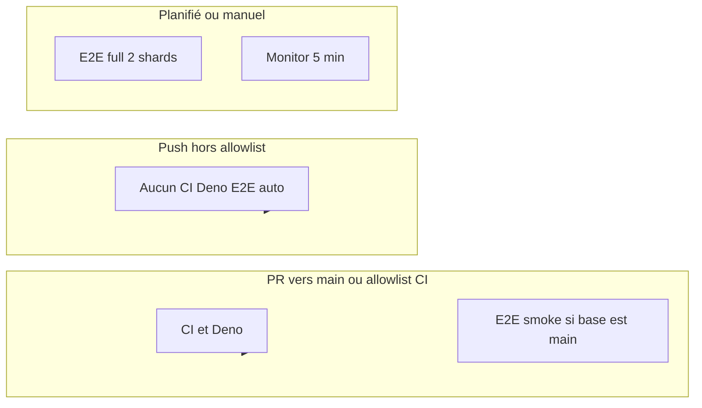

# GitHub Actions — inventory, branch coverage, KPIs, and runbook

**Maintained team doc** for CI/CD behavior (the Cursor plan file is not edited; this file is the source of truth in-repo).

**Prerequisites:** GitHub CLI `gh` with `repo` scope; repository default remote `benmed00/lucid-web-craftsman` (adjust commands if you fork).

### Audit closure (canonical deliverable)

This document **concludes** the CI/CD audit work for this repo: workflow inventory, empirical metrics (`gh`), branch semantics, strategy, KPIs, fallback, and validation steps. The Cursor **plan** file under `.cursor/plans/` is not the maintained artifact—**this file is.**

**Forks / other remotes:** In every `gh run list` / `gh api … --repo …` command, replace `benmed00/lucid-web-craftsman` with your **`owner/repo`** (see `git remote -v`). Metrics tables here reference the upstream remote used when the snapshot was taken.

**Team sign-off checklist (once per release policy change):**

- [ ] Branch policy above matches how PRs are opened (prefer **into `main`**).
- [ ] Retired long-lived branches are removed from [ci.yml](../.github/workflows/ci.yml) / [deno-create-payment.yml](../.github/workflows/deno-create-payment.yml).
- [ ] Optional YAML widenings (CI/E2E bases, Monitor cron) are either **rejected** or tracked as **separate PRs** with KPI before/after.

---

## Workflow inventory

| Workflow file                                                                                   | Display name           |
| ----------------------------------------------------------------------------------------------- | ---------------------- |
| [.github/workflows/ci.yml](../.github/workflows/ci.yml)                                         | CI                     |
| [.github/workflows/e2e.yml](../.github/workflows/e2e.yml)                                       | E2E                    |
| [.github/workflows/deno-create-payment.yml](../.github/workflows/deno-create-payment.yml)       | Deno create-payment    |
| [.github/workflows/monitor-payment-events.yml](../.github/workflows/monitor-payment-events.yml) | Monitor payment events |

There are no other workflow YAML files under `.github/workflows/`.

### Complexity (design load)

| Workflow                   | Complexity  | Notes                                                                                                                                           |
| -------------------------- | ----------- | ----------------------------------------------------------------------------------------------------------------------------------------------- |
| **CI**                     | Medium–high | Single job, many sequential steps: install → lint → format → Deno bundling → OpenAPI/Postman drift → typecheck → unit tests → build.            |
| **E2E**                    | High        | Cypress + dev stack; full suite uses 2 shards (`fail-fast: false`). PR/push automation only when **`main`** is the branch involved (see below). |
| **Deno create-payment**    | Medium–high | `deno check/lint/test` for create-payment and create-admin-user, pricing-snapshot guard, bundled helper tests.                                  |
| **Monitor payment events** | Low         | `curl` + `jq`; cron every **5 minutes** → ~**8 640** runs/month (30-day month: `12×24×30`). Baseline Actions load independent of PRs.           |

---

## Branch coverage (CI / E2E semantics)

GitHub: `pull_request.branches` / `push.branches` are the **base branch** (for PRs) or the branch **receiving the push**.

### CI + Deno create-payment (same allowlist as [ci.yml](../.github/workflows/ci.yml))

| Situation                                                                                               | CI + Deno? |
| ------------------------------------------------------------------------------------------------------- | ---------- |
| Push on a branch **other** than `main`, `feat/backend-migration-and-cypress`, `yakov/git-state-cleanup` | No         |
| PR **into** one of those three branches                                                                 | Yes        |
| PR **into** any other base branch                                                                       | No         |

**Gap:** work pushed only on a feature branch (no PR yet, or PR into a non-allowlisted base) gets **no** automated CI/Deno on GitHub.

### E2E ([e2e.yml](../.github/workflows/e2e.yml))

| Situation                                                        | E2E smoke (PR/push automation)?                                          |
| ---------------------------------------------------------------- | ------------------------------------------------------------------------ |
| PR `feature/foo` → **`main`**                                    | Yes                                                                      |
| PR `feature/foo` → another base (e.g. long-lived staging branch) | No                                                                       |
| Push on `feature/foo` only                                       | No (only `main` counts for the configured `push`/`pull_request` filters) |

---

## Team policy (branch coverage)

**Decision for this repo:**

1. **Merge target for product work:** Prefer **PRs into `main`** so CI, Deno, and E2E smoke all run on the same path as [AGENTS.md](../AGENTS.md) / [STANDARDS.md](./STANDARDS.md).
2. **Long-lived integration branches** (`feat/backend-migration-and-cypress`, `yakov/git-state-cleanup`): Kept in workflow allowlists **only while active**; remove from `ci.yml` / `deno-create-payment.yml` when the branch is retired to avoid dead config.
3. **Widening CI to “every PR regardless of base”:** Defer unless the team routinely opens PRs into non-`main` bases and needs gates there; it increases minutes. If adopted, prefer **`pull_request` without a narrow `branches` filter** (or add explicit bases) in a **small dedicated PR** with a measured baseline (this doc, KPI section).

---

## Global CI/CD strategy (aligned with this repo)

### Tiered pipeline: fail fast, then expensive

1. **Cheap checks first** — CI already runs lint → format early; optional future split (fast job vs heavy Deno bundling) only if **measured** queue pain — see [Optional CI job split](#optional-ci-job-split-and-path-filters-when-to-consider).
2. **Unit tests and build** before relying on E2E; E2E smoke on **`main`** only for PR/push automation is intentional separation.
3. **E2E smoke** on PRs targeting `main` — quick browser signal.
4. **Full E2E** on weekly schedule + `workflow_dispatch` — right place for long runs.
5. **Deno workflow** — keep branch filters **in sync** with [ci.yml](../.github/workflows/ci.yml) (noted in [deno-create-payment.yml](../.github/workflows/deno-create-payment.yml)).

### Overlapping gates (CI vs Deno)

[ci.yml](../.github/workflows/ci.yml) runs `check:edge-functions:bundling:full`; [deno-create-payment.yml](../.github/workflows/deno-create-payment.yml) runs deep Deno tests and pricing guards. Both can fail on edge changes — **acceptable** if failures are different classes (bundle vs unit/guard). Locally: `pnpm run validate` and `pnpm run verify:create-payment` before pushing edge work.

### Observability when something breaks

| Workflow                | Where to look first                                                                         |
| ----------------------- | ------------------------------------------------------------------------------------------- |
| **CI**                  | Failed **step** name in the job log (Lint, OpenAPI, Build, …).                              |
| **E2E**                 | Artifact name: `cypress-screenshots-smoke` vs `cypress-screenshots-full-shard-N`.           |
| **Deno create-payment** | Job **Summary** and artifact `pricing-snapshot-guard-report`.                               |
| **Monitor**             | Supabase function logs / `payment_events_critical`; workflow logs for `severity` / `count`. |

### Speed vs reliability

- **Concurrency** `cancel-in-progress: true` on CI, E2E, Deno, Monitor — avoids stale runs (explains many **cancelled** E2E runs).
- **E2E full** matrix uses `fail-fast: false` — both shards run even if one fails.

### Optional improvements (only if needed)

- **`workflow_run`** or status badges — docs/visibility only unless you automate merges.
- **`GITHUB_STEP_SUMMARY`** on CI — optional Markdown for first failing command (advanced).
- **`paths` / `paths-ignore`** — see [Optional CI job split](#optional-ci-job-split-and-path-filters-when-to-consider).

### Summary — branch filters, E2E, Monitor

| Topic                                | Risk if ignored                                                            | Mitigation                                                                                   |
| ------------------------------------ | -------------------------------------------------------------------------- | -------------------------------------------------------------------------------------------- |
| CI on three base branches only       | No GitHub gate on push-only feature work or PRs into non-allowlisted bases | Prefer PRs into `main`; widen `pull_request` if needed                                       |
| E2E not on every “feature branch” PR | No Cypress when PR **base ≠ `main`**                                       | Extend [e2e.yml](../.github/workflows/e2e.yml) `branches` for long-lived staging bases       |
| Monitor every 5 min                  | ~8 640 scheduler runs/month on default math                                | Space cron, external probe, or accept cost; see [Monitor cadence](#monitor-cadence-and-cost) |

---

## Proving impact after workflow changes

1. **Before** changing YAML: capture baseline (2–4 weeks or **30 runs**): median/P90 duration, failure rate, Actions minutes (billing), E2E flake vs real (manual).
2. **After** deploy: same window and metrics — compare **median** and rates, not single runs.
3. **Success examples:** lower minutes without higher merge failure rate; Monitor SLO still met after cron change.
4. **Watch for harm:** PR time-to-green or failure rate **worsens** — treat as regression even if minutes drop.

**Limits:** Failure rates and durations are **not** in git; they come from GitHub (`gh run list`, Actions UI, billing). Refresh the [metrics table](#snapshot-last-30-runs-per-workflow-github-api-via-gh) after meaningful workflow changes.

---

## Characteristics and recent run metrics

Repo-defined triggers and behavior:

| Workflow                | Triggers                                                                 | Jobs                       | Secrets                         | Artifacts on failure            |
| ----------------------- | ------------------------------------------------------------------------ | -------------------------- | ------------------------------- | ------------------------------- |
| **CI**                  | `push`/`pull_request` on the three allowlisted branches                  | 1 job                      | None in YAML                    | None                            |
| **E2E**                 | `push`/`pull_request` on **main** only; `workflow_dispatch`; weekly full | Smoke 1 job; full 2 shards | `CYPRESS_*` ×4                  | Cypress screenshots             |
| **Deno create-payment** | Same branches as CI                                                      | 1 job                      | None                            | `pricing-snapshot-guard-report` |
| **Monitor**             | Cron `*/5 * * * *`; `workflow_dispatch`                                  | 1 job                      | Supabase URL/key, monitor token | None                            |

### Snapshot: last 30 runs per workflow (GitHub API via `gh`)

**Last refreshed:** 2026-05-09 (closure pass; re-run the commands below to update). **Repo:** `benmed00/lucid-web-craftsman` · **Window:** last 30 completed workflow runs per file (`gh run list`).

| Workflow                   | Success | Failure | Cancelled | Fail % (fail / (fail+success)) | Median duration (all runs) | Median duration (success only) | P90 duration (success only) |
| -------------------------- | ------- | ------- | --------- | ------------------------------ | -------------------------- | ------------------------------ | --------------------------- |
| **CI**                     | 7       | 21      | 2         | **75%**                        | ~0.8 min                   | ~2.3 min                       | ~2.5 min                    |
| **E2E**                    | 12      | 4       | 14        | **25%**                        | ~2.4 min                   | ~8.3 min                       | ~8.6 min                    |
| **Deno create-payment**    | 30      | 0       | 0         | **0%**                         | ~0.4 min                   | ~0.4 min                       | ~0.6 min                    |
| **Monitor payment events** | 30      | 0       | 0         | **0%**                         | ~0.2 min                   | ~0.2 min                       | ~0.3 min                    |

**Interpretation:** Short **median wall time on failing CI** runs usually means **fail-fast** (early step). Use **success-only** duration as “typical green CI” (~2.3 min in this snapshot). **E2E** has many **cancelled** runs (concurrency `cancel-in-progress`); fail % is over non-cancelled outcomes only.

**Refresh locally:**

```powershell
# From repo root; set GH_REPO or use --repo owner/name
gh run list --workflow ci.yml --limit 30 --json conclusion,startedAt,updatedAt
```

Repeat for `e2e.yml`, `deno-create-payment.yml`, `monitor-payment-events.yml`.

### CI failure triage (sampled)

For **`benmed00/lucid-web-craftsman`**, run **`25406442354`** (failed **2026-05-05**) failed at step **`Format check`** (`pnpm run format:check` / Prettier); later steps were skipped. Several consecutive failures on **`main`** match **early exit at lint/format**, not Deno or build.

**Remediation:** Run **`pnpm run format`** (or `pnpm run validate`) before push; fix Prettier drift so CI does not burn cycles red.

**Cadence:** After fixing formatting on default branch, re-sample **`gh run list --workflow ci.yml`** and update the [snapshot table](#snapshot-last-30-runs-per-workflow-github-api-via-gh)—fail % should drop once greens outnumber historic reds.

---

## Optional workflow YAML changes (deferred policy)

The audit **does not require** edits to `.github/workflows/*.yml`. Implement only via **focused PRs** after explicit decision:

| Change                                         | Files                                                                                                          | When                                                     |
| ---------------------------------------------- | -------------------------------------------------------------------------------------------------------------- | -------------------------------------------------------- |
| CI/Deno on more PR bases                       | [ci.yml](../.github/workflows/ci.yml), [deno-create-payment.yml](../.github/workflows/deno-create-payment.yml) | Team often targets non-allowlisted bases and needs gates |
| E2E smoke on a long-lived staging base         | [e2e.yml](../.github/workflows/e2e.yml)                                                                        | Same                                                     |
| Reduce Monitor frequency or move probe off GHA | [monitor-payment-events.yml](../.github/workflows/monitor-payment-events.yml)                                  | Minutes cost or SLO trade-off accepted                   |

Record KPI baseline **before** and refresh this doc **after** merge.

---

## Monitor cadence and cost

- **Current:** every **5 minutes** → ~**8 640** runs/month (30-day month). Order of magnitude **~8.6k–8.8k** if counting differently.
- **If GitHub minutes or scheduler load matters:** consider **`*/15 * * * *`** (~**2 880** runs/month) or move probing to **Supabase Cron / external monitor**, keeping [monitor-payment-events.yml](../.github/workflows/monitor-payment-events.yml) on **`workflow_dispatch`** for manual checks.
- **Alerting:** On `critical`, the workflow fails — add **GitHub notification rules** (email/Slack/webhook) for workflow failures on default branch if not already configured.

---

## Optional CI job split and path filters (when to consider)

**Do not change** [.github/workflows/ci.yml](../.github/workflows/ci.yml) until **measured** pain (queue time, median duration **on success** trending up).

**If** CI success median exceeds your KPI ceiling or queue blocks the team:

1. Add **parallel jobs** only after profiling: e.g. fast job (`lint`, `format:check`, `type:check`) vs heavier (`edge bundling`, `test:unit`, `build`) — watch **duplicate `pnpm install`** cost.
2. **`paths` / `paths-ignore`:** e.g. skip full CI for `docs/**`-only PRs — **trade-off:** risk missing doc-adjacent checks; document exceptions in PR template.

Record any YAML change in a PR that updates **this file’s KPI snapshot** after merge.

---

## KPIs — baseline, targets, and regression ceilings

Replace **snapshot** rows after each workflow change. **Plafonds** trigger review or revert per team process.

| Metric                            | Window   | Baseline (snapshot 2026-05-09)                                              | Target (after a deliberate change)      | Max acceptable regression            |
| --------------------------------- | -------- | --------------------------------------------------------------------------- | --------------------------------------- | ------------------------------------ |
| Median CI duration (success only) | 30 runs  | ~2.3 min                                                                    | e.g. −10% vs new baseline               | +15% vs baseline                     |
| P90 CI duration (success only)    | 30 runs  | ~2.5 min                                                                    | Improve or hold                         | +20% vs baseline                     |
| CI fail % (excl. cancelled)       | 30 runs  | **75%**                                                                     | Reduce toward org target (e.g. &lt;10%) | +5 pts absolute vs post-fix baseline |
| Median E2E smoke (success only)   | 30 runs  | ~8.3 min                                                                    | Hold or −10%                            | +25%                                 |
| E2E fail % (excl. cancelled)      | 30 runs  | **25%**                                                                     | Reduce flake / infra noise              | +5 pts or “3 flakes/week” policy     |
| Deno workflow fail %              | 30 runs  | 0%                                                                          | ≤ baseline                              | +3 pts (stricter: any sustained red) |
| Monitor runs/month                | calendar | ~8 640 @ 5 min                                                              | Lower only if SLO allows                | N/A — track **max detection delay**  |
| Actions minutes (org billing)     | month    | TBD — record once from GitHub **Settings → Billing → Minutes** (org owners) | e.g. −10–20% if optimizing              | +10% if goal was reduction           |

**Decision rule (recommended):** If **two** of: median CI (success), CI fail %, E2E smoke fail % breach their ceiling over the agreed window → **fallback** (revert or corrective PR).

---

## Fallback playbook (workflow changes)

| Scenario                              | Action                                                                           |
| ------------------------------------- | -------------------------------------------------------------------------------- |
| Broken workflow YAML                  | Revert the commit/PR that touched `.github/workflows/`                           |
| New job slow/flaky                    | Prefer **revert**; avoid long-lived `if: false`                                  |
| E2E / secrets                         | Restore previous matrix/suite; run **Actions → E2E → Run workflow** with `smoke` |
| Monitor noisy / missing secrets       | Restore previous cron; or disable schedule, keep **`workflow_dispatch`** only    |
| Bad merge already consumed downstream | Branch protection + revert; coordinate                                           |

**After any workflow edit:** run **3–5** Actions runs on a test PR or default branch; compare to KPI table.

---

## Validation before/after workflow edits

| Phase      | Command / action                                                                                                        |
| ---------- | ----------------------------------------------------------------------------------------------------------------------- |
| Local      | `pnpm run validate`, `pnpm run verify:create-payment`, optional `pnpm run e2e:ci:smoke` (see [AGENTS.md](../AGENTS.md)) |
| PR         | Small PR; target branch in allowlist so CI runs                                                                         |
| Post-merge | Watch Actions; compare metrics snapshot in this doc                                                                     |

**Negative tests to watch:** wrong `paths` filters, disabled `concurrency`, Monitor cron too sparse for incident SLO.

---

## Change impact — surface and blast radius

| File                         | Who is affected                     | Blast radius                                     |
| ---------------------------- | ----------------------------------- | ------------------------------------------------ |
| `ci.yml`                     | All merges gated by CI              | High                                             |
| `e2e.yml`                    | Release confidence / UI regressions | Medium–high                                      |
| `deno-create-payment.yml`    | Edge/pricing paths                  | Medium                                           |
| `monitor-payment-events.yml` | Ops alerting (not app compile)      | Low on code; **high** if alerts are wrong/missed |

---

## Diagram (automation coverage)



---

## Related docs

- [STANDARDS.md](./STANDARDS.md) — gates, `validate` vs CI
- [E2E-COVERAGE.md](./E2E-COVERAGE.md) — Cypress scope
- [cypress/README.md](../cypress/README.md) — local/CI commands
- [AGENTS.md](../AGENTS.md) — scripts and ports
