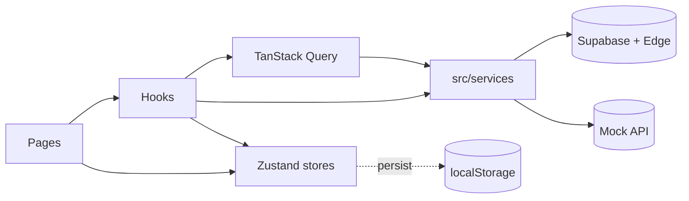

# Hooks catalog (React)

Maintained inventory of every hook-shaped API used by the SPA: where it lives, what it does, what it depends on, and whether it is covered by a dedicated unit test.

The companion conceptual primer (why hooks, when to use them, how to test them) is at the bottom of this file: jump to [Hooks primer](#hooks-primer-concepts).

## Where hooks live in this repo

| Location                                                        | Role                                                                                       |
| --------------------------------------------------------------- | ------------------------------------------------------------------------------------------ |
| [`src/hooks/`](../src/hooks/)                                   | Feature hooks: checkout, cart UI, catalog, admin orders, performance, i18n, infra.         |
| [`src/stores/`](../src/stores/)                                 | Zustand stores plus convenience hooks (`useCart`, `useTheme`, `useCurrency`, `useLocale`). |
| [`src/context/`](../src/context/)                               | Context hooks — currently `useAuth` / `useOptimizedAuth` and `useProfileActions`.          |
| [`src/lib/`](../src/lib/)                                       | Generic primitives (`useStableCallback`, `useDebouncedCallback`, page tracking).           |
| [`src/components/performance/`](../src/components/performance/) | Hook-shaped helpers colocated with the components that own them.                           |
| [`src/utils/`](../src/utils/)                                   | Wrappers around scheduling / FID utilities.                                                |
| [`src/hooks/use-toast.ts`](../src/hooks/use-toast.ts)           | shadcn/ui toast hook (legacy; `sonner` is the project-preferred toaster).                  |

## Counts

- **41 hook modules** under `src/hooks` (including `use-mobile.tsx` and `use-toast.ts`).
- **~65 named hook exports** across the repo when counting multi-export files (`useOrderManagement` exports 11, `useTranslatedContent` 6, `usePerformanceOptimization` 7, `useStableCallback` 4, `useCompanySettings` 3).
- **6 Zustand stores** (`cartStore`, `currencyStore`, `themeStore`, `languageStore`, `compareStore`, `uiStyleStore`) — each exports both a raw `useXxxStore` and one or more selector hooks.
- **~35+ hook modules** have dedicated Vitest `renderHook` (or co-located component hook) tests — see [Test coverage index](#test-coverage-index) and the **Test** column in the tables below. Integration-heavy hooks remain covered via page tests or Cypress (`useCheckoutPage`, `useProductsPage`).

## Testability tiers (guide)

Every hook **can** be mounted with `renderHook`; not every hook deserves the same **depth** of unit coverage.

| Tier            | Meaning                                                                                                  | Examples in this repo                                                                      |
| --------------- | -------------------------------------------------------------------------------------------------------- | ------------------------------------------------------------------------------------------ |
| **pure**        | Timers, local state, or pure derivations; minimal setup.                                                 | `useSafetyTimeout`, `usePagination`, `useCachedProductSearch`, `useProductRecommendations` |
| **wrapper**     | Needs `QueryClientProvider`, `MemoryRouter`, `AuthProvider`, or `I18nextProvider`.                       | `useOrders`, `useWishlist`, `useTranslatedContent`, `useAdminAuth`                         |
| **stub**        | Polyfill or spy on browser APIs (`matchMedia`, `IntersectionObserver`, `Image`, touch events).           | `useIsMobile`, `useInfiniteScroll`, `usePullToRefresh`, `useCriticalResourceLoading`       |
| **service**     | Stub `@/services/*` or Supabase client; assert IO boundaries.                                            | `useShipping`, `useStock`, `useCheckoutSession`, `useBusinessRules`                        |
| **integration** | Composes many hooks; duplicating it in a hook-only test overlaps page/E2E coverage.                      | `useCheckoutPage`, `useProductsPage`                                                       |
| **low-value**   | Ultra-thin pass-through; smoke test or skip.                                                             | `useCartUI` (mocked `useCart`), `useTaskScheduler`, `useMainThreadOptimizer`               |
| **not-unit**    | Realtime transport, production metrics, or dynamic `import()` preloads — smoke or E2E only beyond stubs. | `useOrderRealtimeUpdates` (channel semantics), `useRoutePreloading` (network chunks)       |

**Mocks:** Prefer **`vi.mock('@/services/...')`** at the module boundary; mirror return types from [`DATA_TYPES.md`](./DATA_TYPES.md). Reset mocks in `beforeEach` / `afterEach`. For TanStack Query hooks, use a **fresh `QueryClient`** per test with `retry: false`.

## Inventory tables

Legend for the **Test** column:

- **direct** — dedicated `renderHook` test exists.
- **indirect** — exercised through a page/component test or Cypress flow only.
- **none** — not covered.

Legend for the **Tier** column (testability — how much effort a meaningful unit test costs):

- **pure** — trivial: just `renderHook`, optionally fake timers / storage stubs.
- **wrapper** — needs a provider wrapper (`AuthProvider`, `QueryClientProvider`, `MemoryRouter`, `I18nextProvider`).
- **stub** — needs a browser-API stub (`matchMedia`, `IntersectionObserver`, touch events, `crypto.subtle`, dynamic `import()`).
- **service** — needs `vi.mock` on `@/services/*` or the Supabase client.
- **integration** — the hook composes many others; cover it via page tests or Cypress instead of duplicating logic at the hook level.
- **low-value** — code is so thin a unit test only re-asserts pass-through (Zustand selectors, singleton wrappers).
- **not-unit** — depends on real browser/runtime behavior (realtime, perf metrics, dynamic preloads); use integration tests or production telemetry.

### `src/hooks/` — checkout and cart

| Hook                         | File                                                                          | Purpose                                                                                                                                                                             | Deps                                                         | Tier              | Test                                                                                               |
| ---------------------------- | ----------------------------------------------------------------------------- | ----------------------------------------------------------------------------------------------------------------------------------------------------------------------------------- | ------------------------------------------------------------ | ----------------- | -------------------------------------------------------------------------------------------------- |
| `useCheckoutPage`            | [`useCheckoutPage.ts`](../src/hooks/useCheckoutPage.ts) (`checkout/` helpers: totals, promo, steps, payment, hydration) | Page-level orchestrator: wires cart, currency, CSRF, business rules, guest/auth, session, persistence, validation, Stripe loader into one return object consumed by `Checkout.tsx`. | many hooks                                                   | integration       | indirect ([`Checkout.test.tsx`](../src/pages/Checkout.test.tsx)), [`checkoutPageTotals.test.ts`](../src/hooks/checkout/checkoutPageTotals.test.ts) |
| `useCheckoutSession`         | [`useCheckoutSession.ts`](../src/hooks/useCheckoutSession.ts)                 | Tracks `checkout_sessions` row for analytics/recovery. In-memory only for elevated storefront users; lazy DB insert on first persist.                                               | Supabase, React Query, `useGuestSession`, `useOptimizedAuth` | service + wrapper | direct ([`useCheckoutSession.test.tsx`](../src/hooks/useCheckoutSession.test.tsx))                 |
| `useCheckoutFormPersistence` | [`useCheckoutFormPersistence.ts`](../src/hooks/useCheckoutFormPersistence.ts) | Persists checkout draft (form data, step, coupon) to localStorage + optional DB snapshot, with elevated-user carve-out.                                                             | safeStorage, `checkoutApi`, `profileApi`                     | service + wrapper | direct ([`useCheckoutFormPersistence.test.tsx`](../src/hooks/useCheckoutFormPersistence.test.tsx)) |
| `useCheckoutResume`          | [`useCheckoutResume.ts`](../src/hooks/useCheckoutResume.ts)                   | Detects a saved checkout draft on mount; returns `{ hasPendingCheckout, savedStep, isExpired }` for the resume banner.                                                              | safeStorage, `getCheckoutStorageKeys`                        | pure              | direct ([`useCheckoutResume.test.ts`](../src/hooks/useCheckoutResume.test.ts))                     |
| `useGuestSession`            | [`useGuestSession.ts`](../src/hooks/useGuestSession.ts)                       | GDPR-compliant guest identity with server-signed tokens, device metadata, localStorage TTL.                                                                                         | safeStorage, Supabase                                        | service           | direct ([`useGuestSession.test.ts`](../src/hooks/useGuestSession.test.ts))                         |
| `usePromoCode`               | [`usePromoCode.ts`](../src/hooks/usePromoCode.ts)                             | Validates and applies discount coupons (`validate_coupon_code` RPC); exposes `discount`, `hasFreeShipping`.                                                                         | `checkoutApi`, `useCurrency`                                 | service           | direct ([`usePromoCode.test.ts`](../src/hooks/usePromoCode.test.ts))                               |
| `useBusinessRules`           | [`useBusinessRules.ts`](../src/hooks/useBusinessRules.ts)                     | Loads cart/wishlist/checkout limits from `app_settings`, with sensible defaults and an imperative `getBusinessRules()` getter.                                                      | `appSettingsApi`                                             | service           | direct ([`useBusinessRules.test.ts`](../src/hooks/useBusinessRules.test.ts))                       |
| `useShipping`                | [`useShipping.ts`](../src/hooks/useShipping.ts)                               | Calculates shipping cost/zones for a postal code + order amount.                                                                                                                    | `shippingService`, `useCurrency`                             | service           | direct ([`useShipping.test.ts`](../src/hooks/useShipping.test.ts))                                 |
| `useCsrfToken`               | [`useCsrfToken.ts`](../src/hooks/useCsrfToken.ts)                             | Generates and rotates a CSRF token + nonce in `sessionStorage`; exposes header helpers for Edge invokes.                                                                            | Web Crypto                                                   | stub              | direct ([`useCsrfToken.test.ts`](../src/hooks/useCsrfToken.test.ts))                               |
| `useCartUI`                  | [`useCartUI.ts`](../src/hooks/useCartUI.ts)                                   | Thin selector over `useCart` that returns badge color, item count, sync status for the nav cart pill.                                                                               | `useCart` (Zustand)                                          | wrapper           | direct ([`useCartUI.test.ts`](../src/hooks/useCartUI.test.ts))                                     |
| `useCartSyncListeners`       | [`useCartSync.ts`](../src/hooks/useCartSync.ts)                               | Subscribes to `online`/`offline` and Supabase auth events; forwards transitions to the cart store.                                                                                  | `cartApi`                                                    | service           | direct ([`useCartSync.test.ts`](../src/hooks/useCartSync.test.ts))                                 |
| `useDebouncedCartSave`       | [`useCartSync.ts`](../src/hooks/useCartSync.ts)                               | Debounces cart writes (default 500 ms) before persisting via `cartSyncService`.                                                                                                     | refs, timers                                                 | service           | direct ([`useCartSync.test.ts`](../src/hooks/useCartSync.test.ts))                                 |

### `src/hooks/` — catalog and product UX

| Hook                          | File                                                                        | Purpose                                                                                                             | Deps                                    | Tier              | Test                                                                                             |
| ----------------------------- | --------------------------------------------------------------------------- | ------------------------------------------------------------------------------------------------------------------- | --------------------------------------- | ----------------- | ------------------------------------------------------------------------------------------------ |
| `useProductsPage`             | [`useProductsPage.ts`](../src/hooks/useProductsPage.ts)                     | Page-level orchestrator for the catalog: filters, pagination/infinite scroll, mobile flag, batch stock, quick view. | many hooks                              | integration       | indirect (Cypress catalog specs)                                                                 |
| `useProductFilters`           | [`useProductFilters.ts`](../src/hooks/useProductFilters.ts)                 | URL-synced category/price/sort/search/inStock/isNew filter state.                                                   | `react-router-dom`                      | wrapper           | direct ([`useProductFilters.test.tsx`](../src/hooks/useProductFilters.test.tsx))                 |
| `useAdvancedProductFilters`   | [`useAdvancedProductFilters.ts`](../src/hooks/useAdvancedProductFilters.ts) | Extended filters with deferred values, search history, optional analytics logging.                                  | `useCachedProductSearch`, `activityApi` | wrapper + service | direct ([`useAdvancedProductFilters.test.tsx`](../src/hooks/useAdvancedProductFilters.test.tsx)) |
| `useCachedProductSearch`      | [`useCachedProductSearch.ts`](../src/hooks/useCachedProductSearch.ts)       | Memoized scoring + filtering over a product list for the advanced filter hook.                                      | `useMemo`                               | pure              | direct ([`useCachedProductSearch.test.ts`](../src/hooks/useCachedProductSearch.test.ts))         |
| `useProductRecommendations`   | [`useProductRecommendations.ts`](../src/hooks/useProductRecommendations.ts) | Computes ranked recommendations from current product, recently viewed, and full catalog.                            | `useMemo`                               | pure              | direct ([`useProductRecommendations.test.ts`](../src/hooks/useProductRecommendations.test.ts))   |
| `useRecentlyViewed`           | [`useRecentlyViewed.ts`](../src/hooks/useRecentlyViewed.ts)                 | Persists the last 10 viewed products in `safeStorage`.                                                              | safeStorage                             | pure              | direct ([`useRecentlyViewed.test.ts`](../src/hooks/useRecentlyViewed.test.ts))                   |
| `useStock` (overloaded)       | [`useStock.ts`](../src/hooks/useStock.ts)                                   | Fetches stock for a single product or batch; exposes reserve/update helpers.                                        | `stockService`                          | service           | direct ([`useStock.test.ts`](../src/hooks/useStock.test.ts))                                     |
| `useBatchStock`               | [`useBatchStock.ts`](../src/hooks/useBatchStock.ts)                         | Lighter batch-stock fetcher used by listings (avoids N+1).                                                          | `stockService`                          | service           | direct ([`useBatchStock.test.ts`](../src/hooks/useBatchStock.test.ts))                           |
| `useReviews`                  | [`useReviews.ts`](../src/hooks/useReviews.ts)                               | Loads approved reviews, stats, and the current user's review for a product; handles helpful/submit.                 | `reviewsApi`, `useAuth`                 | service + wrapper | direct ([`useReviews.test.tsx`](../src/hooks/useReviews.test.tsx))                               |
| `useHeroImage`                | [`useHeroImage.ts`](../src/hooks/useHeroImage.ts)                           | Hydrates hero image from localStorage cache, then refreshes from Supabase after 3 s.                                | `heroImageService`                      | service           | direct ([`useHeroImage.test.ts`](../src/hooks/useHeroImage.test.ts))                             |
| `useImageLoader`              | [`useImageLoader.ts`](../src/hooks/useImageLoader.ts)                       | Cascading-fallback image loader with category-aware optimization.                                                   | `imageService`                          | service           | direct ([`useImageLoader.test.ts`](../src/hooks/useImageLoader.test.ts))                         |
| `useInfiniteScroll` (generic) | [`useInfiniteScroll.ts`](../src/hooks/useInfiniteScroll.ts)                 | IntersectionObserver-based "load more" pattern.                                                                     | DOM                                     | stub              | direct ([`useInfiniteScroll.test.ts`](../src/hooks/useInfiniteScroll.test.ts))                   |
| `usePagination` (generic)     | [`usePagination.ts`](../src/hooks/usePagination.ts)                         | Page math + helpers for any item list.                                                                              | `useState`                              | pure              | direct ([`usePagination.test.ts`](../src/hooks/usePagination.test.ts))                           |
| `usePullToRefresh`            | [`usePullToRefresh.ts`](../src/hooks/usePullToRefresh.ts)                   | Touch-gesture pull-to-refresh; exposes `pullDistance`, `isRefreshing`.                                              | touch events                            | stub              | direct ([`usePullToRefresh.test.tsx`](../src/hooks/usePullToRefresh.test.tsx))                     |

### `src/hooks/` — admin and orders

| Hook                      | File                                                            | Purpose                                                                                            | Deps                                           | Tier              | Test                                                                                                             |
| ------------------------- | --------------------------------------------------------------- | -------------------------------------------------------------------------------------------------- | ---------------------------------------------- | ----------------- | ---------------------------------------------------------------------------------------------------------------- |
| `useOrders`               | [`useOrderManagement.ts`](../src/hooks/useOrderManagement.ts)   | TanStack Query for admin orders list with filters.                                                 | React Query, `adminOrdersApi`                  | wrapper + service | direct ([`useOrderManagement.test.tsx`](../src/hooks/useOrderManagement.test.tsx))                               |
| `useOrder`                | same                                                            | Fetches a single order with details.                                                               | React Query                                    | wrapper + service | direct (same file)                                                                                               |
| `useOrderHistory`         | same                                                            | Loads status history rows.                                                                         | React Query                                    | wrapper + service | direct (same file)                                                                                               |
| `useOrderAnomalies`       | same                                                            | Loads anomaly rows (optionally unresolved only).                                                   | React Query                                    | wrapper + service | direct (same file)                                                                                               |
| `useValidTransitions`     | same                                                            | Returns valid status transitions for a given current status.                                       | React Query                                    | wrapper + service | direct (same file)                                                                                               |
| `useOrderStats`           | same                                                            | Aggregates the order stats projection into KPI buckets.                                            | React Query                                    | wrapper + service | direct (same file)                                                                                               |
| `useUpdateOrderStatus`    | same                                                            | Mutation calling `update_order_status` RPC with toasts + invalidation.                             | React Query                                    | wrapper + service | direct (same file)                                                                                               |
| `useResolveAnomaly`       | same                                                            | Mutation calling `resolve_order_anomaly` RPC.                                                      | React Query                                    | wrapper + service | direct (same file)                                                                                               |
| `useCustomerOrder`        | same                                                            | Customer-facing single-order view via `get_order_customer_view`.                                   | React Query                                    | wrapper + service | direct (same file)                                                                                               |
| `useCustomerOrders`       | same                                                            | Customer-facing list (`fetchCustomerOrdersSummaryList`).                                           | React Query                                    | wrapper + service | direct (same file)                                                                                               |
| `useOrderRealtimeUpdates` | same                                                            | Supabase realtime subscription to `orders` table updates with cache invalidation.                  | Supabase Realtime                              | not-unit          | direct ([`useOrderManagement.test.tsx`](../src/hooks/useOrderManagement.test.tsx) — subscribe + payload handler) |
| `useAdminAuth`            | [`useAdminAuth.ts`](../src/hooks/useAdminAuth.ts)               | Derives admin/super-admin flag and `adminUser` from `useAuth` + RBAC helpers.                      | `useAuth`, `lib/rbac`                          | wrapper           | direct ([`useAdminAuth.test.tsx`](../src/hooks/useAdminAuth.test.tsx))                                           |
| `useReauthentication`     | [`useReauthentication.ts`](../src/hooks/useReauthentication.ts) | Re-checks password via Supabase for sensitive admin actions.                                       | `authApi`, `useAuth`                           | wrapper + service | direct ([`useReauthentication.test.tsx`](../src/hooks/useReauthentication.test.tsx))                             |
| `useAuditLog`             | [`useAuditLog.ts`](../src/hooks/useAuditLog.ts)                 | Sends audit log entries (action / entity / details) under the current user.                        | `useAuth`                                      | wrapper + service | direct ([`useAuditLog.test.tsx`](../src/hooks/useAuditLog.test.tsx))                                             |
| `useMaintenanceMode`      | [`useMaintenanceMode.ts`](../src/hooks/useMaintenanceMode.ts)   | Subscribes to `display_settings` for site-wide maintenance flag/message.                           | `appSettingsApi`                               | service           | direct ([`useMaintenanceMode.test.ts`](../src/hooks/useMaintenanceMode.test.ts))                                 |
| `useCompanySettings`      | [`useCompanySettings.ts`](../src/hooks/useCompanySettings.ts)   | Loads company info from `app_settings` with module-level cache + defaults.                         | `appSettingsApi`                               | service           | direct ([`useCompanySettings.test.ts`](../src/hooks/useCompanySettings.test.ts))                                 |
| `useCompanyAddress`       | same                                                            | Selector over `useCompanySettings`.                                                                | —                                              | low-value         | direct (same file)                                                                                               |
| `useCompanyContact`       | same                                                            | Selector over `useCompanySettings`.                                                                | —                                              | low-value         | direct (same file)                                                                                               |
| `useWishlist`             | [`useWishlist.ts`](../src/hooks/useWishlist.ts)                 | Wishlist read/write via React Query; handles elevated-user localStorage path and cart-sync policy. | React Query, `wishlistApi`, `useOptimizedAuth` | wrapper + service | direct ([`useWishlist.test.tsx`](../src/hooks/useWishlist.test.tsx))                                             |

### `src/hooks/` — infrastructure and performance

| Hook                                     | File                                                                          | Purpose                                                                                                                                                   | Deps                     | Tier              | Test                                                                                                                                                                  |
| ---------------------------------------- | ----------------------------------------------------------------------------- | --------------------------------------------------------------------------------------------------------------------------------------------------------- | ------------------------ | ----------------- | --------------------------------------------------------------------------------------------------------------------------------------------------------------------- |
| `useSafetyTimeout`                       | [`useSafetyTimeout.ts`](../src/hooks/useSafetyTimeout.ts)                     | Guarantees a loading state exits after `timeout` ms; intermediate `slowThreshold` flag. Callbacks stored in refs so timers are not reset on every render. | `useEffect`, `useRef`    | pure              | direct ([`useSafetyTimeout.diagnostics.test.tsx`](../src/hooks/useSafetyTimeout.diagnostics.test.tsx), [`ui-resilience.test.ts`](../src/tests/ui-resilience.test.ts)) |
| `useWebVitals`                           | [`useWebVitals.ts`](../src/hooks/useWebVitals.ts)                             | Lightweight Web Vitals navigation timing capture; runs once after `load`.                                                                                 | `performance` API        | not-unit          | direct ([`useWebVitals.test.ts`](../src/hooks/useWebVitals.test.ts))                                                                                                  |
| `useOptimizedQuery` / `useOptimizedData` | [`useOptimizedData.ts`](../src/hooks/useOptimizedData.ts)                     | Generic data fetcher backed by `UnifiedCache` (tags, TTLs, stale).                                                                                        | `lib/cache/UnifiedCache` | service           | direct ([`useOptimizedData.test.ts`](../src/hooks/useOptimizedData.test.ts))                                                                                          |
| `useOptimizedProducts`                   | same                                                                          | Pre-baked optimized fetch for active products.                                                                                                            | `productService`         | service           | direct (same file)                                                                                                                                                    |
| `useOptimizedOrders`                     | same                                                                          | Pre-baked optimized fetch for user orders.                                                                                                                | `orderService`           | service           | direct (same file)                                                                                                                                                    |
| `usePerformanceMonitor`                  | [`usePerformanceOptimization.ts`](../src/hooks/usePerformanceOptimization.ts) | Counts renders and average render time (perf debug).                                                                                                      | `performance.now`        | not-unit          | direct ([`usePerformanceOptimization.test.tsx`](../src/hooks/usePerformanceOptimization.test.tsx))                                                                    |
| `useOptimizedScroll`                     | same                                                                          | Throttled (`~60 fps`) window-scroll handler.                                                                                                              | DOM                      | stub              | direct ([`usePerformanceOptimization.test.tsx`](../src/hooks/usePerformanceOptimization.test.tsx))                                                                    |
| `useOptimizedResize`                     | same                                                                          | Debounced resize handler.                                                                                                                                 | DOM                      | stub              | direct (same file)                                                                                                                                                    |
| `useVirtualScrolling`                    | same                                                                          | Calculates a windowed item range for a tall list.                                                                                                         | `useMemo`                | pure              | direct (same file)                                                                                                                                                    |
| `useOptimizedImageLoading`               | same                                                                          | Image preload registry to avoid duplicate requests.                                                                                                       | `Image`                  | stub              | direct (same file)                                                                                                                                                    |
| `useMemoryOptimization`                  | same                                                                          | Registers cleanup tasks for unmount; optional dev-only `window.gc()`.                                                                                     | `useRef`                 | pure              | direct (same file)                                                                                                                                                    |
| `useCriticalResourceLoading`             | same                                                                          | Splits critical vs non-critical asset loading.                                                                                                            | `document.fonts`         | not-unit          | direct ([`usePerformanceOptimization.test.tsx`](../src/hooks/usePerformanceOptimization.test.tsx))                                                                    |
| `useABThemeTest`                         | [`useABThemeTest.ts`](../src/hooks/useABThemeTest.ts)                         | Sticky A/B theme assignment from DB, applied via `uiStyleStore`.                                                                                          | React Query, Supabase    | wrapper + service | direct ([`useABThemeTest.test.tsx`](../src/hooks/useABThemeTest.test.tsx))                                                                                            |
| `useCurrentLocale`                       | [`useTranslatedContent.ts`](../src/hooks/useTranslatedContent.ts)             | Returns the current locale from `react-i18next`.                                                                                                          | `react-i18next`          | wrapper           | direct ([`useTranslatedContent.test.tsx`](../src/hooks/useTranslatedContent.test.tsx))                                                                                |
| `useProductWithTranslation`              | same                                                                          | Single product + translation.                                                                                                                             | React Query              | wrapper + service | direct (same file)                                                                                                                                                    |
| `useProductsWithTranslations`            | same                                                                          | All products + translations (retry + GC config tuned for navigation).                                                                                     | React Query              | wrapper + service | direct (same file)                                                                                                                                                    |
| `useBlogPostWithTranslation`             | same                                                                          | Single blog post + translation.                                                                                                                           | React Query              | wrapper + service | direct (same file)                                                                                                                                                    |
| `useBlogPostBySlug`                      | same                                                                          | Blog post by slug + translation.                                                                                                                          | React Query              | wrapper + service | direct (same file)                                                                                                                                                    |
| `useBlogPostsWithTranslations`           | same                                                                          | All blog posts + translations.                                                                                                                            | React Query              | wrapper + service | direct (same file)                                                                                                                                                    |
| `useTagTranslations`                     | [`useTagTranslations.ts`](../src/hooks/useTagTranslations.ts)                 | Loads tag translation table (10 min cache).                                                                                                               | React Query              | wrapper + service | direct ([`useTagTranslations.test.tsx`](../src/hooks/useTagTranslations.test.tsx))                                                                                    |
| `useTranslateTag`                        | same                                                                          | Returns a `(tag, locale) => string` translator.                                                                                                           | `useTagTranslations`     | wrapper + service | direct (same file)                                                                                                                                                    |
| `useIsMobile`                            | [`use-mobile.tsx`](../src/hooks/use-mobile.tsx)                               | Reactive `< 768 px` viewport flag via `matchMedia`.                                                                                                       | `matchMedia`             | stub              | direct ([`use-mobile.test.tsx`](../src/hooks/use-mobile.test.tsx))                                                                                                    |
| `useToast`                               | [`use-toast.ts`](../src/hooks/use-toast.ts)                                   | shadcn/ui toast queue (legacy; project prefers `sonner` for new code).                                                                                    | reducer + listeners      | low-value         | direct ([`use-toast.test.tsx`](../src/hooks/use-toast.test.tsx))                                                                                                      |

### `src/stores/` — Zustand and selector hooks

| Hook                                      | File                                                 | Purpose                                                                                            | Tier        | Test                                                                    |
| ----------------------------------------- | ---------------------------------------------------- | -------------------------------------------------------------------------------------------------- | ----------- | ----------------------------------------------------------------------- |
| `useCartStore`                            | [`cartStore.ts`](../src/stores/cartStore.ts)         | Zustand cart state: items, sync flags, offline queue, persist, broadcast.                          | integration | indirect (Cypress cart specs)                                           |
| `useCart`                                 | same                                                 | React-facing facade over `useCartStore` — filters items to valid lines and exposes derived totals. | wrapper     | direct ([`useCart.hook.test.ts`](../src/stores/useCart.hook.test.ts))   |
| `useCurrencyStore`                        | [`currencyStore.ts`](../src/stores/currencyStore.ts) | Zustand currency + exchange rates with persistence.                                                | pure        | direct ([`currencyStore.test.ts`](../src/stores/currencyStore.test.ts)) |
| `useCurrency`                             | same                                                 | Selector hook returning `{ currency, formatPrice, convertPrice, ... }`.                            | low-value   | direct (same file)                                                      |
| `useThemeStore`                           | [`themeStore.ts`](../src/stores/themeStore.ts)       | Zustand theme state (`light`/`dark`/`system`), DOM class sync.                                     | pure        | direct ([`themeStore.test.ts`](../src/stores/themeStore.test.ts))       |
| `useTheme`                                | same                                                 | Selector hook returning `{ theme, resolvedTheme, setTheme, toggleTheme }`.                         | low-value   | direct (same file)                                                      |
| `useLanguageStore`                        | [`languageStore.ts`](../src/stores/languageStore.ts) | Zustand locale state mirroring `i18next`.                                                          | wrapper     | direct ([`languageStore.test.ts`](../src/stores/languageStore.test.ts)) |
| `useLocale` / `useSetLocale` / `useIsRTL` | same                                                 | Single-field selectors over the language store.                                                    | low-value   | direct (same file)                                                      |
| `useCompareStore`                         | [`compareStore.ts`](../src/stores/compareStore.ts)   | Compare list (max 3 products).                                                                     | pure        | direct ([`compareStore.test.ts`](../src/stores/compareStore.test.ts))   |
| `useUIStyleStore`                         | [`uiStyleStore.ts`](../src/stores/uiStyleStore.ts)   | `legacy` vs `modern` UI variant, applied as `data-ui-style` attribute.                             | pure        | direct ([`uiStyleStore.test.ts`](../src/stores/uiStyleStore.test.ts))   |

### `src/context/` — context hooks

| Hook                           | File                                                          | Purpose                                                                                                                                                          | Tier    | Test                                                                               |
| ------------------------------ | ------------------------------------------------------------- | ---------------------------------------------------------------------------------------------------------------------------------------------------------------- | ------- | ---------------------------------------------------------------------------------- |
| `useAuth` / `useOptimizedAuth` | [`AuthContext.tsx`](../src/context/AuthContext.tsx)           | Reads `AuthContext` (throws outside the provider); exposes user, role, loading, refresh helpers. `useOptimizedAuth` is an alias kept for backward compatibility. | wrapper | direct ([`AuthContext.test.tsx`](../src/context/AuthContext.test.tsx))             |
| `useProfileActions`            | [`useProfileManager.ts`](../src/context/useProfileManager.ts) | Memoized profile load/update callbacks (with module-level `profileCache`) wired into `AuthContext`.                                                              | service | direct ([`useProfileActions.test.tsx`](../src/context/useProfileActions.test.tsx)) |

### `src/lib/` — generic primitives

| Hook                   | File                                                            | Purpose                                                                   | Tier              | Test                                                                                |
| ---------------------- | --------------------------------------------------------------- | ------------------------------------------------------------------------- | ----------------- | ----------------------------------------------------------------------------------- |
| `useStableCallback`    | [`useStableCallback.ts`](../src/lib/hooks/useStableCallback.ts) | Returns a stable function reference that always calls the latest closure. | pure              | direct ([`useStableCallback.test.ts`](../src/lib/hooks/useStableCallback.test.ts))  |
| `useStableValue`       | same                                                            | Returns a memoized value, reused while a shallow/deep-equal check holds.  | pure              | direct (same file)                                                                  |
| `useDebouncedCallback` | same                                                            | Debounce a callback by `delay` ms with proper cleanup.                    | pure              | direct (same file)                                                                  |
| `useThrottledCallback` | same                                                            | Throttle a callback by `delay` ms.                                        | pure              | direct (same file)                                                                  |
| `usePageTracking`      | [`usePageTracking.ts`](../src/lib/tracking/usePageTracking.ts)  | Calls `trackPageView()` on every route change.                            | wrapper + service | direct ([`usePageTracking.test.tsx`](../src/lib/tracking/usePageTracking.test.tsx)) |

### `src/components/performance/` — colocated component hooks

| Hook                      | File                                                                                 | Purpose                                                                             | Tier      | Test                                                                                                                      |
| ------------------------- | ------------------------------------------------------------------------------------ | ----------------------------------------------------------------------------------- | --------- | ------------------------------------------------------------------------------------------------------------------------- |
| `useLazyStripe`           | [`LazyStripe.tsx`](../src/components/performance/LazyStripe.tsx)                     | Returns a `loadStripe()` that dynamic-imports `@stripe/stripe-js` only when needed. | low-value | direct ([`LazyStripe.hooks.test.tsx`](../src/components/performance/LazyStripe.hooks.test.tsx))                           |
| `useRoutePreloading`      | [`CodeSplittingWrapper.tsx`](../src/components/performance/CodeSplittingWrapper.tsx) | `preloadRoute(name)` triggers an early `import()` for known routes.                 | not-unit  | direct smoke ([`CodeSplittingWrapper.hooks.test.tsx`](../src/components/performance/CodeSplittingWrapper.hooks.test.tsx)) |
| `useOptimizedComputation` | [`PerformanceMonitor.tsx`](../src/components/performance/PerformanceMonitor.tsx)     | Runs a heavy computation through the `taskScheduler` and stores the result.         | stub      | direct ([`PerformanceMonitor.hooks.test.tsx`](../src/components/performance/PerformanceMonitor.hooks.test.tsx))           |

### `src/utils/` — scheduling helpers

| Hook                     | File                                                                              | Purpose                                                                                          | Tier      | Test                                                                                       |
| ------------------------ | --------------------------------------------------------------------------------- | ------------------------------------------------------------------------------------------------ | --------- | ------------------------------------------------------------------------------------------ |
| `useTaskScheduler`       | [`taskScheduler.ts`](../src/utils/taskScheduler.ts)                               | Wraps the global task scheduler (`schedule`, `scheduleBatch`, `scheduleChunked`, `yieldToMain`). | low-value | direct smoke ([`reactSchedulingHooks.test.ts`](../src/utils/reactSchedulingHooks.test.ts)) |
| `useMainThreadOptimizer` | [`mainThreadOptimizer.ts`](../src/utils/mainThreadOptimizer.ts)                   | Wraps `executeInWorker` / `executeBatch` from the main-thread optimizer instance.                | low-value | direct (same file)                                                                         |
| `useInputResponsiveness` | [`inputResponsivenessOptimizer.ts`](../src/utils/inputResponsivenessOptimizer.ts) | Wraps chunked array processing and yielding helpers (FID-friendly).                              | low-value | direct (same file)                                                                         |

## Test coverage index

The **Test** column in each inventory table is authoritative. Dedicated Vitest files include (non-exhaustive — grep `renderHook` under `src/` for the full set):

| Area             | Test file(s)                                                                                                                                                                                                                                                                                                                                                                                                                                                                                                                                                                                                                                                                                                                                                                                                                                                                                                                                                                                         |
| ---------------- | ---------------------------------------------------------------------------------------------------------------------------------------------------------------------------------------------------------------------------------------------------------------------------------------------------------------------------------------------------------------------------------------------------------------------------------------------------------------------------------------------------------------------------------------------------------------------------------------------------------------------------------------------------------------------------------------------------------------------------------------------------------------------------------------------------------------------------------------------------------------------------------------------------------------------------------------------------------------------------------------------------- |
| Auth / profile   | [`AuthContext.test.tsx`](../src/context/AuthContext.test.tsx), [`useProfileActions.test.tsx`](../src/context/useProfileActions.test.tsx)                                                                                                                                                                                                                                                                                                                                                                                                                                                                                                                                                                                                                                                                                                                                                                                                                                                             |
| Checkout / guest | [`useGuestSession.test.ts`](../src/hooks/useGuestSession.test.ts), [`useCheckoutResume.test.ts`](../src/hooks/useCheckoutResume.test.ts), [`useCheckoutFormPersistence.test.tsx`](../src/hooks/useCheckoutFormPersistence.test.tsx), [`useCheckoutSession.test.tsx`](../src/hooks/useCheckoutSession.test.tsx), [`usePromoCode.test.ts`](../src/hooks/usePromoCode.test.ts), [`useCsrfToken.test.ts`](../src/hooks/useCsrfToken.test.ts)                                                                                                                                                                                                                                                                                                                                                                                                                                                                                                                                                             |
| Cart / sync      | [`useCartUI.test.ts`](../src/hooks/useCartUI.test.ts), [`useCartSync.test.ts`](../src/hooks/useCartSync.test.ts), [`useCart.hook.test.ts`](../src/stores/useCart.hook.test.ts)                                                                                                                                                                                                                                                                                                                                                                                                                                                                                                                                                                                                                                                                                                                                                                                                                       |
| Catalog          | [`useProductFilters.test.tsx`](../src/hooks/useProductFilters.test.tsx), [`useAdvancedProductFilters.test.tsx`](../src/hooks/useAdvancedProductFilters.test.tsx), [`useCachedProductSearch.test.ts`](../src/hooks/useCachedProductSearch.test.ts), [`useProductRecommendations.test.ts`](../src/hooks/useProductRecommendations.test.ts), [`useRecentlyViewed.test.ts`](../src/hooks/useRecentlyViewed.test.ts), [`useStock.test.ts`](../src/hooks/useStock.test.ts), [`useBatchStock.test.ts`](../src/hooks/useBatchStock.test.ts), [`useReviews.test.tsx`](../src/hooks/useReviews.test.tsx), [`useHeroImage.test.ts`](../src/hooks/useHeroImage.test.ts), [`useImageLoader.test.ts`](../src/hooks/useImageLoader.test.ts), [`useInfiniteScroll.test.ts`](../src/hooks/useInfiniteScroll.test.ts), [`usePagination.test.ts`](../src/hooks/usePagination.test.ts), [`usePullToRefresh.test.tsx`](../src/hooks/usePullToRefresh.test.tsx), [`use-mobile.test.tsx`](../src/hooks/use-mobile.test.tsx) |
| Admin / orders   | [`useOrderManagement.test.tsx`](../src/hooks/useOrderManagement.test.tsx), [`useAdminAuth.test.tsx`](../src/hooks/useAdminAuth.test.tsx), [`useReauthentication.test.tsx`](../src/hooks/useReauthentication.test.tsx), [`useAuditLog.test.tsx`](../src/hooks/useAuditLog.test.tsx), [`useMaintenanceMode.test.ts`](../src/hooks/useMaintenanceMode.test.ts), [`useCompanySettings.test.ts`](../src/hooks/useCompanySettings.test.ts)                                                                                                                                                                                                                                                                                                                                                                                                                                                                                                                                                                 |
| i18n / content   | [`useTranslatedContent.test.tsx`](../src/hooks/useTranslatedContent.test.tsx), [`useTagTranslations.test.tsx`](../src/hooks/useTagTranslations.test.tsx), [`useABThemeTest.test.tsx`](../src/hooks/useABThemeTest.test.tsx)                                                                                                                                                                                                                                                                                                                                                                                                                                                                                                                                                                                                                                                                                                                                                                          |
| Infra / perf     | [`useSafetyTimeout.diagnostics.test.tsx`](../src/hooks/useSafetyTimeout.diagnostics.test.tsx), [`ui-resilience.test.ts`](../src/tests/ui-resilience.test.ts), [`useWebVitals.test.ts`](../src/hooks/useWebVitals.test.ts), [`usePerformanceOptimization.test.tsx`](../src/hooks/usePerformanceOptimization.test.tsx), [`useOptimizedData.test.ts`](../src/hooks/useOptimizedData.test.ts)                                                                                                                                                                                                                                                                                                                                                                                                                                                                                                                                                                                                            |
| Wishlist         | [`useWishlist.test.tsx`](../src/hooks/useWishlist.test.tsx)                                                                                                                                                                                                                                                                                                                                                                                                                                                                                                                                                                                                                                                                                                                                                                                                                                                                                                                                          |
| Legacy toast     | [`use-toast.test.tsx`](../src/hooks/use-toast.test.tsx)                                                                                                                                                                                                                                                                                                                                                                                                                                                                                                                                                                                                                                                                                                                                                                                                                                                                                                                                              |
| Lib / utils      | [`useStableCallback.test.ts`](../src/lib/hooks/useStableCallback.test.ts), [`usePageTracking.test.tsx`](../src/lib/tracking/usePageTracking.test.tsx), [`reactSchedulingHooks.test.ts`](../src/utils/reactSchedulingHooks.test.ts)                                                                                                                                                                                                                                                                                                                                                                                                                                                                                                                                                                                                                                                                                                                                                                   |
| Stores           | [`currencyStore.test.ts`](../src/stores/currencyStore.test.ts), [`themeStore.test.ts`](../src/stores/themeStore.test.ts), [`languageStore.test.ts`](../src/stores/languageStore.test.ts), [`compareStore.test.ts`](../src/stores/compareStore.test.ts), [`uiStyleStore.test.ts`](../src/stores/uiStyleStore.test.ts)                                                                                                                                                                                                                                                                                                                                                                                                                                                                                                                                                                                                                                                                                 |
| Colocated hooks  | [`LazyStripe.hooks.test.tsx`](../src/components/performance/LazyStripe.hooks.test.tsx), [`CodeSplittingWrapper.hooks.test.tsx`](../src/components/performance/CodeSplittingWrapper.hooks.test.tsx), [`PerformanceMonitor.hooks.test.tsx`](../src/components/performance/PerformanceMonitor.hooks.test.tsx)                                                                                                                                                                                                                                                                                                                                                                                                                                                                                                                                                                                                                                                                                           |

**Still integration-tested primarily** (not duplicated at hook level): **`useCheckoutPage`** ([`Checkout.test.tsx`](../src/pages/Checkout.test.tsx)), **`useProductsPage`** (Cypress catalog flows — [`E2E-COVERAGE.md`](./E2E-COVERAGE.md)), **`useCartStore`** / persist internals (Cypress + [`useCart.hook.test.ts`](../src/stores/useCart.hook.test.ts) for the facade only).

When adding a new hook in `src/hooks/`, add a row to the inventory table in this doc and a focused `renderHook` test (or extend an existing family test file).

## How to test hooks in this stack

`renderHook` from `@testing-library/react` runs a hook inside a real renderer. Patterns already in use here:

```tsx
import { renderHook, act, waitFor } from '@testing-library/react';

const { result } = renderHook(() => useThing(initialArg));
act(() => {
  result.current.doSomething();
});
await waitFor(() => expect(result.current.status).toBe('ready'));
```

Useful additions per hook shape:

- **Timers** (`useSafetyTimeout`, `useDebouncedCallback`): `vi.useFakeTimers()` / `vi.useRealTimers()` and `vi.advanceTimersByTime(ms)` inside `act`.
- **Provider-bound hooks** (`useAuth`, anything reading `useCart` etc.): pass a `wrapper` in the options.

  ```tsx
  const wrapper = ({ children }: { children: React.ReactNode }) => (
    <AuthProvider>{children}</AuthProvider>
  );
  renderHook(() => useAuth(), { wrapper });
  ```

- **TanStack Query hooks** (`useOrders`, `useProductsWithTranslations`, etc.): create a fresh `QueryClient` per test with retry disabled so failures surface immediately.

  ```tsx
  const queryClient = new QueryClient({
    defaultOptions: { queries: { retry: false }, mutations: { retry: false } },
  });
  const wrapper = ({ children }: { children: React.ReactNode }) => (
    <QueryClientProvider client={queryClient}>{children}</QueryClientProvider>
  );
  ```

- **Rerender with new props** (`useSafetyTimeout` loading → done):

  ```tsx
  const { result, rerender } = renderHook(
    ({ loading }) => useSafetyTimeout(loading, { timeout: 10000 }),
    { initialProps: { loading: true } }
  );
  rerender({ loading: false });
  ```

## Mocks — when and how

Most hook tests in this repo mock at the **service boundary** rather than at the React or Supabase level. That keeps tests fast and deterministic without re-implementing protocol details.

What to mock per hook shape:

- **`src/services/*` modules** for hooks that hit Supabase or the mock API:

  ```ts
  vi.mock('@/services/checkoutApi', () => ({
    fetchCheckoutFormSnapshotByUserId: vi.fn().mockResolvedValue(null),
    fetchCheckoutFormSnapshotByGuestId: vi.fn().mockResolvedValue(null),
  }));
  ```

- **Supabase client** when a hook bypasses services (rare):

  ```ts
  vi.mock('@/integrations/supabase/client', () => ({
    supabase: {
      auth: {
        getSession: vi.fn().mockResolvedValue({ data: { session: null } }),
      },
      from: vi.fn(),
    },
  }));
  ```

- **Timers**: `vi.useFakeTimers()` (and reset in `afterEach`).
- **Browser APIs**: stub `window.matchMedia`, `localStorage`, `sessionStorage`, `IntersectionObserver`, `ResizeObserver` when the hook reads them. The project ships a few of these in `vitest.setup.ts` — check there before redefining.

Two rules for accurate mocks:

1. **Mirror the real return shape.** Use the same TypeScript types (or Zod contracts from [`src/types/contracts`](../src/types/contracts/)) as the production implementation. See [`docs/DATA_TYPES.md`](./DATA_TYPES.md) for the type-layer policy. A mock that returns a half-populated row is a future false positive.
2. **Reset between tests.** `beforeEach(() => vi.clearAllMocks())` (or `vi.resetAllMocks()` if you also re-stub return values) avoids cross-test bleed when several tests share the same `vi.mock` factory.

For hooks that just expose Zustand/Query results, prefer to mock the underlying data source rather than the hook itself; the hook code is then actually executed in the test.

## Hooks primer (concepts)

### Why React has hooks

Hooks let function components hold state, subscribe to external systems, and reuse stateful logic without classes or higher-order components. React identifies each hook call by **the order in which it runs**, so hooks must be called at the top level of a React function — never inside conditions, loops, or non-component helpers.

### When hooks fit

- UI state owned by a subtree (`useState`, `useReducer`).
- Side effects tied to the lifecycle or specific dependencies (`useEffect`, `useLayoutEffect`).
- Reusable stateful behavior shared across screens (most of `src/hooks/`).
- Subscriptions to external systems (media queries, Supabase realtime, touch gestures).
- Library integrations whose APIs are hooks (TanStack Query, Zustand, React Router).

### When they are a poor fit

- **Pure calculations** with no state or lifecycle — plain functions are easier to test and reuse.
- **One-off logic** used in a single trivial component — inlining beats indirection.
- **Non-React contexts** (Node scripts, Edge Functions, the mock API server) — hooks are invalid there.
- **Heavy IO orchestration** — keep IO in [`src/services/`](../src/services/README.md) and let the hook stay thin. This is the convention the repo already follows.

### Architecture in this app



### Related docs

- [`docs/PLATFORM.md`](./PLATFORM.md) — system shape, services layer, state.
- [`docs/DATA_TYPES.md`](./DATA_TYPES.md) — typing layers used when shaping mock data.
- [`docs/TECH_DEBT.md`](./TECH_DEBT.md) — `react-hooks/exhaustive-deps` policy and other lint notes.
- [`docs/STANDARDS.md`](./STANDARDS.md) — verifications, tests, formatting.
- [`docs/E2E-COVERAGE.md`](./E2E-COVERAGE.md) — Cypress coverage map (the main path for "indirect" hook coverage).
