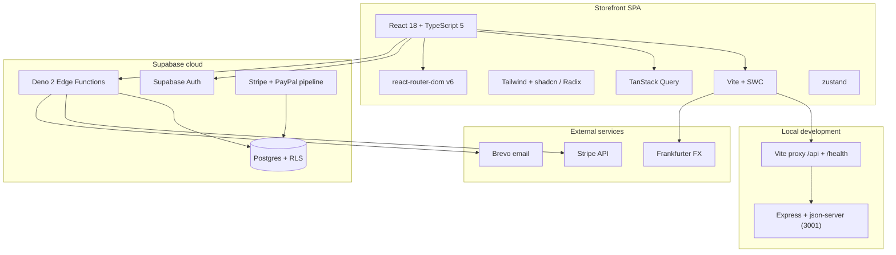

# Technology cartography

A layered map of the **lucid-web-craftsman** stack: the storefront SPA, the local mock API, hosted Supabase (Postgres + Deno Edge Functions), payments, and the tooling that ships them. The authoritative dependency lists remain [`package.json`](../package.json) and [`backend/package.json`](../backend/package.json); this page links them together.

For runtime behavior see [PLATFORM.md](./PLATFORM.md); for the typing layers see [DATA_TYPES.md](./DATA_TYPES.md); for engineering gates see [STANDARDS.md](./STANDARDS.md).

## High-level architecture

## Layer-by-layer inventory

### Tooling baseline ([`package.json`](../package.json), [`pnpm-workspace.yaml`](../pnpm-workspace.yaml))

- **Package manager:** **pnpm** 9 (`packageManager` pinned), `legacy-peer-deps=true` via [`.npmrc`](../.npmrc).
- **Runtime:** **Node** `>=18`, ESM (`"type": "module"`).
- **Workspaces:** repo root and [`backend/`](../backend/) share one lockfile.

### Storefront SPA (browser)

- **Build / dev server:** **Vite** 5 with **`@vitejs/plugin-react-swc`** (SWC, not Babel). Strict port 8080, IPv4 binding, proxies `/api` and `/health` to the mock API, and `/frankfurter-api` to `api.frankfurter.dev` — see [`vite.config.ts`](../vite.config.ts).
- **UI framework:** **React** 18 + **TypeScript** 5.
- **Styling and components:** **Tailwind CSS** 3 ([`tailwind.config.ts`](../tailwind.config.ts)), **Radix UI** primitives composed as shadcn-style components in [`src/components/ui/`](../src/components/ui/), **class-variance-authority**, **tailwind-merge**, **lucide-react** icons, **`@tailwindcss/typography`**.
- **Routing:** **react-router-dom** v6 ([`src/App.tsx`](../src/App.tsx)).
- **Server state:** **`@tanstack/react-query`** + devtools, with a feature-prefixed real-time channel convention (see [`src/services/README.md`](../src/services/README.md)).
- **Client state:** **zustand**.
- **Forms and validation:** **react-hook-form**, **`@hookform/resolvers`**, **zod**.
- **Backend client (browser):** **`@supabase/supabase-js`** and **`@supabase/ssr`** through [`src/integrations/supabase/`](../src/integrations/supabase/); access flows through the modules in [`src/services/`](../src/services/) (ESLint forbids importing the raw client from `pages/` and `components/` — see [`eslint.config.js`](../eslint.config.js)).
- **Payments (client):** **`@stripe/stripe-js`**.
- **i18n:** **i18next**, **react-i18next**, **i18next-browser-languagedetector** (deduped in `vite.config.ts`).
- **Content and visual stack:** **react-markdown**, **`@uiw/react-md-editor`**, **dompurify**, **recharts**, **react-leaflet** / **leaflet**, **embla-carousel-react**, **react-day-picker**, **sonner** toasts, **next-themes**, **react-helmet-async**, **react-error-boundary**, **vaul**, **cmdk**, **`react-resizable-panels`**, **web-vitals**.
- **HTTP helper:** **axios** alongside Supabase calls (the services layer in [`src/services/`](../src/services/) is the canonical entry point).
- **Bundle splitting:** manual `vendor-*` chunks (`react`, `router`, `query`, `i18n`, `supabase`, `ui`, `forms`, `charts`) — see the `build.rollupOptions` block in [`vite.config.ts`](../vite.config.ts).

### Local mock API ([`backend/package.json`](../backend/package.json))

- **Node Express** wrapper around **json-server**, serving `backend/db.json` plus a `/health` route.
- **Hardening:** **helmet**, **cors**, **express-rate-limit**.
- **API docs assets:** **swagger-ui-dist**, **redoc** (optional, served by the mock).
- **Entry point:** [`backend/server.cjs`](../backend/server.cjs); started with `pnpm run start:api` and proxied through Vite during E2E.

### Supabase: database, auth, Edge Functions

- **Postgres** with **RLS** policies; migrations in [`supabase/migrations/`](../supabase/migrations/); typed via [`scripts/supabase-gen-types.mjs`](../scripts/supabase-gen-types.mjs).
- **Auth** via Supabase, consumed through [`src/integrations/supabase/`](../src/integrations/supabase/) and the services layer.
- **Edge runtime:** **Deno 2** with the shared import map in [`supabase/functions/deno.json`](../supabase/functions/deno.json) (`@std/*`, `npm:@supabase/supabase-js@2`, `npm:stripe@18.5.0`, `npm:zod@3.23.8`).
- **Shared checkout logic:** [`supabase/functions/_shared/`](../supabase/functions/_shared/) and Zod contracts in [`src/types/contracts/`](../src/types/contracts/).
- **Function families** under [`supabase/functions/`](../supabase/functions/):

  | Family      | Examples                                                                                                                                                                                                                                                                                               |
  | ----------- | ------------------------------------------------------------------------------------------------------------------------------------------------------------------------------------------------------------------------------------------------------------------------------------------------------ |
  | Payments    | `create-payment`, `verify-payment`, `stripe-webhook`, `reconcile-payment`, `stripe-session-display`, `create-paypal-payment`, `verify-paypal-payment`                                                                                                                                                  |
  | Orders      | `order-lookup`, `order-confirmation-lookup`, `get-order-by-token`, `sign-order-token`, `cleanup-pending-orders`                                                                                                                                                                                        |
  | Emails      | `send-order-confirmation`, `send-order-notification-improved`, `send-shipping-notification`, `send-delivery-confirmation`, `send-cancellation-email`, `send-newsletter-welcome`, `send-vip-order-notification`, `send-abandoned-cart-email`, `process-scheduled-emails`, `security-alert-notification` |
  | Admin / ops | `create-admin-user`, `monitor-payment-events`, `carrier-webhook`, `check-promo-alerts`                                                                                                                                                                                                                 |
  | Utilities   | `generate-invoice`, `sign-invoice-token`, `generate-sitemap`, `translate-tag`, `submit-contact`                                                                                                                                                                                                        |

### External services

- **Stripe** for card payments (browser **`@stripe/stripe-js`**, Edge **`npm:stripe@18.5.0`** webhook + verify).
- **PayPal** through the Edge functions listed above.
- **Brevo** for transactional email (operational notes in [CHECKOUT-PROD-RUNBOOK.md](./CHECKOUT-PROD-RUNBOOK.md)).
- **Frankfurter** public FX API, proxied in dev so the browser stays CORS-clean.

### Testing and quality

- **Unit / component:** **Vitest** 4 + **jsdom**, **`@testing-library/react`** + **`jest-dom`**, coverage via **`@vitest/coverage-v8`**; config embedded in [`vite.config.ts`](../vite.config.ts).
- **E2E:** **Cypress** 15 with **`@cypress/grep`**, **cypress-axe**, **cypress-real-events**, orchestrated by **`start-server-and-test`** — see [`cypress/README.md`](../cypress/README.md) and [`docs/E2E-COVERAGE.md`](./E2E-COVERAGE.md).
- **Deno tests:** `pnpm run verify:create-payment`, `verify:create-admin-user`, and `test:pricing-snapshot` cover Edge logic with the same Deno 2 flags CI uses.
- **Lint / format:** **ESLint** 9 flat config in [`eslint.config.js`](../eslint.config.js) (TypeScript, react-hooks, react-refresh, jsx-a11y, unused-imports, `no-restricted-imports` for the Supabase client) with **Prettier** 3 applied last.
- **Git hooks:** **Husky** + **Commitlint** ([`commitlint.config.mjs`](../commitlint.config.mjs)) enforce Conventional Commits.
- **Type docs:** **TypeDoc** via `pnpm run docs:typedoc` — see [TYPEDOC.md](./TYPEDOC.md).

### API contracts and automation

- **OpenAPI** bundle for Edge: `pnpm run openapi:edge-functions` → [`openapi/`](../openapi/).
- **Postman** collection generator: `pnpm run postman:collection` → [`postman/`](../postman/).
- Both refresh together via `pnpm run api:artifacts`; drift gates run in CI.
- **Node maintenance scripts:** [`scripts/`](../scripts/) — bundling checks ([`scripts/check-edge-functions-bundling.mjs`](../scripts/check-edge-functions-bundling.mjs)), Cypress sharding, migration diffs, and more.

### CI / CD ([`.github/workflows/`](../.github/workflows/))

| Workflow                                                                        | What it runs                                                                                       |
| ------------------------------------------------------------------------------- | -------------------------------------------------------------------------------------------------- |
| [`ci.yml`](../.github/workflows/ci.yml)                                         | Lint, format check, edge-function bundling, OpenAPI / Postman drift, typecheck, `test:unit`, build |
| [`e2e.yml`](../.github/workflows/e2e.yml)                                       | Cypress smoke on PR / push; full suite on schedule via sharded jobs                                |
| [`deno-create-payment.yml`](../.github/workflows/deno-create-payment.yml)       | Deno check / lint / test for `create-payment`, `create-admin-user`, and pricing-snapshot helpers   |
| [`monitor-payment-events.yml`](../.github/workflows/monitor-payment-events.yml) | Scheduled monitor for payment-event drift                                                          |
| [`rpc-postgrest-smoke.yml`](../.github/workflows/rpc-postgrest-smoke.yml)       | `workflow_dispatch`-only RPC smoke against real Supabase                                           |

Local mirror of the root workflow: `pnpm run ci:local` (details in [LOCAL_CI.md](./LOCAL_CI.md)). Workflow inventory and KPIs in [GITHUB-ACTIONS-CI-CD.md](./GITHUB-ACTIONS-CI-CD.md).

### Deployment surface

- **SPA:** `vite build` static output; **gh-pages** + **vite-plugin-gh-pages** support optional GitHub Pages deploys.
- **Supabase:** CLI invoked via `npx supabase@…` for migrations; Edge deploys go through the `deploy:functions:*` scripts in [`package.json`](../package.json) and [`scripts/deploy-all-supabase-functions.mjs`](../scripts/deploy-all-supabase-functions.mjs).

## Where to go deeper

| Topic                   | Primary references                                                                                                                                                       |
| ----------------------- | ------------------------------------------------------------------------------------------------------------------------------------------------------------------------ |
| End-to-end system shape | [PLATFORM.md](./PLATFORM.md), [README.md](./README.md)                                                                                                                   |
| Edge functions index    | [`supabase/functions/README.md`](../supabase/functions/README.md), [`supabase/functions/create-payment/DATA_FLOW.md`](../supabase/functions/create-payment/DATA_FLOW.md) |
| Typing layers           | [DATA_TYPES.md](./DATA_TYPES.md), [TYPES_INDEX.md](./TYPES_INDEX.md)                                                                                                     |
| E2E scope               | [E2E-COVERAGE.md](./E2E-COVERAGE.md), [`cypress/README.md`](../cypress/README.md)                                                                                        |
| Standards and gates     | [STANDARDS.md](./STANDARDS.md), [LOCAL_CI.md](./LOCAL_CI.md), [AGENTS.md](../AGENTS.md)                                                                                  |
| Rules and edge cases    | [RULES_REGISTRY.md](./RULES_REGISTRY.md) (governance index) and [BUSINESS_LOGIC_AND_EDGE_CASES.md](./BUSINESS_LOGIC_AND_EDGE_CASES.md) (schemas + UI effects + catalog)  |
| Tech-debt carve-outs    | [TECH_DEBT.md](./TECH_DEBT.md)                                                                                                                                           |
