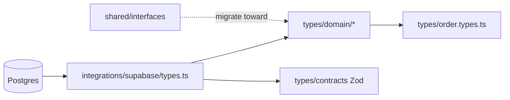

# Type symbol index (SPA)

Flat reference for **finding** types: IDE search, `rg`, or [TypeDoc search](./TYPEDOC.md) after `pnpm run docs:typedoc`.

## How to search

| Method               | When to use                                                                                                    |
| -------------------- | -------------------------------------------------------------------------------------------------------------- |
| **VS Code / Cursor** | `Ctrl+T` / “Go to Symbol in Workspace”, or `@` in file picker — resolves imports via `paths`: `@/*` → `src/*`. |
| **TypeDoc**          | Full-text search over TSDoc + exports; open `docs/generated/typedoc/index.html`.                               |
| **Ripgrep**          | `rg "OrderRow" src` or `rg "export type" src/types/domain`.                                                    |
| **This file**        | Quick table of **canonical** names and import paths.                                                           |

## Canonical imports (prefer these)

| Import path                                | Contents                                                                     |
| ------------------------------------------ | ---------------------------------------------------------------------------- |
| `@/types/domain` or `@/types/domain/order` | DB-aligned **rows**, **inserts**, **updates**, **enums** (see tables below). |
| `@/types/contracts`                        | **Zod** schemas + `z.infer` types + `parse*` for Edge `invoke`.              |
| `@/integrations/supabase/types`            | **`Database`**, **`Json`** — generator output; do not hand-edit.             |
| `@/types/order.types`                      | **Composite** order/admin UI types — not the same as `OrderRow`.             |

## `src/types/domain` — exports by file

### `database.ts`

| Symbol         | Meaning                                                                  |
| -------------- | ------------------------------------------------------------------------ |
| `Database`     | Re-export of generated Supabase `Database`.                              |
| `PublicTables` | `Database['public']['Tables']` — navigate to any table `Row` in the IDE. |

### `product.ts`

| Symbol          | Postgres              |
| --------------- | --------------------- |
| `ProductRow`    | `public.products` row |
| `ProductInsert` | insert                |
| `ProductUpdate` | update                |

**Related (not DB):** `@/shared/interfaces` → `Product` (storefront/mock loose shape). Prefer `ProductRow` for persisted data.

### `order.ts`

| Symbol                 | Postgres                      |
| ---------------------- | ----------------------------- |
| `OrderRow`             | `public.orders`               |
| `OrderInsert`          | insert                        |
| `OrderUpdate`          | update                        |
| `OrderItemRow`         | `public.order_items`          |
| `OrderStatus`          | enum `order_status`           |
| `AnomalyType`          | enum `order_anomaly_type`     |
| `AnomalySeverity`      | enum `anomaly_severity`       |
| `StatusChangeActor`    | enum `status_change_actor`    |
| `AdminOrderPermission` | enum `admin_order_permission` |

### `checkout.ts`

| Symbol                  | Postgres / column                   |
| ----------------------- | ----------------------------------- |
| `CheckoutSessionRow`    | `public.checkout_sessions`          |
| `CheckoutSessionInsert` | insert                              |
| `CheckoutSessionUpdate` | update                              |
| `CheckoutCartItemsJson` | `checkout_sessions.cart_items` JSON |

### `profile.ts`

| Symbol          | Postgres          |
| --------------- | ----------------- |
| `ProfileRow`    | `public.profiles` |
| `ProfileInsert` | insert            |
| `ProfileUpdate` | update            |

### `cart.ts`

| Symbol                  | Notes                                                |
| ----------------------- | ---------------------------------------------------- |
| `CheckoutCartItemsJson` | Re-export from `checkout.ts` for cart/checkout JSON. |

---

## `src/types/contracts` — Edge boundaries

| Symbol                               | Kind       | Role                                |
| ------------------------------------ | ---------- | ----------------------------------- |
| `createPaymentInvokeBodySchema`      | Zod schema | create-payment / PayPal invoke body |
| `CreatePaymentInvokeBody`            | type       | Inferred                            |
| `orderLookupResponseSchema`          | Zod schema | order-lookup discriminated union    |
| `OrderLookupResponse`                | type       | Inferred                            |
| `stripeSessionDisplayResponseSchema` | Zod schema | stripe-session-display              |
| `StripeSessionDisplayResponse`       | type       | Inferred                            |
| `parseCreatePaymentInvokeBody`       | function   | `unknown` → body                    |
| `parseOrderLookupResponse`           | function   | `unknown` → `{ ok, data \| error }` |
| `parseStripeSessionDisplayResponse`  | function   | `unknown` → `{ ok, data \| error }` |

Tests: `src/types/contracts/edge-invoke-responses.test.ts`.

---

## `src/types/order.types.ts` — composite / UI

Persisted row for orders is **`OrderRow`** (`@/types/domain/order`). This file adds **admin and customer view** shapes and config maps.

| Symbol                                                   | Kind                                                          |
| -------------------------------------------------------- | ------------------------------------------------------------- |
| `Order`                                                  | interface — lifecycle aggregate (not identical to `OrderRow`) |
| `OrderItem`                                              | interface                                                     |
| `ShippingAddress` / `BillingAddress`                     | interface                                                     |
| `OrderStatusHistory`                                     | interface                                                     |
| `OrderAnomaly`                                           | interface                                                     |
| `OrderStateTransition`                                   | interface                                                     |
| `CustomerStatusMapping`                                  | interface                                                     |
| `CustomerOrderView`                                      | interface                                                     |
| `CustomerOrderItem`                                      | interface                                                     |
| `CustomerTimelineEvent`                                  | interface                                                     |
| `OrderFilters` / `OrderStats`                            | interface                                                     |
| `UpdateOrderStatusRequest` / `UpdateOrderStatusResponse` | interface                                                     |
| `ORDER_STATUS_CONFIG`                                    | const map                                                     |
| `ANOMALY_SEVERITY_CONFIG`                                | const map                                                     |
| `ANOMALY_TYPE_CONFIG`                                    | const map                                                     |

Enums and row aliases in this file are **re-exported** from `@/types/domain/order`.

---

## Other `src/types/*`

| File                     | Role                                       |
| ------------------------ | ------------------------------------------ |
| `image.types.ts`         | Image helpers                              |
| `window-extensions.d.ts` | Global `Window` / `Navigator` augmentation |
| `domain/index.ts`        | Barrel — re-exports all domain modules     |

---

## Relation graph (mental model)

---

## Maintenance

- After **`supabase gen types`**: re-run `pnpm run docs:typedoc` and spot-check [DATA_TYPES.md](./DATA_TYPES.md) tables if new enums/tables matter for commerce flows.
- New persisted entity: add aliases under `src/types/domain/<entity>.ts` and a row in this index.
