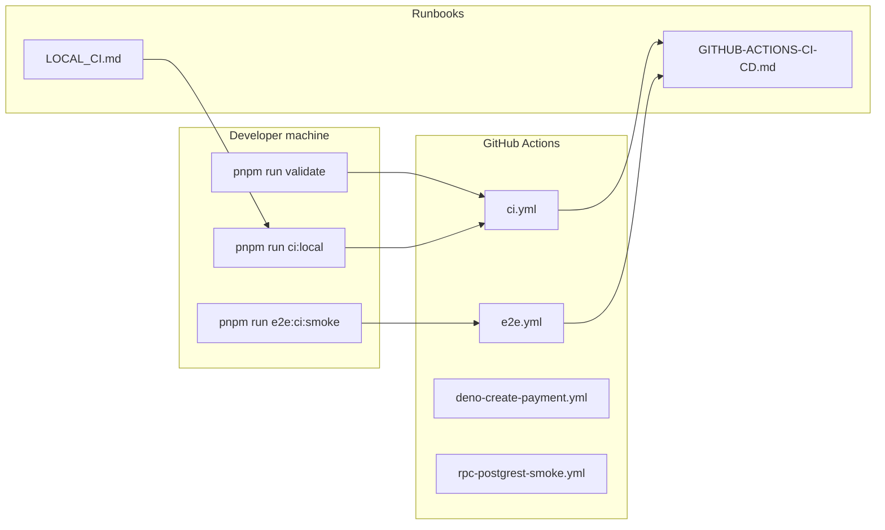

# ci: workflows, smoke probe parity, and GITHUB-ACTIONS runbook

| Field | Value |
|-------|--------|
| **Tracking PR** | [#35](https://github.com/benmed00/lucid-web-craftsman/pull/35) |
| **Branch** | `feat/platform-pnpm-supabase-rebaseline-edge-hardening` |
| **Labels** | `area:ci`, `area:docs`, `type:documentation` |
| **Risk** | Medium — incorrect CI parity causes false greens or blocked releases |
| **Owner** | Platform / DevEx |

---

## Executive summary

Establish **one source of truth** for how GitHub Actions maps to local commands, how the **E2E smoke probe** stays aligned with Vite’s `strictPort`, and how maintainers refresh **KPI snapshots** after merge. This issue is satisfied when PR #35 lands with updated workflows, `docs/GITHUB-ACTIONS-CI-CD.md`, and `docs/LOCAL_CI.md`, and when `main` runs the same gates as `pnpm run ci:local`.

---

## Problem statement

| Gap | Symptom | Business impact |
|-----|---------|-----------------|
| Split brain between local vs CI | Developers run `pnpm run validate` but CI also runs OpenAPI/Postman/docs drift | Surprises at PR time |
| E2E port drift | `start-server-and-test` probes wrong port vs Cypress `baseUrl` | Flaky or false-red smoke on Windows |
| No runbook inventory | On-call does not know which workflow owns payments vs lint | Slower incident response |

---

## Target architecture



---

## What changed (code snapshots)

### Root CI workflow — gate sequence

```yaml
# .github/workflows/ci.yml (excerpt)
- run: pnpm run lint
- run: pnpm run format:check
- run: pnpm run check:edge-functions:bundling:full
- run: pnpm run openapi:edge-functions:check
- run: pnpm run postman:collection:check
- run: pnpm run docs:check-links
- run: pnpm run docs:gen:check
- run: pnpm run type:check
- run: pnpm run test:unit
- run: pnpm run build
```

### E2E port contract (single module)

```javascript
// scripts/lib/e2e-port.mjs
export const E2E_HOST = '127.0.0.1';
export const E2E_PORT = Number.parseInt(
  process.env.VITE_DEV_SERVER_PORT ?? '8080',
  10
);
export const E2E_HTTP_GET_PROBE = `http-get://${E2E_HOST}:${E2E_PORT}/contact`;
```

### CI-style E2E orchestration

```javascript
// scripts/run-e2e-ci.mjs — chains mock API → Vite → Cypress
const cliArgs = [
  'pnpm run start:api',
  'http-get://localhost:3001',
  'pnpm run dev:e2e',
  E2E_HTTP_GET_PROBE,
  testCmd,
];
```

---

## Before vs after

| Aspect | Before | After |
|--------|--------|-------|
| E2E probe URL | Could diverge from `vite.config.ts` port | `e2e-port.mjs` shared by Cypress + `start-server-and-test` |
| Actions inventory | Scattered README mentions | `docs/GITHUB-ACTIONS-CI-CD.md` with workflow table + KPI cadence |
| Local mirror | Ad-hoc commands | `pnpm run ci:local` documented in `LOCAL_CI.md` |
| RPC smoke | Manual only | `rpc-postgrest-smoke.yml` (`workflow_dispatch`) |

---

## Cypress / CI evidence

PR #35 aligns smoke with **`VITE_DEV_SERVER_PORT`**. Related E2E specs (not all in this issue’s scope, but same port contract):

| Spec | Tag | Purpose |
|------|-----|---------|
| `cypress/e2e/checkout_flow_spec.js` | `@smoke` | Checkout happy path |
| `cypress/e2e/internal_links_spa_spec.js` | `@regression` | SPA navigation after Footer `Link` migration |

### Cypress evidence — smoke probe route (`/contact`)

The same URL family used by `E2E_HTTP_GET_PROBE` (`http-get://127.0.0.1:8080/contact`):


### GitHub Actions (attach manually)

| Screenshot | Where to capture |
|------------|------------------|
| **CI workflow** | PR #35 → Checks → `ci` job → green steps (lint, test:unit, build) |
| **E2E smoke** | PR #35 → Checks → `e2e` / smoke workflow (if triggered) |

_Regenerate Cypress assets: `pnpm run pr:enterprise:screenshots:capture` then `pnpm run pr:enterprise:screenshots:copy`._

---

## Acceptance criteria

- [ ] `.github/workflows/ci.yml` passes on PR #35 and on `main` after merge.
- [ ] `docs/GITHUB-ACTIONS-CI-CD.md` lists every workflow, branch filters, and monitor cadence.
- [ ] `docs/LOCAL_CI.md` maps each CI step to a `package.json` script.
- [ ] `pnpm run e2e:ci:smoke` succeeds with default **8080** and documents override via `VITE_DEV_SERVER_PORT`.
- [ ] KPI snapshot section in runbook updated or scheduled per maintainer checklist.

---

## Verification commands

```bash
pnpm run ci:local
pnpm run e2e:ci:smoke
pnpm run docs:check-links
gh workflow list
```

---

## Related files

- [`.github/workflows/ci.yml`](../../.github/workflows/ci.yml)
- [`.github/workflows/e2e.yml`](../../.github/workflows/e2e.yml)
- [`docs/GITHUB-ACTIONS-CI-CD.md`](../../GITHUB-ACTIONS-CI-CD.md)
- [`docs/LOCAL_CI.md`](../../LOCAL_CI.md)
- [`scripts/run-e2e-ci.mjs`](../../scripts/run-e2e-ci.mjs)
- [`scripts/lib/e2e-port.mjs`](../../scripts/lib/e2e-port.mjs)

---

## Closure

Close when PR **#35** is merged and **main** CI + documented smoke path are green. Link this issue in the PR body under **Fixes #36**.
