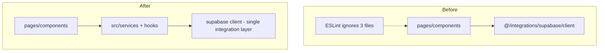

# chore(lint): align eslint config with stricter posture on admin/UI surfaces

| Field | Value |
|-------|--------|
| **Tracking PR** | [#35](https://github.com/benmed00/lucid-web-craftsman/pull/35) |
| **Labels** | `area:frontend`, `tech-debt` |
| **Risk** | Low–Medium — lint regressions block all PRs |

---

## Executive summary

Raise engineering quality on the SPA by enforcing **`react-hooks/exhaustive-deps` at error**, scoping **`@typescript-eslint/no-explicit-any` to error** on app sources (excluding tests), and **removing grandfather carve-outs** that allowed `@/integrations/supabase/client` in selected pages/components. Admin and shared UI touched by the platform PR must compile and lint without new unjustified suppressions.

---

## Problem statement



| Anti-pattern | Why it hurts |
|--------------|--------------|
| Raw Supabase in JSX-heavy files | RLS bypass confusion, untestable UI, duplicate query logic |
| `any` in money/admin paths | Silent contract drift vs Edge functions |
| Disabled `exhaustive-deps` | Stale closures in checkout and cart |

---

## Code snapshots

### SPA import boundary (no grandfathers)

```javascript
// eslint.config.js
{
  files: ['src/pages/**/*.{ts,tsx}', 'src/components/**/*.{ts,tsx}'],
  ignores: ['**/*.{test,spec}.{ts,tsx}'],
  rules: {
    'no-restricted-imports': [
      'error',
      {
        paths: [{
          name: '@/integrations/supabase/client',
          message:
            'Import Supabase through src/services/* or shared hooks; keep pages/components free of the raw client.',
        }],
      },
    ],
  },
},
```

### Strict typing layers

```javascript
// eslint.config.js — app sources
{ files: ['src/**/*.{ts,tsx}'], ignores: ['**/*.{test,spec}.{ts,tsx}', ...],
  rules: { '@typescript-eslint/no-explicit-any': 'error' } },

// contracts / domain — same rule, dedicated block
{ files: ['src/types/domain/**/*.{ts,tsx}', 'src/types/contracts/**/*.{ts,tsx}'],
  rules: { '@typescript-eslint/no-explicit-any': 'error' } },
```

### Policy documented in TECH_DEBT

```markdown
## ESLint: SPA Supabase client imports
There are **no grandfather exceptions** in app sources:
prefer src/services/, edge invokes, and shared hooks (AuthContext).
```

---

## Before vs after

| Check | Before | After |
|-------|--------|-------|
| `ABThemeManager`, `Artisans`, `OrderConfirmation` | ESLint **ignored** | Must use services (already migrated in tree) |
| `exhaustive-deps` | Was `off`, backlog of warnings | **`error`** with documented disable policy |
| `no-explicit-any` in `src/**` | Off globally | **Error** except tests / `vite-env.d.ts` |
| Admin components in PR | Mixed `any` | Typed against domain/contracts where touched |

---

## Cypress / visual evidence

Lint does not produce UI screenshots; regression signal is **CI lint job** + **typed catalog render** (no runtime `any` explosions in product grid).

| Command | Expected |
|---------|----------|
| `pnpm run lint` | Exit 0, `--max-warnings 0` at root script |
| `pnpm exec eslint src/components/admin --max-warnings 9999` | No new errors on touched admin files |


**Related specs:** [`cypress/e2e/admin_routes_smoke_spec.js`](../../cypress/e2e/admin_routes_smoke_spec.js) (admin routes), [`cypress/e2e/checkout_flow_spec.js`](../../cypress/e2e/checkout_flow_spec.js) (hooks / exhaustive-deps on payment path).

---

## Acceptance criteria

- [ ] `pnpm run lint` passes locally and in `ci.yml`.
- [ ] No new `eslint-disable` without comment per [TECH_DEBT.md](../../TECH_DEBT.md).
- [ ] Zero production imports of `@/integrations/supabase/client` under `src/pages` / `src/components` (tests may `vi.mock` it).
- [ ] Touched admin files compile under `pnpm run type:check`.

---

## Verification

```bash
pnpm run lint
pnpm run type:check
rg "@/integrations/supabase/client" src/pages src/components --glob "!*.{test,spec}*"
```

---

## Related files

- [`eslint.config.js`](../../eslint.config.js)
- [`docs/TECH_DEBT.md`](../../TECH_DEBT.md)
- [`src/services/README.md`](../../src/services/README.md)

**Closes via PR #35 — Fixes #37**
