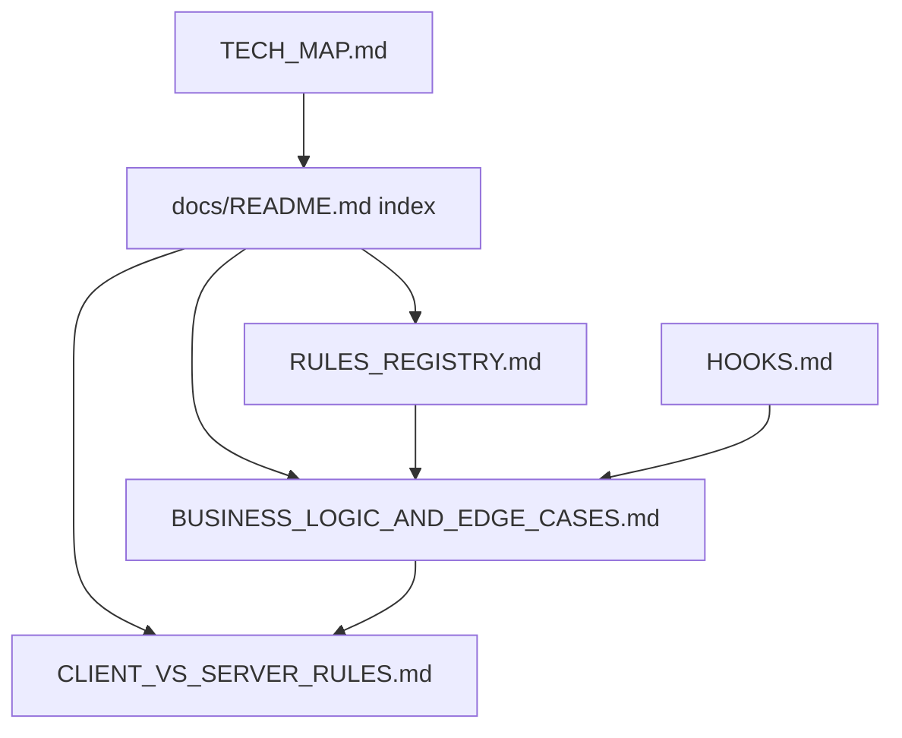

# docs: rules registry, business logic, tech map, and agent runbooks

| Field           | Value                                                          |
| --------------- | -------------------------------------------------------------- |
| **Tracking PR** | [#35](https://github.com/benmed00/lucid-web-craftsman/pull/35) |
| **Labels**      | `area:docs`, `type:documentation`                              |
| **Risk**        | Low — documentation drift if not kept in sync with code        |

---

## Executive summary

Ship a **maintained documentation layer** so engineers, reviewers, and agents can answer: _where do rules live?_, _what is client-only vs server-enforced?_, and _what happens in checkout edge cases?_ without spelunking the monolith. This issue covers **RULES_REGISTRY**, **BUSINESS_LOGIC_AND_EDGE_CASES**, **TECH_MAP**, **HOOKS**, **DATA_TYPES**, **CLIENT_VS_SERVER_RULES**, and index updates in **docs/README.md** + **AGENTS.md**.

---

## Information architecture



---

## Deliverables (file-level)

| Document                                                                   | Lines (approx.) | Role                                                       |
| -------------------------------------------------------------------------- | --------------- | ---------------------------------------------------------- |
| [RULES_REGISTRY.md](../../RULES_REGISTRY.md)                               | 200+            | Index of lint, CI, CSP, RLS, Edge, validation modules      |
| [BUSINESS_LOGIC_AND_EDGE_CASES.md](../../BUSINESS_LOGIC_AND_EDGE_CASES.md) | 900+            | Schemas, enforcement layer, edge-case catalog, Cypress map |
| [CLIENT_VS_SERVER_RULES.md](../../CLIENT_VS_SERVER_RULES.md)               | Short checklist | Trust boundaries for money path                            |
| [HOOKS.md](../../HOOKS.md)                                                 | 300+            | Every hook module + test status                            |
| [GITHUB-ACTIONS-CI-CD.md](../../GITHUB-ACTIONS-CI-CD.md)                   | 300+            | Workflow inventory                                         |
| [TECH_MAP.md](../../TECH_MAP.md)                                           | New cartography | SPA ↔ Edge ↔ Postgres diagram                            |

---

## Code snapshot — doc link gate in CI

```yaml
# .github/workflows/ci.yml
- name: Docs link & anchor check
  run: pnpm run docs:check-links
```

```javascript
// scripts/check-doc-links.mjs — validates RULES_REGISTRY + BUSINESS_LOGIC anchors
const DEFAULT_TARGETS = [
  'docs/RULES_REGISTRY.md',
  'docs/BUSINESS_LOGIC_AND_EDGE_CASES.md',
];
```

---

## Code snapshot — generated doc blocks

```bash
pnpm run docs:gen:check   # fails if auto-blocks drift
pnpm run docs:typedoc     # HTML under docs/generated/typedoc/
```

---

## Before vs after

| Question                           | Before                 | After                                      |
| ---------------------------------- | ---------------------- | ------------------------------------------ |
| Where is min order enforced?       | Hunt `useCheckoutPage` | Table in BUSINESS_LOGIC + CLIENT_VS_SERVER |
| Which ESLint rules apply to pages? | README fragment        | RULES_REGISTRY §1–3                        |
| Hook test coverage?                | Unknown                | HOOKS.md Test column                       |
| Agent onboarding                   | AGENTS.md only         | AGENTS.md + docs/README hub                |

---

## Evidence — documentation + E2E cross-reference

### Cypress maps to documented edge cases

`BUSINESS_LOGIC_AND_EDGE_CASES.md` §13 links catalog rows to specs. Example: **CO-1** honeypot → `checkout_flow_spec.js`; **SPA navigation** → `internal_links_spa_spec.js`.

| Documented behavior         | Screenshot                                                                                                                                                                                                       | Spec                         |
| --------------------------- | ---------------------------------------------------------------------------------------------------------------------------------------------------------------------------------------------------------------- | ---------------------------- |
| Checkout customer step      |    | `checkout_flow_spec.js`      |
| Footer SPA (no full reload) |  | `internal_links_spa_spec.js` |

### Manual doc screenshots (attach to this issue)

| Capture                                 | How                                                                |
| --------------------------------------- | ------------------------------------------------------------------ |
| `RULES_REGISTRY.md` rendered TOC        | GitHub: open file on branch → preview                              |
| `CLIENT_VS_SERVER_RULES.md` trust table | Same                                                               |
| TypeDoc index                           | `pnpm run docs:typedoc` → open `docs/generated/typedoc/index.html` |

---

## Acceptance criteria

- [ ] `docs/README.md` lists all new maintained docs with one-line purpose.
- [ ] `pnpm run docs:check-links` passes.
- [ ] `pnpm run docs:gen:check` passes when generators touched.
- [ ] [.github/CODEOWNERS](../../.github/CODEOWNERS) includes rules/docs paths if policy requires review.
- [ ] PR #35 description links to these docs in **Related documentation**.

---

## Verification

```bash
pnpm run docs:check-links
pnpm run docs:gen:check
node scripts/check-doc-links.mjs docs/TECH_DEBT.md docs/CLIENT_VS_SERVER_RULES.md
```

**Closes via PR #35 — Fixes #38**
