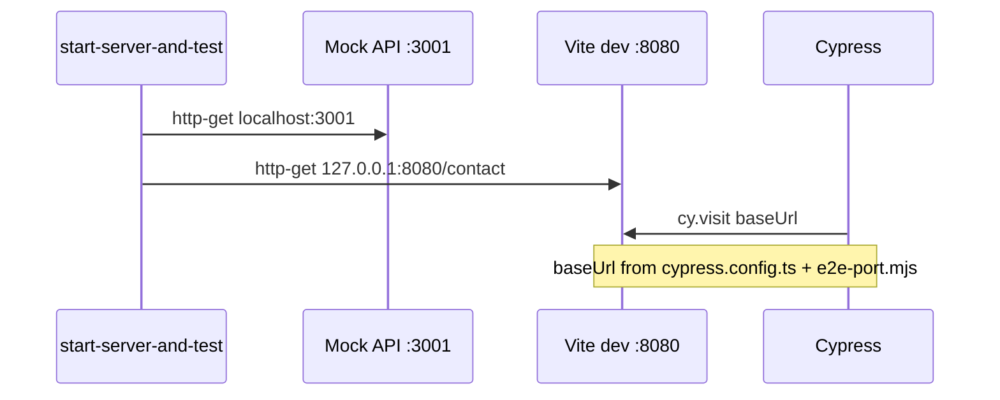

# test(e2e): smoke probe port alignment and internal links spec

| Field           | Value                                                          |
| --------------- | -------------------------------------------------------------- |
| **Tracking PR** | [#35](https://github.com/benmed00/lucid-web-craftsman/pull/35) |
| **Labels**      | `area:test`, `area:ci`                                         |
| **Risk**        | High if broken — smoke is merge gate for checkout-related PRs  |

---

## Executive summary

Guarantee **Cypress smoke** and **GitHub `e2e.yml`** use the **same origin** as Vite (`127.0.0.1` + `VITE_DEV_SERVER_PORT` / 8080), and add **`internal_links_spa_spec.js`** to prevent regressions where `<a href>` full reloads destroyed cart and React Query state. Checkout specs remain the money-path signal; SPA link spec protects navigation quality.

---

## Port contract (diagram)



---

## Code snapshot — SPA marker test

```javascript
// cypress/e2e/internal_links_spa_spec.js
const SPA_MARKER = '__cypress_internal_link_spa__';

function assertSpaClick(selector, urlChecks) {
  cy.window().then((win) => {
    win[SPA_MARKER] = true;
  });
  cy.get(selector).filter(':visible').first().scrollIntoView().click();
  urlChecks.forEach((frag) => cy.url().should('include', frag));
  cy.window().its(SPA_MARKER).should('eq', true);
}
```

```javascript
// Footer cases — React Router Link, not document navigation
footerCases.forEach(({ href, url }) => {
  it(`footer Link SPA: ${href}`, () => {
    cy.visit('/');
    assertSpaClick(`footer a[href="${href}"]`, url);
  });
});
```

---

## Code snapshot — checkout smoke

```javascript
// cypress/e2e/checkout_flow_spec.js
cy.addCatalogLineAndOpenCheckoutStep1();
cy.get('[data-testid="checkout-continue-to-payment"]')
  .filter(':visible')
  .click();
cy.contains(/visa|mastercard|paiement sécurisé|secure payment/i).should(
  'be.visible'
);
```

---

## Cypress screenshots (committed assets)

| Asset                                                                                                                                                                                                            | Spec step                    | Proves                               |
| ---------------------------------------------------------------------------------------------------------------------------------------------------------------------------------------------------------------- | ---------------------------- | ------------------------------------ |
|         | `pr_issue_evidence` / footer | Storefront baseline                  |
|  | After footer click           | **No full reload** — marker survives |
|     | SPA cart navigation          | Cart state before checkout           |

_Regenerate: `pnpm run pr:enterprise:screenshots:capture` → `pnpm run pr:enterprise:screenshots:copy`_

---

## Before vs after

| Behavior            | Before                          | After                                    |
| ------------------- | ------------------------------- | ---------------------------------------- |
| Footer shop link    | `<a href>` → full document load | `<Link>` → client route                  |
| CI smoke probe      | Possible 8080 vs env mismatch   | `scripts/lib/e2e-port.mjs`               |
| Cart → checkout     | Flaky with `cy.visit('/cart')`  | `addCatalogLineAndOpenCartSpa()` command |
| Product detail spec | Timing assumptions              | Adjusted in PR for catalog stub          |

---

## How to run

```bash
# Full CI-style smoke
pnpm run e2e:ci:smoke

# SPA links only
pnpm exec start-server-and-test \
  "pnpm run start:api" http-get://localhost:3001 \
  "pnpm run dev:e2e" http-get://127.0.0.1:8080/contact \
  "pnpm exec cypress run --spec cypress/e2e/internal_links_spa_spec.js"

# Checkout only
pnpm run e2e:checkout
```

---

## Acceptance criteria

- [ ] `pnpm run e2e:ci:smoke` green on PR branch.
- [ ] `internal_links_spa_spec.js` passes all footer + FAQ + newsletter cases.
- [ ] `checkout_flow_spec.js` `@smoke` tests pass with stubbed catalog.
- [ ] `cypress.config.ts` `baseUrl` matches `E2E_HTTP_GET_PROBE` host/port.
- [ ] Evidence PNGs committed under `docs/pr-enterprise/assets/issues/issue-evidence/`.

---

## Related files

- [`cypress/e2e/internal_links_spa_spec.js`](../../cypress/e2e/internal_links_spa_spec.js)
- [`cypress/e2e/checkout_flow_spec.js`](../../cypress/e2e/checkout_flow_spec.js)
- [`cypress/support/commands.ts`](../../cypress/support/commands.ts)
- [`cypress/e2e/pr_issue_evidence_spec.js`](../../cypress/e2e/pr_issue_evidence_spec.js)

**Closes via PR #35 — Fixes #39**
