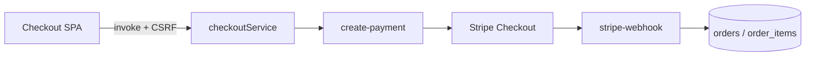

# supabase: create-payment schema, confirm-order tests, generate-invoice hardening

| Field           | Value                                                          |
| --------------- | -------------------------------------------------------------- |
| **Tracking PR** | [#35](https://github.com/benmed00/lucid-web-craftsman/pull/35) |
| **Labels**      | `area:supabase`, `risk: medium`                                |
| **Risk**        | **Critical** — payment and order confirmation                  |

---

## Executive summary

Harden the **money path** on Supabase Edge: align **`create-payment`** discount parsing with client contracts, improve **`confirm-order`** validation, extend **`generate-invoice`** test coverage, and keep **Deno** checks in CI (`deno-create-payment.yml`). The browser must never be the source of truth for amounts; these functions re-verify cart, coupons, and limits.

---

## Payment data flow



---

## Code snapshot — client invokes Edge (not raw supabase in UI)

```typescript
// src/hooks/checkout/useCheckoutPayment.ts (excerpt)
const { data, error } = await createPaymentSessionWithRetry(
  functionName, // 'create-payment' | 'create-paypal-payment'
  {
    items: cartItems,
    customerInfo: sanitizedFormData,
    guestSession,
    paymentMethod,
    discount: appliedCoupon
      ? { couponId, code, amount, includesFreeShipping }
      : null,
  },
  headerRecord, // CSRF + x-checkout-session-id
  { maxAttempts: 2, baseDelayMs: 1000 }
);
```

```typescript
// src/services/checkoutService.ts — retry wrapper around invoke
export async function createPaymentSessionWithRetry(...) { ... }
```

---

## Code snapshot — Edge discount alignment

```typescript
// supabase/functions/create-payment/lib/discount.ts
// Validates coupon dates, usage limits, minimum order, caps discount
```

Commit message on branch: `fix(create-payment): align resolveServerDiscount discount with ParsedCheckoutRequest`

---

## Code snapshot — Deno verification (local = CI)

```bash
pnpm run verify:create-payment   # deno check + lint + test
pnpm run test:pricing-snapshot   # shared pricing helpers + Vitest client schema
```

---

## Before vs after

| Area                    | Before                     | After                                      |
| ----------------------- | -------------------------- | ------------------------------------------ |
| Discount shape mismatch | Possible client/Edge drift | Aligned parsing + tests                    |
| confirm-order           | Gaps in validation         | Hardened + tests in PR                     |
| Invoice fetch           | Limited coverage           | `test(invoice): add fetchInvoice coverage` |
| CI                      | Deno on select branches    | Workflow aligned with root CI branches     |

---

## Cypress evidence (checkout → Edge boundary)

Cypress **stubs** Edge for smoke; real integration is Deno + optional live Supabase.

| Screenshot                                                                                                                                                                                                          | Meaning                                                   |
| ------------------------------------------------------------------------------------------------------------------------------------------------------------------------------------------------------------------- | --------------------------------------------------------- |
|  | UI ready to call `create-payment`                         |
| Spec                                                                                                                                                                                                                | `checkout_flow_spec.js` — reaches payment step with stubs |

**Post-merge manual:** Stripe test mode → verify Edge logs + order row.

---

## Acceptance criteria

- [ ] `pnpm run verify:create-payment` passes.
- [ ] `pnpm run test:pricing-snapshot` passes when pricing files touched.
- [ ] OpenAPI/Postman drift checks pass if HTTP contracts changed.
- [ ] No breaking change to `create-payment` request without contract doc update.
- [ ] [CHECKOUT-PROD-RUNBOOK.md](../../CHECKOUT-PROD-RUNBOOK.md) still accurate for webhook deploy.

---

## Related files

- [`supabase/functions/create-payment/`](../../supabase/functions/create-payment/)
- [`supabase/functions/create-payment/DATA_FLOW.md`](../../supabase/functions/create-payment/DATA_FLOW.md)
- [`supabase/functions/_shared/PRICING_SNAPSHOT.md`](../../supabase/functions/_shared/PRICING_SNAPSHOT.md)
- [`src/services/checkoutService.ts`](../../src/services/checkoutService.ts)

**Closes via PR #35 — Fixes #40**
