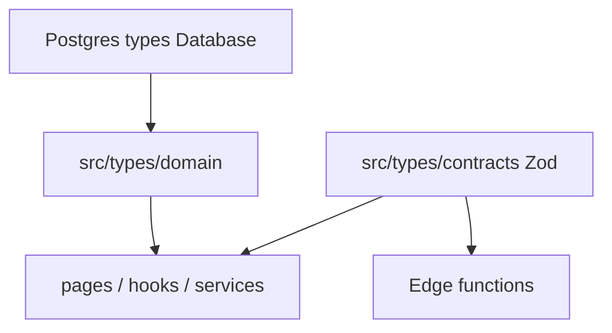

# types: edge invoke contracts, domain modules, Typedoc pipeline

| Field           | Value                                                          |
| --------------- | -------------------------------------------------------------- |
| **Tracking PR** | [#35](https://github.com/benmed00/lucid-web-craftsman/pull/35) |
| **Labels**      | `area:frontend`, `type:feature`                                |

---

## Executive summary

Introduce a **three-layer typing model** for the SPA: generated **`Database`** types, **`src/types/domain`** aliases, and Zod **`src/types/contracts`** at Edge invoke boundaries. Enable **`strict`** TypeScript, enforce **`no-explicit-any`** on app sources, and add **TypeDoc** + **TYPES_INDEX** for discoverability.

---

## Typing layers



---

## Code snapshots

### Strict mode

```json
// tsconfig.app.json (enabled in PR)
"strict": true
```

### ESLint guard on contracts

```javascript
{ files: ['src/types/domain/**/*', 'src/types/contracts/**/*'],
  rules: { '@typescript-eslint/no-explicit-any': 'error' } }
```

### Domain + window extensions

```typescript
// src/types/domain/* — order, product, checkout aliases
// src/types/window-extensions.d.ts — analytics / third-party globals (typed, not any)
```

### TypeDoc

```bash
pnpm run docs:typedoc
# → docs/generated/typedoc/ (gitignored HTML)
```

---

## Before vs after

| Concern          | Before             | After                       |
| ---------------- | ------------------ | --------------------------- |
| Checkout payload | Loose interfaces   | Contracts + service facades |
| `window` globals | `any` or implicit  | `window-extensions.d.ts`    |
| Order enums      | Duplicated strings | SSOT in domain modules      |
| Discoverability  | Grep only          | TYPES_INDEX + TypeDoc       |

---

## Test evidence

```bash
pnpm run type:check          # app + node + cypress tsconfigs
pnpm run lint                # no-explicit-any on src/**
pnpm run test:unit           # typed tests pass
```

Cypress TypeScript specs: `checkout_db_hydration_spec.ts`, `get_order_by_token_mocked_spec.ts` — compile under `cypress/tsconfig.json`.

### Runtime screenshot (typed checkout UI)

Checkout step 1 uses typed form state from `CheckoutFormData` / validation helpers — no regression after `strict` + contract work:


---

## Acceptance criteria

- [ ] `pnpm run type:check` passes in CI.
- [ ] New public types documented in [DATA_TYPES.md](../../DATA_TYPES.md).
- [ ] Contracts referenced from [PLATFORM.md](../../PLATFORM.md) or STANDARDS.
- [ ] No new `any` in `src/types/contracts` without exception ticket.

**Closes via PR #35 — Fixes #41**
