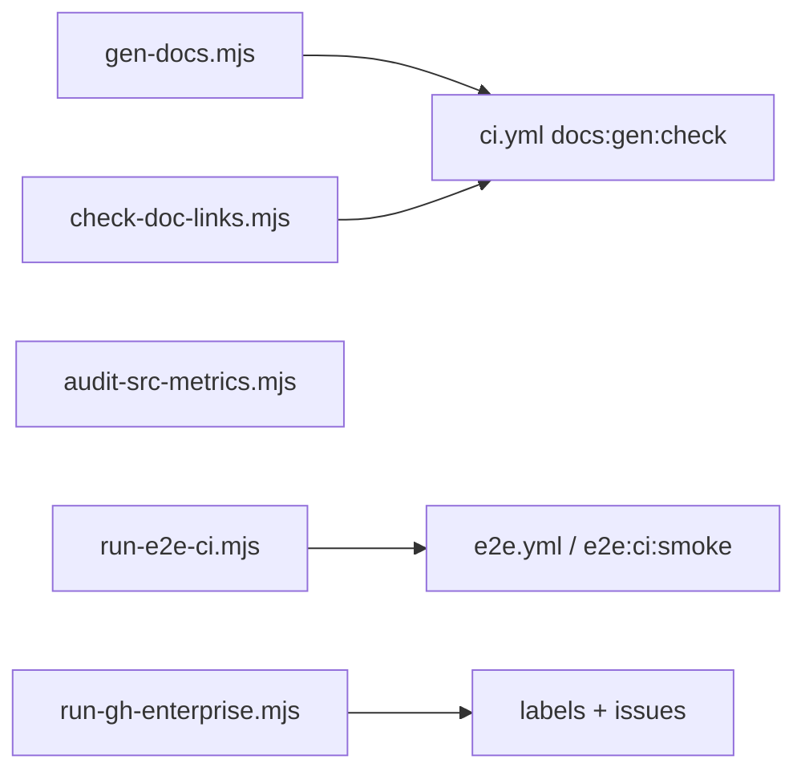

# chore(scripts): audit metrics, doc link check, gen-docs, proxy/CA helpers

| Field | Value |
|-------|--------|
| **Tracking PR** | [#35](https://github.com/benmed00/lucid-web-craftsman/pull/35) |
| **Labels** | `area:ci`, `type:chore` |

---

## Executive summary

Add **repeatable Node scripts** under `scripts/` that enforce doc quality, measure source metrics, orchestrate E2E CI, and support enterprise GitHub workflows (`pr:enterprise:*`). Each script is documented in [scripts/README.md](../../scripts/README.md) and wired into `package.json` where appropriate.

---

## Script inventory



| Script | npm script | CI gate |
|--------|------------|---------|
| `check-doc-links.mjs` | `docs:check-links` | Yes |
| `gen-docs.mjs` | `docs:gen:check` | Yes |
| `run-e2e-ci.mjs` | `e2e:ci`, `e2e:ci:smoke` | e2e workflow |
| `audit-src-metrics.mjs` | (optional local) | No |
| `run-gh-enterprise.mjs` | `pr:enterprise:*` | No |
| `copy-pr-issue-screenshots.mjs` | `pr:enterprise:screenshots:copy` | No |
| `sync-pr-enterprise-issues.mjs` | `pr:enterprise:issues:sync` | No |

---

## Code snapshot — doc link checker

```javascript
// scripts/check-doc-links.mjs
const DEFAULT_TARGETS = [
  'docs/RULES_REGISTRY.md',
  'docs/BUSINESS_LOGIC_AND_EDGE_CASES.md',
];
// Validates relative paths + #anchor slugs (GitHub-flavored)
```

---

## Code snapshot — E2E CI wrapper

```javascript
// scripts/run-e2e-ci.mjs
import { E2E_HTTP_GET_PROBE } from './lib/e2e-port.mjs';
// start-server-and-test: API 3001 → Vite probe → cypress run …
```

---

## Code snapshot — enterprise gh runner

```json
// package.json
"pr:enterprise:labels": "node scripts/run-gh-enterprise.mjs labels",
"pr:enterprise:issues:sync": "node scripts/sync-pr-enterprise-issues.mjs",
"pr:enterprise:screenshots:capture": "node scripts/run-e2e-ci.mjs \"pnpm exec cypress run --spec cypress/e2e/pr_issue_evidence_spec.js\""
```

---

## Before vs after

| Task | Before | After |
|------|--------|-------|
| Broken doc anchor | Found at review | Fails `docs:check-links` in CI |
| E2E one-liner | Copy-paste long SST command | `pnpm run e2e:ci:smoke` |
| Issue scaffolding | Manual | `pr:enterprise:issues` + bodies in repo |
| Source metrics | Ad hoc | `audit-src-metrics.mjs` |

---

## Evidence

### Cypress — output of `run-e2e-ci.mjs` stack

Scripts orchestrate **mock API + Vite + Cypress**. Successful capture proves the E2E wrapper works end-to-end:

| Asset | Produced by |
|-------|-------------|
|  | `pr_issue_evidence_spec.js` via `pr:enterprise:screenshots:capture` |
|  | Same |

### CI log (attach manually)

PR #35 → **ci** job → steps **Docs link & anchor check** and **Generate docs check** (green).

```bash
pnpm run docs:check-links
pnpm run docs:gen:check
pnpm run pr:enterprise:issues:sync   # push issue bodies from repo
node scripts/audit-src-metrics.mjs     # optional
```

---

## Acceptance criteria

- [ ] Every new script has header comment: usage, exit codes, prerequisites.
- [ ] [scripts/README.md](../../scripts/README.md) indexes new scripts.
- [ ] CI runs `docs:check-links` and `docs:gen:check` on PR #35.
- [ ] `pnpm run pr:enterprise:issues:sync` updates GitHub from `docs/pr-enterprise/issues/*.md`.

**Closes via PR #35 — Fixes #42**
