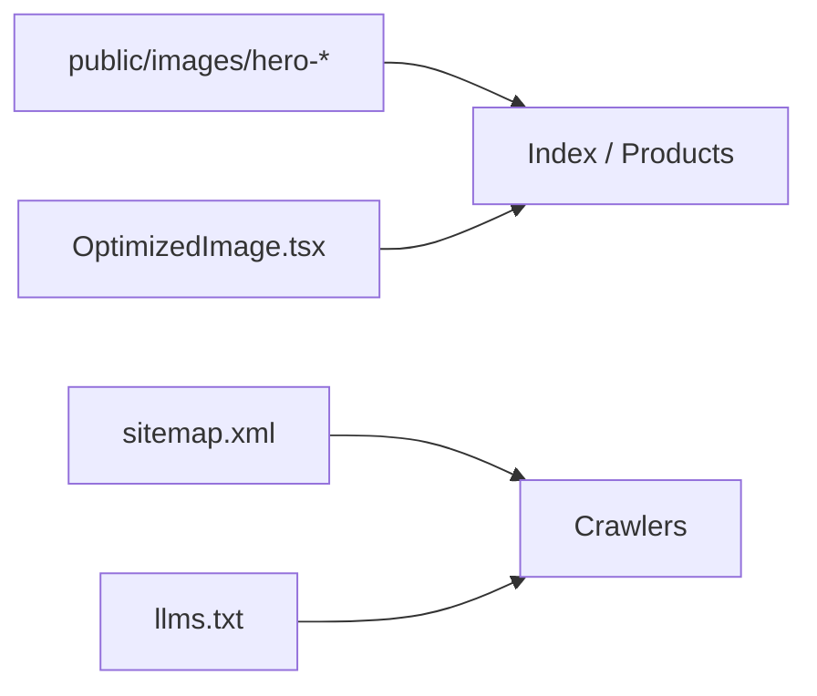

# perf/seo: OptimizedImage, Hero webp set, sitemap, llms.txt, index metadata

| Field | Value |
|-------|--------|
| **Tracking PR** | [#35](https://github.com/benmed00/lucid-web-craftsman/pull/35) |
| **Labels** | `area:frontend`, `type:feature` |
| **Risk** | Low–Medium — SEO and LCP affect conversion |

---

## Executive summary

Improve **storefront performance and discoverability**: responsive **Hero** assets (webp), safer **`OptimizedImage`** loading, **`index.html`** metadata, **`public/llms.txt`**, and **sitemap** updates. Changes must not regress **LCP** on `/` and `/products` (smoke catalog path).

---

## Asset pipeline (conceptual)



---

## Code snapshot — OptimizedImage

```typescript
// src/components/performance/OptimizedImage.tsx (refactored in PR)
// - Explicit dimensions / loading strategy
// - Reduced layout shift risk on product grids
```

---

## Code snapshot — index metadata

```html
<!-- index.html — title, description, OG tags (excerpt in PR) -->
```

---

## Before vs after

| Metric / signal | Before | After |
|-----------------|--------|-------|
| Hero delivery | Single large asset | Responsive webp set |
| Image component | Heavier re-renders | Tighter props + tests |
| LLM/crawler hints | Minimal | `llms.txt` + sitemap refresh |
| Product grid LCP | Baseline | Must not regress in smoke |

---

## Cypress screenshot evidence

| Screenshot | Route | Validates |
|------------|-------|-----------|
|  | `/products` | Catalog renders with images (stubbed Supabase) |
|  | `/` | Home + hero region visible |

Captured by: `cypress/e2e/pr_issue_evidence_spec.js`

```bash
pnpm run pr:enterprise:screenshots:capture
pnpm run pr:enterprise:screenshots:copy
```

---

## Manual checks

- [ ] Lighthouse (mobile) on `/` and `/products` — compare before/after merge (attach report PDF optional).
- [ ] View source: meta description, canonical if applicable.
- [ ] `curl -s https://<preview>/llms.txt` returns expected content.

---

## Acceptance criteria

- [ ] `pnpm run build` succeeds with new static assets.
- [ ] `enterprise_full_platform_spec` or smoke catalog still finds products.
- [ ] No broken image URLs in catalog fixture vs component paths.
- [ ] Sitemap URLs match [PLATFORM.md](../../PLATFORM.md) route inventory.

**Closes via PR #35 — Fixes #43**
