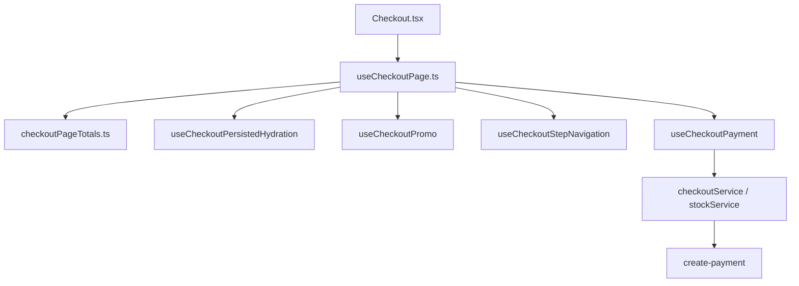

# refactor(checkout): split useCheckoutPage, SPA import policy, CLIENT_VS_SERVER rules

| Field | Value |
|-------|--------|
| **Tracking PR** | [#35](https://github.com/benmed00/lucid-web-craftsman/pull/35) |
| **Labels** | `area:frontend`, `type:feature`, `risk: medium` |
| **Issue** | **#44** |

---

## Executive summary

Replace a **~750-line monolithic** `useCheckoutPage` with a **thin orchestrator** and **five focused modules** under `src/hooks/checkout/`, while documenting **which rules are UX hints vs server-enforced** in [`CLIENT_VS_SERVER_RULES.md`](../../CLIENT_VS_SERVER_RULES.md). **No intentional change** to happy-path checkout UX; payment authority remains on **Edge + Stripe**.

---

## Module architecture



| Module | Responsibility |
|--------|----------------|
| `checkoutPageTotals.ts` | Pure `computeCheckoutTotals` (subtotal, discount, shipping, total) |
| `useCheckoutPersistedHydration.ts` | One-shot restore step + coupon from localStorage |
| `useCheckoutPromo.ts` | Promo field, `validateCouponCodeRpc`, apply/remove |
| `useCheckoutStepNavigation.ts` | Steps 1–2 validation, session persistence, scroll |
| `useCheckoutPayment.ts` | Honeypot, business rules, stock reserve, `handlePayment` |
| `useCheckoutPage.ts` | Wire hooks + form handlers + free-shipping fetch |

---

## Code snapshot — orchestrator (after)

```typescript
// src/hooks/useCheckoutPage.ts (excerpt)
import { computeCheckoutTotals } from '@/hooks/checkout/checkoutPageTotals';
import { useCheckoutPersistedHydration } from '@/hooks/checkout/useCheckoutPersistedHydration';
import { useCheckoutPromo } from '@/hooks/checkout/useCheckoutPromo';
import { useCheckoutStepNavigation } from '@/hooks/checkout/useCheckoutStepNavigation';
import { useCheckoutPayment } from '@/hooks/checkout/useCheckoutPayment';

export function useCheckoutPage() {
  // … cart, auth, session, form persistence …
  const { appliedCoupon, handleValidatePromoCode, … } = useCheckoutPromo({ … });
  const { subtotal, discount, shipping, total, … } = computeCheckoutTotals(
    cartItems, appliedCoupon, freeShippingSettings
  );
  const { goToNextStep, handleEditStep } = useCheckoutStepNavigation({ … });
  const { handlePayment, isProcessing, paymentError } = useCheckoutPayment({ … });
  return { … }; // same public shape for Checkout.tsx
}
```

---

## Code snapshot — pure totals (testable)

```typescript
// src/hooks/checkout/checkoutPageTotals.ts
export function computeCheckoutTotals(
  cartItems: CheckoutCartLine[],
  appliedCoupon: SavedCoupon | null,
  freeShippingSettings: FreeShippingSettings
) {
  // subtotal → discount cap → free shipping → shipping 6.95 → total
}
```

```typescript
// src/hooks/checkout/checkoutPageTotals.test.ts — Vitest
expect(r.discount).toBe(10);
expect(r.shipping).toBe(0); // includes_free_shipping
```

---

## Code snapshot — payment (trust boundary)

```typescript
// src/hooks/checkout/useCheckoutPayment.ts (excerpt)
const stockVerification = await stockService.reserveStock(...);
const { data, error } = await createPaymentSessionWithRetry(
  functionName,
  { items, customerInfo, guestSession, paymentMethod, discount },
  { ...csrfHeaders, 'x-checkout-session-id': checkoutSessionId },
);
if (data?.url) target.location.href = data.url;
```

See [CLIENT_VS_SERVER_RULES.md](../../CLIENT_VS_SERVER_RULES.md) — browser **displays** totals; Edge **authorizes** payment.

---

## Before vs after

| Dimension | Before | After |
|-----------|--------|-------|
| File size | `useCheckoutPage.ts` ~750 lines | Orchestrator ~260 lines + modules |
| Unit tests | Page mock only | `checkoutPageTotals.test.ts` + `Checkout.test.tsx` |
| ESLint grandfathers | 3 pages/components ignored | **None** |
| Reviewability | Single diff blob | Thematic modules |
| Public API | `useCheckoutPage()` return shape | **Unchanged** for `Checkout.tsx` |

---

## Cypress screenshots

| Step | Image | Spec |
|------|-------|------|
| Customer info (step 1) |  | `pr_issue_evidence_spec.js` |
| Payment (step 3) |  | `pr_issue_evidence_spec.js` |
| Full flow | — | `checkout_flow_spec.js` @smoke |

```bash
# Regenerate assets
pnpm run pr:enterprise:screenshots:capture
pnpm run pr:enterprise:screenshots:copy
git add docs/pr-enterprise/assets/issues/issue-evidence/
```

---

## SPA layering (related)

```javascript
// eslint.config.js — pages/components cannot import raw client
'no-restricted-imports': ['@/integrations/supabase/client', …]
```

All checkout Supabase access goes through **`checkoutApi`**, **`checkoutService`**, **`useCheckoutSession`**.

---

## Acceptance criteria

- [ ] `npx vitest run src/hooks/checkout/checkoutPageTotals.test.ts src/pages/Checkout.test.tsx` — pass.
- [ ] `pnpm run e2e:checkout` or smoke checkout specs — pass.
- [ ] `pnpm exec tsc --noEmit -p tsconfig.app.json` — pass.
- [ ] `docs/CLIENT_VS_SERVER_RULES.md` linked from README + RULES_REGISTRY.
- [ ] `docs/TECH_DEBT.md` architecture row references `src/hooks/checkout/`.
- [ ] Evidence PNGs present on branch (or attached to this issue).

---

## Verification matrix

| Layer | Command |
|-------|---------|
| Unit | `npx vitest run src/hooks/checkout/` |
| Page | `npx vitest run src/pages/Checkout.test.tsx` |
| E2E | `pnpm run e2e:checkout` |
| Lint | `pnpm exec eslint src/hooks/checkout src/hooks/useCheckoutPage.ts` |

---

## Related files

- [`src/hooks/useCheckoutPage.ts`](../../src/hooks/useCheckoutPage.ts)
- [`src/hooks/checkout/`](../../src/hooks/checkout/)
- [`src/pages/Checkout.tsx`](../../src/pages/Checkout.tsx)
- [`docs/CLIENT_VS_SERVER_RULES.md`](../../CLIENT_VS_SERVER_RULES.md)
- [`cypress/e2e/checkout_flow_spec.js`](../../cypress/e2e/checkout_flow_spec.js)

**Closes via PR #35 — Fixes #44**
