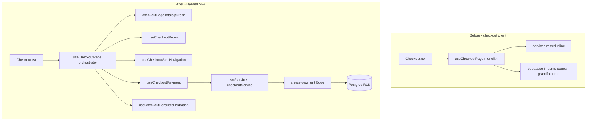

# feat(platform): pnpm rebaseline, CI/CD hardening, checkout architecture, and rules governance

> **PR:** [#35](https://github.com/benmed00/lucid-web-craftsman/pull/35)  
> **Branch:** `feat/platform-pnpm-supabase-rebaseline-edge-hardening` → `main`  
> **Type:** Integration / platform (XL) · **Risk:** Medium–High (checkout, payments, CI, Edge)  
> **Suggested labels:** `type:feature`, `area:ci`, `area:docs`, `area:supabase`, `area:frontend`, `area:test`, `size: XL`, `needs: review`, `risk: medium`

---

## Executive summary

This integration PR rebases **Rif Raw Straw** storefront engineering on a **pnpm workspace**, aligns **GitHub Actions** with local developer workflows, hardens **Supabase Edge** checkout/payment paths, expands **maintained documentation** (rules registry, business logic, hooks, CI runbooks), and refactors the **checkout client** into testable modules with an explicit **client-hint vs server-authority** policy.

**User-visible behavior is preserved** for happy-path checkout; changes are primarily **structure, guardrails, observability, and operability**. Money-path correctness remains **server-enforced** via `create-payment`, webhooks, and Postgres RLS.

---

## Problem statement

| Pain                                                                                           | Impact                                                                    |
| ---------------------------------------------------------------------------------------------- | ------------------------------------------------------------------------- |
| Monolithic `useCheckoutPage` (~750 lines)                                                      | Hard to review, test, or change payment vs step logic without regressions |
| ESLint **grandfather** carve-outs for raw `@/integrations/supabase/client` in pages/components | Layering drift; Supabase calls scattered in UI                            |
| CI / local parity gaps (Vitest slice, E2E port probe, Deno gates)                              | Green local runs that do not match CI; flaky smoke                        |
| Undocumented rule surfaces                                                                     | Client “hints” confused with authoritative pricing/stock/auth             |
| `<a href>` internal navigation                                                                 | Full page reloads; lost React Query / cart state                          |

---

## Solution overview

---

## Before vs after (behavior)

### Checkout UX (storefront)

| Scenario                                | Before                         | After                                               | Notes                                  |
| --------------------------------------- | ------------------------------ | --------------------------------------------------- | -------------------------------------- |
| 3-step checkout (info → shipping → pay) | Same steps, single hook file   | Same steps; logic split by concern                  | **No intentional UX change**           |
| Promo code apply                        | RPC + toast in monolith        | Same flow via `useCheckoutPromo`                    | Server still validates on pay          |
| Pay → Stripe redirect                   | `handlePayment` in monolith    | `useCheckoutPayment`                                | CSRF + session headers unchanged       |
| Return mid-checkout                     | localStorage + session restore | `useCheckoutPersistedHydration`                     | Same persistence contracts             |
| Min/max order toasts                    | `BusinessRules` in monolith    | Same rules; payment hook reads `businessRules.cart` | **Hints only** — Edge is authoritative |
| COD eligibility                         | Postal code checks in monolith | Same rules in orchestrator + payment                |                                        |

### Architecture & governance

| Area                                     | Before                               | After                                                                                    |
| ---------------------------------------- | ------------------------------------ | ---------------------------------------------------------------------------------------- |
| Raw Supabase in `pages/` / `components/` | 3 ESLint **grandfather** files       | **Zero** carve-outs; tests may mock client                                               |
| Checkout hook tests                      | Page test only (`Checkout.test.tsx`) | + `checkoutPageTotals.test.ts` (pure totals)                                             |
| Rules documentation                      | Scattered                            | `RULES_REGISTRY.md`, `BUSINESS_LOGIC_AND_EDGE_CASES.md`, **`CLIENT_VS_SERVER_RULES.md`** |
| Footer / FAQ internal links              | `<a href>` full reload               | `react-router` `<Link>` + Cypress SPA spec                                               |
| TypeScript strictness                    | Partial                              | `strict` enabled; `@typescript-eslint/no-explicit-any` on app sources                    |
| CI E2E smoke                             | Port probe could drift from Vite     | `VITE_DEV_SERVER_PORT` aligned in `run-e2e-ci.mjs`                                       |

---

## Screenshots & recordings (attach before merge)

> **Reviewer:** Replace placeholders with real captures from `pnpm run dev` (8080) or CI artifacts. Drag images into the PR comment or embed URLs below.

| #   | What to capture                           | Path / action                                                 | Status                  |
| --- | ----------------------------------------- | ------------------------------------------------------------- | ----------------------- |
| 1   | Checkout step 1 — customer info           | `/checkout`                                                   | ⬜ Attach               |
| 2   | Checkout step 3 — payment summary + promo | `/checkout` (step 3)                                          | ⬜ Attach               |
| 3   | Stripe redirect (test mode)               | Pay with test card                                            | ⬜ Attach or redact URL |
| 4   | Order confirmation (snapshot hydration)   | `/order-confirmation` after return                            | ⬜ Attach               |
| 5   | Footer SPA navigation (no full reload)    | Click Shop from `/cart` — network tab shows client navigation | ⬜ Attach               |
| 6   | GitHub Actions — CI green on PR           | Checks tab on #35                                             | ⬜ Attach               |
| 7   | GitHub Actions — E2E smoke (if run)       | `e2e.yml` job                                                 | ⬜ Attach               |

**Optional screen recording (30–60s):** guest checkout → promo apply → pay (test mode) → confirmation.

---

## Scope by theme

| Theme                 | Representative paths                                                                                                                | Reviewer focus                                                 |
| --------------------- | ----------------------------------------------------------------------------------------------------------------------------------- | -------------------------------------------------------------- |
| **Checkout refactor** | `src/hooks/checkout/*`, `src/hooks/useCheckoutPage.ts`                                                                              | Payment/session headers, honeypot, stock reserve, error toasts |
| **SPA layering**      | `eslint.config.js`, `src/services/*`                                                                                                | No new raw client imports in pages/components                  |
| **Edge / payments**   | `supabase/functions/create-payment/*`, `confirm-order`                                                                              | Schema alignment, discount parsing, Deno tests                 |
| **CI / DX**           | `.github/workflows/*`, `scripts/run-e2e-ci.mjs`, `scripts/check-doc-links.mjs`                                                      | Parity with `pnpm run ci:local`                                |
| **Documentation**     | `docs/RULES_REGISTRY.md`, `docs/BUSINESS_LOGIC_AND_EDGE_CASES.md`, `docs/GITHUB-ACTIONS-CI-CD.md`, `docs/CLIENT_VS_SERVER_RULES.md` | Links + anchors (`pnpm run docs:check-links`)                  |
| **Types / contracts** | `src/types/domain/*`, `src/types/contracts/*`                                                                                       | No widening of payment payloads                                |
| **Tests**             | `src/hooks/**/*.test.*`, `cypress/e2e/*`                                                                                            | Vitest + smoke paths                                           |
| **SEO / static**      | `index.html`, `public/llms.txt`, Hero assets                                                                                        | No regression on LCP-critical paths                            |

**Diff scale (vs `main`):** ~37 commits · +13.7k / −2.1k lines (integration PR — review by theme, not line-by-line entire diff).

---

## Trust boundaries (money path)

See **[docs/CLIENT_VS_SERVER_RULES.md](../CLIENT_VS_SERVER_RULES.md)**.

| Layer                       | Responsibility                                                                                |
| --------------------------- | --------------------------------------------------------------------------------------------- |
| **Browser**                 | Display totals, form validation (Zod), promo RPC preview, `BusinessRules` toasts, CSRF header |
| **Edge (`create-payment`)** | Authoritative cart, coupon, amounts, rate limits, session creation                            |
| **Postgres + RLS**          | Row access policy                                                                             |
| **Stripe + webhooks**       | Payment state, order fulfillment triggers                                                     |

**This PR does not weaken server enforcement** — it clarifies and documents boundaries and moves client orchestration into testable modules.

---

## Risk assessment

| Risk                                  | Likelihood | Severity | Mitigation                                                              |
| ------------------------------------- | ---------- | -------- | ----------------------------------------------------------------------- |
| Checkout regression                   | Medium     | High     | Vitest + `e2e:checkout`; manual test matrix below                       |
| Payment amount drift (client vs Edge) | Low        | Critical | Existing Deno pricing snapshot tests; no change to Edge authority model |
| CI false green                        | Medium     | Medium   | `ci:local`, workflow parity test, smoke on `VITE_DEV_SERVER_PORT`       |
| Large merge conflicts                 | Medium     | Low      | Merge `main` before final review; use theme-based review                |
| Doc link rot                          | Low        | Low      | `pnpm run docs:check-links` in CI                                       |

---

## Rollback & operations

1. **Revert** the merge commit on `main` (single revert preferred).
2. **Do not** cherry-pick partial reverts across `create-payment` / webhook / checkout without reading **[docs/CHECKOUT-PROD-RUNBOOK.md](../CHECKOUT-PROD-RUNBOOK.md)**.
3. **After merge:** confirm **CI** + **E2E smoke** on `main`; refresh KPI snapshot in **[docs/GITHUB-ACTIONS-CI-CD.md](../GITHUB-ACTIONS-CI-CD.md)** per runbook cadence.
4. **Edge deploy:** only if function sources changed — `pnpm run deploy:functions:payment-success` or targeted deploy per runbook.

---

## Testing evidence

### Automated (run on branch)

| Command                                                                                    | Purpose                                         | Result                       |
| ------------------------------------------------------------------------------------------ | ----------------------------------------------- | ---------------------------- |
| `pnpm run lint`                                                                            | ESLint 9 flat config, import policy, hooks deps | ✅ Local                     |
| `pnpm run format:check`                                                                    | Prettier LF parity                              | ⬜ CI / local                |
| `pnpm exec tsc --noEmit -p tsconfig.app.json`                                              | App strict types                                | ✅ Local                     |
| `pnpm run test:unit`                                                                       | Vitest CI slice                                 | ⬜ CI                        |
| `npx vitest run src/hooks/checkout/checkoutPageTotals.test.ts src/pages/Checkout.test.tsx` | Checkout refactor                               | ✅ 4/4 local                 |
| `pnpm run docs:check-links`                                                                | Rules / business-logic anchors                  | ✅ Local                     |
| `pnpm run verify:create-payment`                                                           | Deno check/lint/test create-payment             | ⬜ When Edge touched         |
| `pnpm run test:pricing-snapshot`                                                           | Pricing shape contract                          | ⬜ When pricing touched      |
| `pnpm run e2e:ci:smoke`                                                                    | Cypress smoke + port contract                   | ⬜ **Required before merge** |
| `pnpm run ci:local`                                                                        | Full CI mirror                                  | ⬜ Recommended               |

### Manual regression matrix

- [ ] Guest checkout — FR address, card payment (Stripe test)
- [ ] Logged-in checkout — profile prefill if enabled
- [ ] Invalid promo — toast `promo.invalid` / min order
- [ ] COD — eligible FR postal code only; reset to card when ineligible
- [ ] Honeypot filled — blocked with generic error
- [ ] Footer link from `/cart` → `/shop` — **no** full document reload (React state preserved)
- [ ] Admin smoke — login + orders list (if credentials available)

---

## Reviewer guide (suggested order)

1. **Trust:** `docs/CLIENT_VS_SERVER_RULES.md` + `useCheckoutPayment.ts` (payload to Edge only).
2. **Structure:** `src/hooks/checkout/` module boundaries vs old monolith (`git show main:src/hooks/useCheckoutPage.ts` if needed).
3. **Lint policy:** `eslint.config.js` — confirm no grandfather paths under pages/components.
4. **CI:** `.github/workflows/ci.yml`, `e2e.yml`, `rpc-postgrest-smoke.yml` (workflow_dispatch).
5. **Docs:** skim `RULES_REGISTRY.md` §3 (SPA imports) and §11 cross-links.
6. **Spot-check UI:** screenshots table above.

---

## Related documentation

| Doc                                                                                                      | Role                             |
| -------------------------------------------------------------------------------------------------------- | -------------------------------- |
| [docs/RULES_REGISTRY.md](../RULES_REGISTRY.md)                                                           | Index of all rule categories     |
| [docs/BUSINESS_LOGIC_AND_EDGE_CASES.md](../BUSINESS_LOGIC_AND_EDGE_CASES.md)                             | Schemas, edge cases, Cypress map |
| [docs/CLIENT_VS_SERVER_RULES.md](../CLIENT_VS_SERVER_RULES.md)                                           | Client hints vs server authority |
| [docs/HOOKS.md](../HOOKS.md)                                                                             | Hook catalog + test status       |
| [docs/GITHUB-ACTIONS-CI-CD.md](../GITHUB-ACTIONS-CI-CD.md)                                               | Workflow inventory & KPIs        |
| [docs/LOCAL_CI.md](../LOCAL_CI.md)                                                                       | `pnpm run ci:local`              |
| [docs/CHECKOUT-PROD-RUNBOOK.md](../CHECKOUT-PROD-RUNBOOK.md)                                             | Production Stripe/Brevo/webhook  |
| [docs/enterprise-pr-pack-feat-platform-rebaseline.md](../enterprise-pr-pack-feat-platform-rebaseline.md) | Labels, issue scaffolding        |
| [AGENTS.md](../../AGENTS.md)                                                                             | Agent/dev command reference      |

---

## Tracking issues (created for this PR)

| #                                                                | Issue                                                                                | Theme                 |
| ---------------------------------------------------------------- | ------------------------------------------------------------------------------------ | --------------------- |
| [#36](https://github.com/benmed00/lucid-web-craftsman/issues/36) | ci: workflows, smoke probe parity, and GITHUB-ACTIONS runbook                        | CI / runbook          |
| [#37](https://github.com/benmed00/lucid-web-craftsman/issues/37) | chore(lint): align eslint config with stricter posture on admin/UI surfaces          | ESLint / typing       |
| [#38](https://github.com/benmed00/lucid-web-craftsman/issues/38) | docs: rules registry, business logic, tech map, and agent runbooks                   | Documentation         |
| [#39](https://github.com/benmed00/lucid-web-craftsman/issues/39) | test(e2e): smoke probe port alignment and internal links spec                        | E2E / Cypress         |
| [#40](https://github.com/benmed00/lucid-web-craftsman/issues/40) | supabase: create-payment schema, confirm-order tests, generate-invoice hardening     | Edge / Deno           |
| [#41](https://github.com/benmed00/lucid-web-craftsman/issues/41) | types: edge invoke contracts, domain modules, Typedoc pipeline                       | Types / contracts     |
| [#42](https://github.com/benmed00/lucid-web-craftsman/issues/42) | chore(scripts): audit metrics, doc link check, gen-docs, proxy/CA helpers            | Scripts / DX          |
| [#43](https://github.com/benmed00/lucid-web-craftsman/issues/43) | perf/seo: OptimizedImage, Hero webp set, sitemap, llms.txt, index metadata           | Perf / SEO            |
| [#44](https://github.com/benmed00/lucid-web-craftsman/issues/44) | refactor(checkout): split useCheckoutPage, SPA import policy, CLIENT_VS_SERVER rules | Checkout architecture |

Bodies live under [`docs/pr-enterprise/issues/`](../pr-enterprise/issues/).

## Related issues

Fixes #36, #37, #38, #39, #40, #41, #42, #43, #44

---

## Checklist (merge gate)

- [ ] All **required** GitHub checks green on this PR
- [ ] `pnpm run validate` (or `pnpm run ci:local`) on latest commit
- [ ] `pnpm run e2e:ci:smoke` **or** documented reason + follow-up issue
- [ ] Screenshots / recording table filled (or waived by maintainer with comment)
- [ ] No secrets in diff; `.env` unchanged except `.env.example` if applicable
- [ ] Rules docs updated where rule surfaces changed (this PR: **yes** — registry + CLIENT_VS_SERVER + TECH_DEBT)
- [ ] Post-merge: monitor `main` CI + smoke within 24h

---

## Changelog (reviewer-facing)

High-level commit themes (37 commits)

- Edge: `confirm-order`, `create-payment` schema/discount alignment
- CI: workflows, E2E port probe, RPC PostgREST smoke workflow, `ci:local`, doc link checker
- Docs: RULES_REGISTRY, BUSINESS_LOGIC, GITHUB-ACTIONS, HOOKS, enterprise PR pack
- Types: strict TS, domain/contracts, `no-explicit-any` on app sources
- UX: React Router `Link` for internal navigation + Cypress SPA specs
- **Latest:** `refactor(checkout): split useCheckoutPage and enforce SPA import policy` (`a11c4be`)

---

**Maintainers:** Prefer **squash merge** only if release notes are updated; otherwise **merge commit** preserves thematic history for bisect. Do not merge with failing **money-path** checks.
