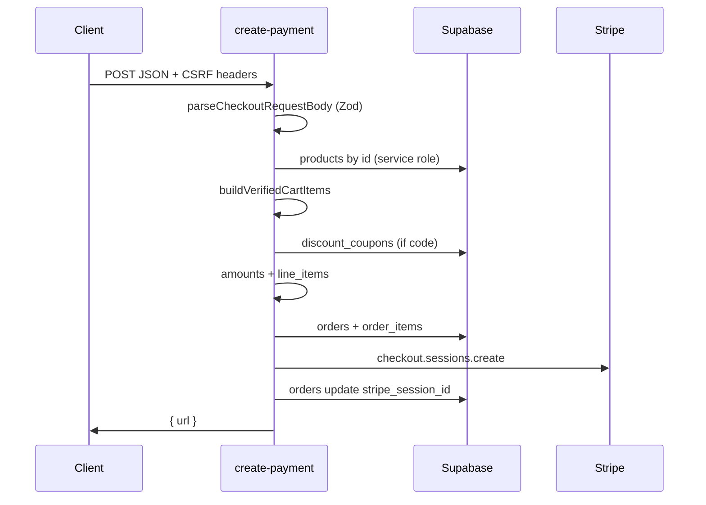

# Create-payment — data flow, mapping, and audit

This document describes how payloads move through the edge function, how types line up, and known operational tradeoffs. The entrypoint is `index.ts`; tests live in `lib/*_test.ts`.

## End-to-end flow (happy path)

## Data transfer: wire → domain → persistence

| Stage | Shape | Notes |
|--------|--------|--------|
| HTTP body | `unknown` | Parsed immediately; never trusted for prices. |
| After Zod | `ParsedCheckoutRequest` | Top-level unknown keys stripped; `items` strict; nested objects `.passthrough()`. |
| Cart verification | `VerifiedCartItem[]` | Prices/names from `products` table; client `product.price` only logged if mismatched. |
| Stripe | `CheckoutSessionLineItem[]` | `unit_amount` in **cents**; proportional discount per line; shipping line if not free. |
| Order row | `orders` insert | `amount` = **total cents**; `shipping_address` = `ShippingAddressPayload \| null`. |
| Line snapshots | `order_items` | `OrderItemInsert` includes `product_snapshot` JSON from `VerifiedProductSnapshot`. |

## Type synergy

- **`CheckoutRequestBody`** (`types.ts`): loose documentation of client JSON; handlers that accept post-parse data should prefer **`ParsedCheckoutRequest`** where possible.
- **`CheckoutCartItem`**: aligns with Zod output; used by `verified-cart` and `collectProductIds`.
- **`VerifiedCartItem`**: single source of truth for totals and Stripe lines until session creation.
- **`SupabaseClient`** without generated `Database`: list/mutation results use `SupabaseListResult` / `SupabaseMutationResult` in `types.ts` where casts are unavoidable.

## Error management

| Layer | Mechanism | HTTP |
|--------|-----------|------|
| Rate limit | `checkRateLimit` | **429** + French message (not JSON `error_type`). |
| CSRF | Missing/invalid headers | **403** |
| Body schema | `parseCheckoutRequestBody` throws `CHECKOUT_VALIDATION_ERROR_PREFIX …` | **422** via `isClientFacingValidationError` |
| Email | `isValidEmail` | **422** (`Invalid` substring) |
| Stock / product | French messages (`introuvable`, etc.) | **422** |
| DB / Stripe / other | `catch` | **500**, `error_type: internal` |

Central mapping: `lib/errors.ts` (`messageFromUnknownError`, `isClientFacingValidationError`). Payment failures are logged with `createPaymentEventLogger` (`payment_initiation_failed`).

## Audit (current strengths / gaps)

**Strengths**

- Server-side price verification; discount recomputed from DB coupon.
- CSRF + rate limit before heavy work.
- Correlation id in order metadata and Stripe metadata.
- Pure helpers covered by Deno tests (`*_test.ts`).

**Gaps / follow-ups**

- Rate limit is in-memory per isolate (resets on cold start; not shared across instances).
- `isClientFacingValidationError` uses substring heuristics; tighten with typed error codes if clients need stable machine-readable codes.
- No generated `Database` generic on `createClient` yet (see `REFACTOR_PLAN.md` Phase 6).
- Order update after Stripe session creation is not in the same transaction as inserts (eventual consistency risk on partial failure).

## Feedback for maintainers

- When changing Zod rules, update `lib/checkout-schema_test.ts` and this table.
- When adding new client fields, prefer `.passthrough()` on nested objects unless you need strict validation.
- Run from repo root: `npm run test:create-payment`, or `deno test create-payment/ --config supabase/functions/deno.json` from `supabase/functions`.
