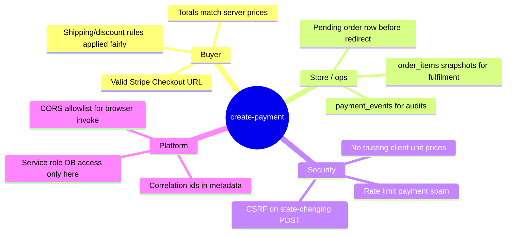
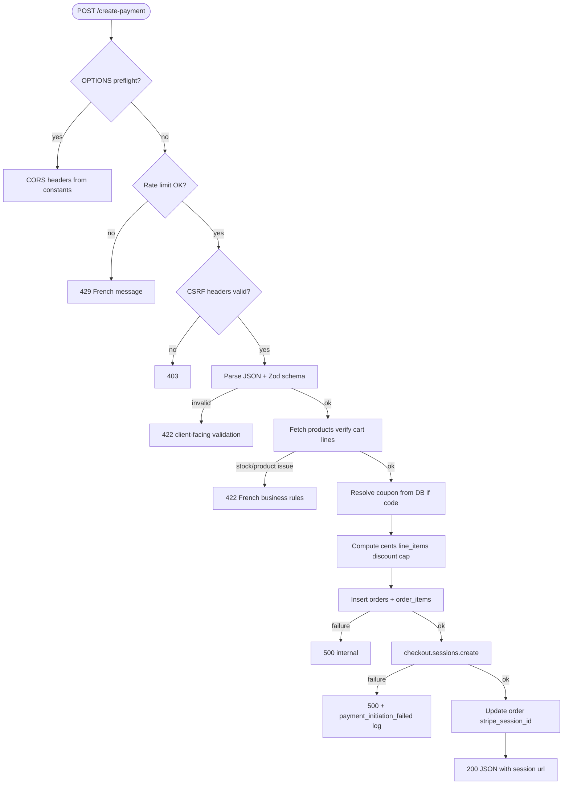
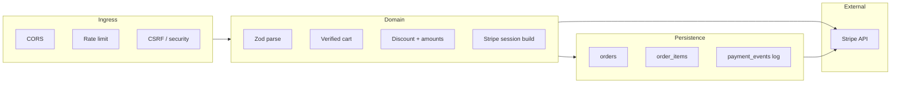
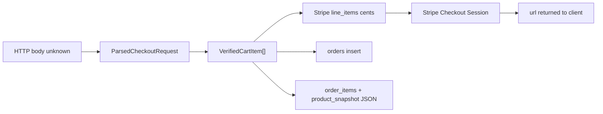
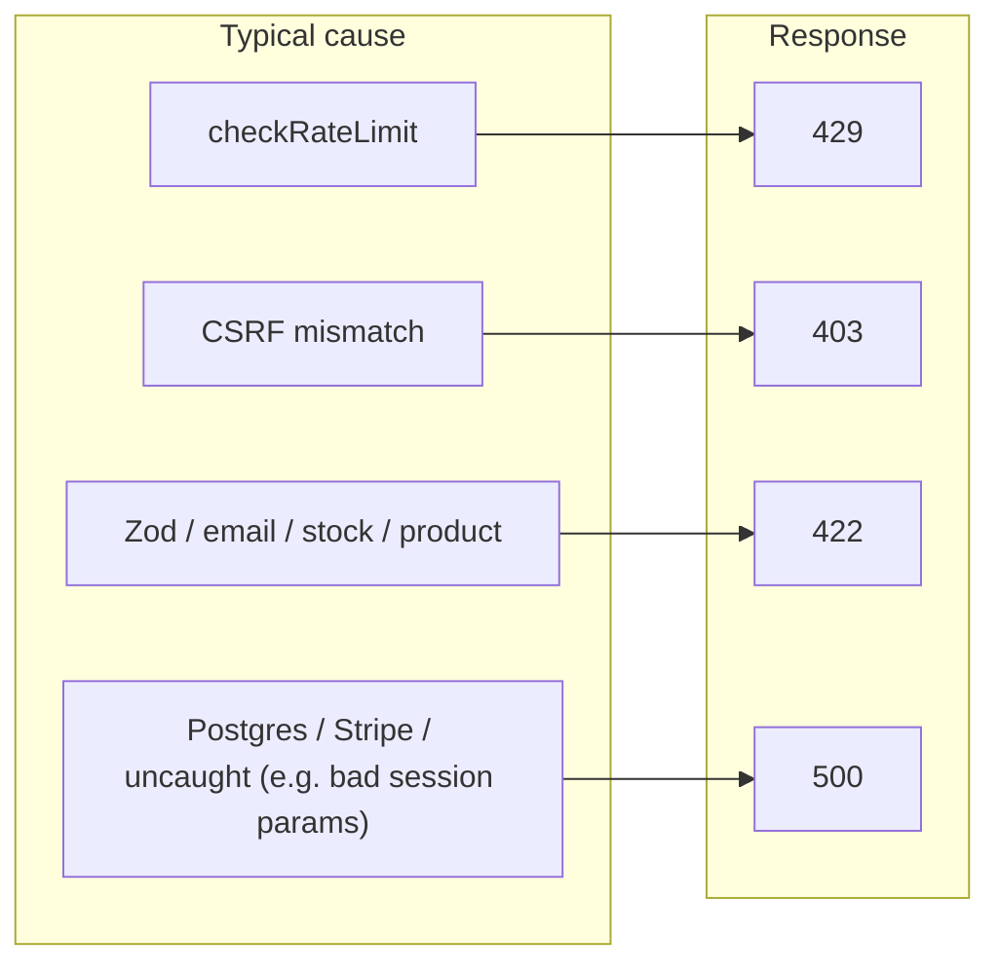
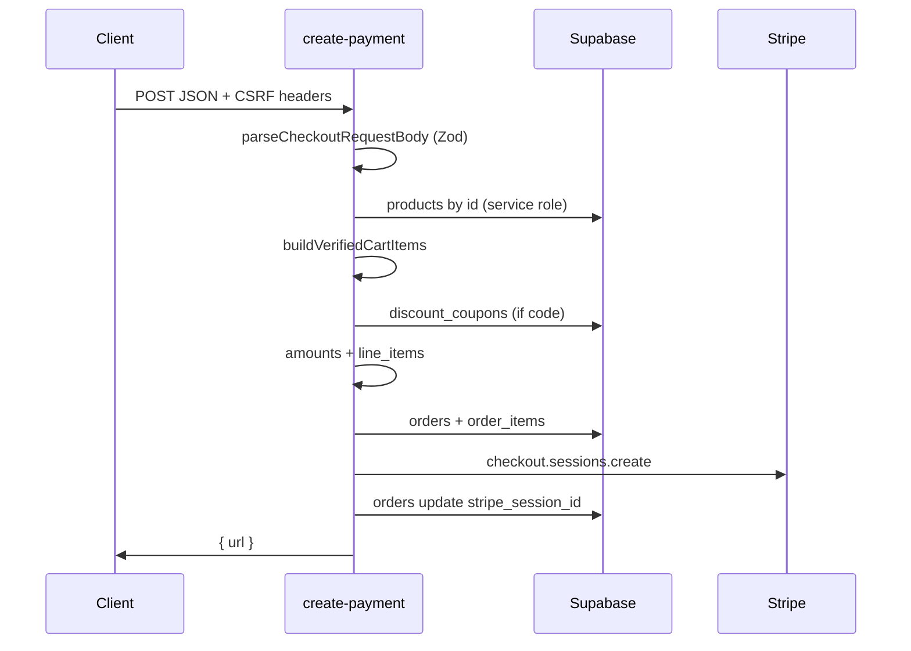

# Create-payment — data flow, mapping, and audit

This document describes how payloads move through the edge function, how types line up, and known operational tradeoffs. The entrypoint is `index.ts`; tests live in `lib/*_test.ts`.

**Configuration & HTTP surface constants** (CORS allow-headers, rate limits, max cart items, Stripe min/shipping cents, origin allowlist, `CHECKOUT_VALIDATION_ERROR_PREFIX`): [`constants.ts`](./constants.ts).

## Visual reference (graphs)

Short atlas of **needs**, **behaviour**, **functional stages**, **module ties**, and **shape evolution**. Diagrams are [Mermaid](https://mermaid.js.org/); they render on GitHub and in many IDEs.

### 1. Needs & stakeholders (mindmap)

What the function must satisfy and for whom.

### 2. Behaviour — guard rails then work (flowchart)

Order of checks and main success path (simplified; see sequence diagram below for IO detail).

### 3. Functionalities by layer (block view)

### 4. Data flow — type / shape handoffs

Mirrors the **Data transfer: wire → domain → persistence** table below; shows **trust boundary**: prices become authoritative only after product rows load.

### 5. Ties — orchestrator imports (`index.ts` → modules)

Direct imports from the Edge entrypoint (runtime order is inside `serve()`, not this star).

```mermaid
flowchart TB
  IDX["index.ts serve"]
  IDX --> CST["constants.ts"]
  IDX --> TYP["types.ts"]
  IDX --> SCH["lib/checkout-schema.ts"]
  IDX --> RL["lib/rate-limit.ts"]
  IDX --> SEC["lib/security.ts"]
  IDX --> VC["lib/verified-cart.ts"]
  IDX --> DIS["lib/discount.ts"]
  IDX --> AMT["lib/amounts.ts"]
  IDX --> SS["lib/stripe-session.ts"]
  IDX --> ORD["lib/orders.ts"]
  IDX --> PE["lib/payment-events.ts"]
  IDX --> SC["lib/stripe-client.ts"]
  IDX --> STRCUS["lib/stripe-customer.ts"]
  IDX --> AU["lib/auth-user.ts"]
  IDX --> ERR["lib/errors.ts"]
```

**Typical runtime chain inside the handler** (simplified): `parseCheckoutRequestBody` → `fetchProductsForCart` / `buildVerifiedCartItems` → `resolveServerDiscount` → `buildStripeCheckoutLineItems` / caps → `insertPaymentPendingOrder` + line items → `buildCheckoutSessionCreateParams` → Stripe `checkout.sessions.create` → order patch + logging.

### 6. Errors → HTTP surface

Maps to the **Error management** table below; central logic in `lib/errors.ts`.

## End-to-end flow (happy path)

### Browser return after Stripe Checkout

After `checkout.sessions.create`, Stripe redirects the customer to **`success_url`** from `lib/stripe-session.ts`:

- **Shape:** `{origin}/order-confirmation?order_id={orders.id}&payment_complete=1` (real UUID embedded at session creation; not a Stripe template variable).
- **Origin:** from `getValidOrigin(req)` in `index.ts` (request `Origin` / `Referer` when allowlisted or local dev, else `SITE_URL` / production default — see `constants.ts`).

The SPA resolves **`order_id`** (and legacy query keys — see `src/lib/checkout/paymentReturnKeys.ts`) and calls **`order-lookup`** with **`{ order_id }`** plus the usual Supabase headers (**`x-guest-id`** when guest checkout). Email recovery links from **`send-order-confirmation`** use the same query shape with **`SITE_URL`**.

## Data transfer: wire → domain → persistence

| Stage             | Shape                       | Notes                                                                                                                                                                                                                                                                                                          |
| ----------------- | --------------------------- | -------------------------------------------------------------------------------------------------------------------------------------------------------------------------------------------------------------------------------------------------------------------------------------------------------------- |
| HTTP body         | `unknown`                   | Parsed immediately; never trusted for prices.                                                                                                                                                                                                                                                                  |
| After Zod         | `ParsedCheckoutRequest`     | Top-level unknown keys stripped; `items` strict; nested objects `.passthrough()`.                                                                                                                                                                                                                              |
| Cart verification | `VerifiedCartItem[]`        | Prices/names from `products` table; client `product.price` only logged if mismatched.                                                                                                                                                                                                                          |
| Stripe            | `CheckoutSessionLineItem[]` | `unit_amount` in **cents**; proportional discount per line; shipping line if not free. **`product_data.images`** must be absolute URLs Stripe can fetch (see `absoluteUrlForStripeProductImage` in `lib/amounts.ts`: never the browser `Origin` on localhost; use `SITE_URL` / `SUPABASE_URL` as appropriate). |
| Order row         | `orders` insert             | `amount` = **total cents**; `shipping_address` = `ShippingAddressPayload \| null`.                                                                                                                                                                                                                             |
| Line snapshots    | `order_items`               | `OrderItemInsert` includes `product_snapshot` JSON from `VerifiedProductSnapshot`.                                                                                                                                                                                                                             |

## Type synergy

- **`CheckoutRequestBody`** (`types.ts`): loose documentation of client JSON; handlers that accept post-parse data should prefer **`ParsedCheckoutRequest`** where possible.
- **`CheckoutCartItem`**: aligns with Zod output; used by `verified-cart` and `collectProductIds`.
- **`VerifiedCartItem`**: single source of truth for totals and Stripe lines until session creation.
- **`SupabaseClient`** without generated `Database`: list/mutation results use `SupabaseListResult` / `SupabaseMutationResult` in `types.ts` where casts are unavoidable.

## Error management

| Layer               | Mechanism                                                              | HTTP                                              |
| ------------------- | ---------------------------------------------------------------------- | ------------------------------------------------- |
| Rate limit          | `checkRateLimit`                                                       | **429** + French message (not JSON `error_type`). |
| CSRF                | Missing/invalid headers                                                | **403**                                           |
| Body schema         | `parseCheckoutRequestBody` throws `CHECKOUT_VALIDATION_ERROR_PREFIX …` | **422** via `isClientFacingValidationError`       |
| Email               | `isValidEmail`                                                         | **422** (`Invalid` substring)                     |
| Stock / product     | French messages (`introuvable`, etc.)                                  | **422**                                           |
| DB / Stripe / other | `catch`                                                                | **500**, `error_type: internal`                   |

Central mapping: `lib/errors.ts` (`messageFromUnknownError`, `isClientFacingValidationError`). Payment failures are logged with `createPaymentEventLogger` (`payment_initiation_failed`).

## Audit (current strengths / gaps)

**Strengths**

- Server-side price verification; discount recomputed from DB coupon.
- CSRF + rate limit before heavy work.
- Correlation id in order metadata and Stripe metadata.
- Pure helpers covered by Deno tests (`*_test.ts`).
- **CI:** `.github/workflows/deno-create-payment.yml` on the same branches as root CI (`deno check` + `deno test` without a frozen lockfile; see **CI and lockfile** below).

**Gaps / follow-ups**

- Rate limit is in-memory per isolate (resets on cold start; not shared across instances).
- `isClientFacingValidationError` uses substring heuristics; tighten with typed error codes if clients need stable machine-readable codes.
- No generated `Database` generic on `createClient` yet (see `REFACTOR_PLAN.md` Phase 6).
- Order update after Stripe session creation is not in the same transaction as inserts (eventual consistency risk on partial failure).

## CI and lockfile

- **GitHub Actions:** `.github/workflows/deno-create-payment.yml` runs on **push** and **pull_request** for the same branch allowlist as `.github/workflows/ci.yml`. `deno check` and `deno test` run **without** `--lock --frozen` so CI matches local `npm run verify:create-payment`. (A committed Deno 2 **lockfile v5** broke older Supabase CLI Docker bundlers; import versions stay pinned in `deno.json` / per-function `deno.json`.)
- **Local parity before a PR:** `npm run verify:create-payment` from the repo root.
- **After changing `deno.json` imports or versions:** run `deno cache supabase/functions/create-payment/index.ts --config supabase/functions/deno.json` locally to confirm resolution; optional: regenerate a lockfile for your own reproducibility (do not commit v5 if your deploy pipeline uses an older bundler).

## Manual smoke (not in CI)

- Full **HTTP** checkout still needs a real CSRF triple, optional auth, and Supabase/Stripe secrets — run against staging or `supabase functions serve` with env vars. Track **422 vs 500** rates and `payment_initiation_failed` after deploys.

## Feedback for maintainers

- When changing Zod rules, update `lib/checkout-schema_test.ts` and this table.
- When adding new client fields, prefer `.passthrough()` on nested objects unless you need strict validation.
- Quick tests from repo root: `npm run test:create-payment`. Stricter pre-PR gate: `npm run verify:create-payment`.

## See also

- SPA behavior after redirect (polling, elevated storefront, service worker): [`docs/PLATFORM.md`](../../../docs/PLATFORM.md).
- Doc index: [`docs/README.md`](../../../docs/README.md).
