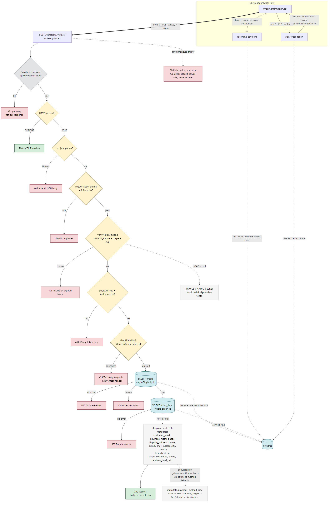

# get-order-by-token

Token-gated read of one order (+ its line items) for the
`/order-confirmation` page. Public endpoint, no login required — the
HMAC-signed token from [`sign-order-token`](../sign-order-token/) is the
sole auth gate.

> **Two HMAC token systems exist in this repo — don't mix them up.**
> This function uses `INVOICE_SIGNING_SECRET` (paired with `sign-order-token`).
> The sibling `order-confirmation-lookup` uses `ORDER_CONFIRMATION_TOKEN_SECRET`
> with a different payload. Different functions, different secrets.

---

## At a glance

|                    |                                                                                                                                                                                                  |
| ------------------ | ------------------------------------------------------------------------------------------------------------------------------------------------------------------------------------------------ |
| **Method / path**  | `POST /functions/v1/get-order-by-token`                                                                                                                                                          |
| **Gateway auth**   | `apikey: <SUPABASE_ANON_KEY>` (header)                                                                                                                                                           |
| **Body**           | `{ "token": "<base64url.base64url>" }`                                                                                                                                                           |
| **Token lifetime** | 15 min (`ORDER_TTL_SECONDS` in [`_shared/invoice/token.ts`](../_shared/invoice/token.ts))                                                                                                        |
| **Token type**     | must be `order_access` — `invoice_access` tokens are rejected                                                                                                                                    |
| **Rate limit**     | 20 requests / 60 s per `order_id` (post-verify); 21st → `429` with `Retry-After`. State in Postgres (`public.edge_rate_limits`), in-memory fallback on DB outage                                 |
| **Returns (200)**  | `{ order, items }` — `order.metadata` **and** `order.shipping_address` both PII-whitelisted (definitions in `_shared/order-response-whitelists.ts`)                                              |
| **DB access**      | service role (bypasses RLS)                                                                                                                                                                      |
| **Logs**           | structured JSON: `{ fn, step, order_id?, reason?, ... }` (matches `sign-order-token`)                                                                                                            |
| **Env vars**       | `SUPABASE_URL`, `SUPABASE_SERVICE_ROLE_KEY`, `INVOICE_SIGNING_SECRET`                                                                                                                            |
| **Tests**          | **55 passing** — 35 handler-layer + 5 Postgres store + 3 composite store + 5 whitelists + 7 labels (rate-limit tests now live in `_shared/rate-limit/`, shared with `order-confirmation-lookup`) |
| **E2E**            | `cypress/e2e/get_order_by_token_mocked_spec.ts` — stubs both edge functions end-to-end                                                                                                           |
| **OpenAPI**        | `openapi.fragment.json` picked up by `pnpm run openapi:edge-functions`                                                                                                                           |
| **Deploy**         | not bundled; `supabase functions deploy get-order-by-token`                                                                                                                                      |

---

## How it works



**Legend** — colour code, consistent throughout:

| Swatch          | Meaning                                      |
| --------------- | -------------------------------------------- |
| green rectangle | success response                             |
| red rectangle   | error response (status + body)               |
| grey rectangle  | not our response (e.g. Supabase gateway 401) |
| yellow diamond  | handler decision point                       |
| blue cylinder   | Postgres query / DB                          |
| light rectangle | annotation (whitelist keys, shared secret)   |

<details>
<summary>Mermaid source (edit <code>diagram.mmd</code> and regenerate)</summary>

The image above is `diagram.svg` / `diagram.png`, rendered from
[`diagram.mmd`](./diagram.mmd). To regenerate after editing:

```bash
npx -p @mermaid-js/mermaid-cli@11 -p puppeteer mmdc \
  -i supabase/functions/get-order-by-token/diagram.mmd \
  -o supabase/functions/get-order-by-token/diagram.png \
  -b white -w 1600
```

The PNG is referenced by the README because SVGs get dark-mode CSS filtering
in some viewers (Cursor, GitHub in dark mode), which re-tints the labels.
PNG is immune.

</details>

---

## Related functions

- **`sign-order-token`** (upstream) — checks order status, mints the
  15-minute HMAC token. Returns **409** until paid; frontend retries up to 4×.
- **`reconcile-payment`** — called by the frontend before `sign-order-token`
  to best-effort flip `status='paid'`. Awaited but its errors are swallowed.
- **`order-confirmation-lookup`** — parallel token system with its own secret
  and payload shape. Different flow (email links / status page). Do not
  confuse the two.

---

## HTTP contract

### Request

```http
POST /functions/v1/get-order-by-token
apikey: <SUPABASE_ANON_KEY>
Content-Type: application/json

{ "token": "<base64url-payload>.<base64url-signature>" }
```

> Without `apikey` you get a **gateway 401** that looks identical to our own
> `Invalid or expired token`. Always check the response body (HTML vs JSON)
> to know which layer rejected you.

### Errors

| Status | Body                       | When                                                                  |
| ------ | -------------------------- | --------------------------------------------------------------------- |
| `400`  | `Invalid JSON body`        | `req.json()` threw                                                    |
| `400`  | `Missing token`            | Zod body schema failed (missing / non-string / empty)                 |
| `401`  | `Invalid or expired token` | bad signature, malformed, or expired                                  |
| `401`  | `Wrong token type`         | valid but not `order_access`                                          |
| `401`  | _(HTML / different JSON)_  | **Gateway**, not us — missing `apikey`                                |
| `404`  | `Order not found`          | token valid, row gone                                                 |
| `429`  | `Too many requests`        | >20 requests/min on the same `order_id`; `Retry-After` header present |
| `500`  | `Database error`           | Postgrest error on `orders` or `order_items`                          |
| `500`  | `Internal server error`    | unexpected throw; full detail server-side only                        |

<details>
<summary>Full success response example</summary>

```jsonc
{
  "order": {
    "id": "ord_…",
    "status": "paid",
    "order_status": "processing",
    "amount": 4999,
    "currency": "eur",
    "created_at": "2026-01-01T00:00:00Z",
    "shipping_address": {
      // Whitelisted — see PUBLIC_SHIPPING_ADDRESS_KEYS in handler.ts.
      // phone and address_line2 are deliberately stripped.
      "first_name": "…",
      "last_name": "…",
      "address_line1": "…",
      "postal_code": "…",
      "city": "…",
      "country": "FR",
      "email": "…",
    },
    "metadata": {
      // Whitelisted — see PUBLIC_ORDER_METADATA_KEYS in handler.ts.
      // Populated by _shared/confirm-order.ts after successful payment.
      "customer_email": "alice@example.com",
      "payment_method_label": "Carte bancaire",
    },
    "payment_method": "card",
    "user_id": null,
    "pricing_snapshot": {
      /* server-computed totals */
    },
    "subtotal_amount": 4999,
    "discount_amount": 0,
    "shipping_amount": 0,
    "total_amount": 4999,
  },
  "items": [
    {
      "quantity": 2,
      "unit_price": 2499,
      "total_price": 4998,
      "product_snapshot": {
        /* … */
      },
      "product_id": 42,
    },
  ],
}
```

> **`items[].product_id` is `number | null`** — the DB migration declares
> `product_id INTEGER REFERENCES public.products(id)`. Both server schema
> (`OrderItemRowSchema` in `handler.ts`) and client type
> (`OrderByTokenResponse` in `generateInvoice.ts`) agree.

</details>

---

## Security model

1. **The HMAC token is the sole auth gate.** No RLS, no session, no cookie.
2. **TTL = 15 min** (`ORDER_TTL_SECONDS`), enforced by `verifyTokenPayload`.
3. **Type guard** — `invoice_access` tokens (30 days) rejected with 401.
4. **Rate limit** — 20 requests / 60 s per `order_id`, applied AFTER token
   verify so bogus tokens can't exhaust a legitimate order's budget. State
   lives in Postgres (`public.edge_rate_limits` + atomic
   `edge_rate_limit_consume` RPC, migration
   [`20260421120000_edge_rate_limits.sql`](../../migrations/20260421120000_edge_rate_limits.sql)),
   with an in-memory fallback (`lib/rate-limit-composite.ts`) so a DB outage
   degrades rather than 5xxs the request.
5. **`metadata` whitelist** — only `customer_email` and `payment_method_label`
   are echoed. Strips `client_ip`, `stripe_session_id`, `correlation_id`,
   device info. `payment_method_label` is populated by
   [`_shared/confirm-order.ts`](../_shared/confirm-order.ts) via
   [`_shared/payment-method-label.ts`](../_shared/payment-method-label.ts)
   (34 Stripe methods mapped to French labels, safe "Carte bancaire" default
   for unknowns) from Stripe's `session.payment_method_types[0]` (or `'cod'`).
6. **`shipping_address` whitelist** — `first_name`, `last_name`, `email`,
   `address_line1`, `postal_code`, `city`, `country`. `phone` and
   `address_line2` are stripped (not consumed by the UI). Both whitelists
   live in
   [`_shared/order-response-whitelists.ts`](../_shared/order-response-whitelists.ts)
   so future endpoints that surface order data enforce the same contract.
7. **`pricing_snapshot`** — server-computed numeric totals
   (`subtotal_minor`, `discount_minor`, `shipping_minor`, `total_minor`,
   `currency`). Audited: safe to return as-is.
8. **500 never leaks `err.message`** — client gets a generic string, full
   detail only in server logs.

---

## Development

<details open>
<summary>Commands (lint, typecheck, test)</summary>

```bash
# Lint
deno lint --config supabase/functions/deno.json \
  supabase/functions/get-order-by-token/ \
  supabase/functions/_shared/rate-limit/

# Typecheck (handler + 3 rate-limit store files + tests)
deno check --config supabase/functions/deno.json \
  supabase/functions/get-order-by-token/index.ts \
  supabase/functions/get-order-by-token/handler.ts \
  supabase/functions/_shared/rate-limit/rate-limit.ts \
  supabase/functions/_shared/rate-limit/rate-limit-postgres.ts \
  supabase/functions/_shared/rate-limit/rate-limit-composite.ts \
  supabase/functions/get-order-by-token/index_test.ts

# Tests for this function (35 handler-layer)
deno test --config supabase/functions/deno.json --allow-env \
  supabase/functions/get-order-by-token/

# Shared rate-limit primitives — now under _shared/, consumed by both
# get-order-by-token and order-confirmation-lookup (5 Postgres + 3 composite)
deno test --config supabase/functions/deno.json --allow-env \
  supabase/functions/_shared/rate-limit/

# Shared helpers owned by this function's write + response path (12)
deno test --config supabase/functions/deno.json --allow-env \
  supabase/functions/_shared/order-response-whitelists_test.ts \
  supabase/functions/_shared/payment-method-label_test.ts
```

### End-to-end (Cypress)

```bash
pnpm run e2e:ci -- --spec cypress/e2e/get_order_by_token_mocked_spec.ts
```

The spec (`cypress/e2e/get_order_by_token_mocked_spec.ts`) stubs
`reconcile-payment` + `sign-order-token` + `get-order-by-token` and covers:
happy path, `sign-order-token` 409-retry loop, and the 401 error branch.

</details>

<details>
<summary>Test layout</summary>

- **Token layer** (5) — `verifyTokenPayload` sign/verify roundtrip,
  tamper, expiry, type distinction.
- **Handler layer** (30) — `handleRequest` against a fake `SupabaseClient`:
  every status code in the decision tree, Zod enforcement, schema ↔ select
  drift guard, PII whitelists (metadata + shipping address, each with a
  serialized-body needle check for leak regressions), rate-limit budget +
  retry-after header, structured-log format, `product_id` must be a number,
  and the 500-no-leak contract.
- **Shared helper** (3, separate file) — `paymentMethodLabel` maps Stripe
  method strings to French labels, with case-insensitive matching and a safe
  fallback for unknown methods.

**No automated E2E today.** `cypress/e2e/order_confirmation_mocked_spec.ts`
visits `/order-confirmation` but intercepts Supabase REST
(`/rest/v1/orders?…`) — not this function. See [Backlog](#backlog).

</details>

<details>
<summary>Deploy</summary>

Not in the `payment-success` or `stripe-return` bundles in `package.json`.
Deploy directly:

```bash
supabase functions deploy get-order-by-token
```

</details>

---

## Debugging

Always check the **response body**, not just the status code.

| Symptom                                                | Likely cause                              | What to check                                                                                                  |
| ------------------------------------------------------ | ----------------------------------------- | -------------------------------------------------------------------------------------------------------------- |
| `400 Invalid JSON body`                                | frontend sent malformed JSON              | POST body in `OrderConfirmation.tsx` / `fetchOrderByToken`                                                     |
| `400 Missing token`                                    | empty / non-string / null token           | frontend payload                                                                                               |
| `401 Invalid or expired token`                         | secret mismatch **or** >15 min old        | `INVOICE_SIGNING_SECRET` same on `sign-order-token` **and** here                                               |
| `401 Wrong token type`                                 | caller sent an `invoice_access` token     | use `/invoice/*` routes instead                                                                                |
| `401` HTML / `No API key found`                        | **Gateway**, not us                       | add `apikey: SUPABASE_ANON_KEY` header                                                                         |
| `404 Order not found`                                  | token valid, row missing                  | DB truncation, wrong project/env                                                                               |
| `429 Too many requests`                                | 20 req/min budget per `order_id` exceeded | wait `Retry-After` seconds; check for a buggy client retry loop                                                |
| `500 Database error`                                   | Postgrest error on query                  | grep structured logs for `"step":"db_query_orders"` or `"db_query_order_items"` and the `pg_code` field        |
| `500 Internal server error`                            | generic catch-all (sanitized)             | grep server logs for `"step":"unexpected"`                                                                     |
| `200` but `metadata`/`shipping_address` fields missing | **by design** — whitelists                | `metadata`: `customer_email` + `payment_method_label` only; `shipping_address`: no `phone`, no `address_line2` |
| endpoint never reached, client spins                   | stuck upstream on `sign-order-token` 409  | check `stripe-webhook` and `reconcile-payment`                                                                 |

<details>
<summary>Curl sanity checks</summary>

```bash
# Happy path (needs a real token from sign-order-token)
curl -sX POST "$SUPABASE_URL/functions/v1/get-order-by-token" \
  -H "apikey: $SUPABASE_ANON_KEY" \
  -H 'Content-Type: application/json' \
  -d "{\"token\":\"$TOKEN\"}" | jq

# Confirm PII is stripped
curl -sX POST "$SUPABASE_URL/functions/v1/get-order-by-token" \
  -H "apikey: $SUPABASE_ANON_KEY" \
  -H 'Content-Type: application/json' \
  -d "{\"token\":\"$TOKEN\"}" \
  | jq '.order.metadata // {} | keys'
# expected: ["customer_email"]   (or [])

# Distinguish gateway 401 from our 401 (NO apikey)
curl -sX POST "$SUPABASE_URL/functions/v1/get-order-by-token" \
  -H 'Content-Type: application/json' \
  -d '{"token":"x"}'
# → gateway: HTML or {"message":"No API key found in request"}
# → ours   : {"error":"Invalid or expired token"} (with apikey set)
```

</details>

<details>
<summary>Local replay (unit test style)</summary>

```ts
import { handleRequest } from './handler.ts';
// makeAdmin is the fake-client helper in index_test.ts
const res = await handleRequest(
  new Request('http://x', { method: 'POST', body: '{"token":"bogus"}' }),
  makeAdmin()
);
console.log(res.status, await res.json());
// 401 { error: 'Invalid or expired token' }
```

</details>

---

## Roadmap & backlog

<details>
<summary>Shipped (5 tiers audited, all landed)</summary>

| Tier  | Scope                                                                                                                                                                                                                                                                                                                                                                                                                                                                                                                                                                                                                                             |
| ----- | ------------------------------------------------------------------------------------------------------------------------------------------------------------------------------------------------------------------------------------------------------------------------------------------------------------------------------------------------------------------------------------------------------------------------------------------------------------------------------------------------------------------------------------------------------------------------------------------------------------------------------------------------- |
| **1** | Extracted `handleRequest` into `handler.ts` so tests can mock the Supabase client. Fixed 400-vs-500 on malformed JSON. Sanitized 500 path. Added 12 handler tests.                                                                                                                                                                                                                                                                                                                                                                                                                                                                                |
| **2** | Zod schemas as single source of truth for row shapes; `ORDER_SELECT` / `ITEMS_SELECT` derived — drift impossible. Zod-validated request body. PII whitelist for `metadata`. Added 11 tests, including an end-to-end PII-leak regression guard.                                                                                                                                                                                                                                                                                                                                                                                                    |
| **3** | Removed dead `payload.exp < nowSeconds` re-check (superseded by `verifyTokenPayload`).                                                                                                                                                                                                                                                                                                                                                                                                                                                                                                                                                            |
| **4** | Fixed `product_id` type drift (now `number \| null`, matches DB `INTEGER`). Populated `metadata.payment_method_label` via new `_shared/payment-method-label.ts` wired into `_shared/confirm-order.ts`. Added `lib/rate-limit.ts` — 20 req/min per `order_id`, post-verify, returns 429 + `Retry-After`. Converted all handler logs to structured JSON (`{ fn, step, order_id?, reason?, ... }`) matching `sign-order-token`. Whitelisted `shipping_address` (drops `phone`, `address_line2`). Added `openapi.fragment.json`. Audited `pricing_snapshot` — numeric totals only, safe to echo. 7 new tests.                                         |
| **5** | Cypress E2E spec (`cypress/e2e/get_order_by_token_mocked_spec.ts`): happy path + 409-retry + 401-error via edge-function stubs. Externalized rate-limit state to Postgres (`public.edge_rate_limits` + atomic `edge_rate_limit_consume` RPC) with in-memory fallback on DB outage — store abstraction in `lib/rate-limit{,-postgres,-composite}.ts`. Promoted both response whitelists to `_shared/order-response-whitelists.ts` so future endpoints get the same PII contract. Widened `paymentMethodLabel` dictionary from 10 → 34 Stripe methods (cards, wallets, BNPL, bank-redirect, offline/in-store). 20 new tests across the new modules. |

Totals across all five tiers for surfaces owned by this function:

- **Handler + store tests:** 43 (35 handler + 5 Postgres store + 3 composite)
- **Shared helpers:** 12 (5 response whitelists + 7 payment-method labels)
- **Cypress E2E:** 3 scenarios in `get_order_by_token_mocked_spec.ts`

</details>

### Open — likely worth doing

- [ ] **Add `verify:get-order-by-token` script** (`package.json` — lint + check + test),
      mirroring `verify:create-payment`. Should cover
      `get-order-by-token/` and both `_shared/` helper test files.
- [ ] **Wire the Cypress spec into a CI job** (PR-gated) — the spec is
      self-contained (all edge-function calls stubbed) so it's cheap to run.

### Open — speculative / parking

- [ ] Tighten CORS to an allow-list of storefront origins.
- [ ] Runtime-validate DB responses with Zod (`.safeParse(row)`) — rejected
      today for perf / legacy-row risk.
- [ ] Token-reuse / replay tracking (`jti` table). The rate limit already
      blunts brute replay; single-use adds state — skip until a reason.
- [ ] Per-IP rate-limit layer on top of the per-`order_id` one, once the
      gateway exposes a trusted client IP header.

---

## File map

```
supabase/functions/get-order-by-token/
├── index.ts                          thin Deno.serve wrapper (env + composite store wiring + delegate)
├── handler.ts                        exported handleRequest + schemas (whitelists re-exported from _shared)
├── index_test.ts                     35 handler-layer tests
├── openapi.fragment.json             merged by pnpm run openapi:edge-functions
├── diagram.mmd                       Mermaid source for the data-flow diagram
├── diagram.png                       rendered version (embedded by this README)
├── diagram.svg                       SVG alternate (zooms cleaner)
└── README.md                         this file
```

Shared helpers this function owns or consumes (new or touched here):

```
supabase/functions/_shared/
├── order-response-whitelists.ts        PUBLIC_ORDER_METADATA_KEYS + PUBLIC_SHIPPING_ADDRESS_KEYS + pick functions
├── order-response-whitelists_test.ts   5 tests (drop, null handling, key-set stability)
├── payment-method-label.ts             34 Stripe methods → French labels
├── payment-method-label_test.ts        7 tests (every category + introspection guard)
├── confirm-order.ts                    imports the label, writes metadata.payment_method_label
└── rate-limit/
    ├── rate-limit.ts                   store interface + in-memory implementation (shared with order-confirmation-lookup)
    ├── rate-limit-postgres.ts          Postgres-backed store (wraps edge_rate_limit_consume RPC)
    ├── rate-limit-postgres_test.ts     5 tests (RPC contract, bigint coercion, error paths)
    ├── rate-limit-composite.ts         primary-with-fallback wrapper
    └── rate-limit-composite_test.ts    3 tests (short-circuit, fallback triggers, optional callback)
```

> The `rate-limit/` primitives moved out of `get-order-by-token/lib/` when
> `order-confirmation-lookup` was rate-limited (same Postgres RPC, different
> identifier namespace). `get-order-by-token` still owns the Postgres
> migration and the atomic `edge_rate_limit_consume` RPC.

Migration:

```
supabase/migrations/
└── 20260421120000_edge_rate_limits.sql  edge_rate_limits table + atomic edge_rate_limit_consume RPC
```

Cypress spec:

```
cypress/e2e/
└── get_order_by_token_mocked_spec.ts   3 scenarios; all edge-function calls stubbed
```

## See also

- [`supabase/functions/README.md`](../README.md) — edge-function index
- [`_shared/invoice/token.ts`](../_shared/invoice/token.ts) — HMAC primitive + TTL constants
- [`_shared/confirm-order.ts`](../_shared/confirm-order.ts) — single writer that populates `metadata.payment_method_label`
- [`_shared/payment-method-label.ts`](../_shared/payment-method-label.ts) — label dictionary
- [`src/lib/invoice/generateInvoice.ts`](../../../src/lib/invoice/generateInvoice.ts) — `requestOrderToken` + `fetchOrderByToken` helpers
- [`src/pages/OrderConfirmation.tsx`](../../../src/pages/OrderConfirmation.tsx) — UI consumer
- [`docs/PLATFORM.md`](../../../docs/PLATFORM.md) — storefront post-checkout flow
